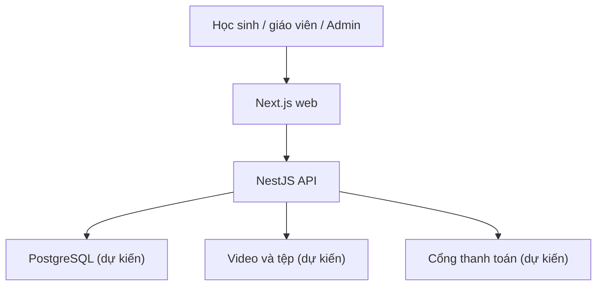

# Shanity — Nền tảng eLearning

## Giới thiệu

Shanity là dự án học trực tuyến dành cho học sinh, dự kiến phục vụ khoảng **1.000 người dùng** với **5–10 khóa học** ban đầu. Học sinh học qua video và tài liệu, làm bài kiểm tra, theo dõi tiến độ và trao đổi trong khóa học. Giáo viên quản lý nội dung và chấm bài; quản trị viên quản lý toàn bộ nền tảng.

> **Trạng thái hiện tại:** Repository đã có nền tảng monorepo và Auth + User. Web có theme/component nền và Auth frontend tại `/login`, `/register`, `/profile` đã nối API, API có endpoint mẫu (`GET /`) và kiểm tra PostgreSQL (`GET /health/db`), migration và seed nền tảng. Auth + User đã có backend cơ bản; các module nghiệp vụ còn lại trong lộ trình chưa có API.
>
> README này có hai vai trò: (1) hướng dẫn chạy mã nguồn hiện có, và (2) làm tài liệu triển khai sản phẩm cho các giai đoạn tiếp theo.

Auth + User đã có API email/JWT/Google OAuth và hồ sơ cá nhân: xem [cấu hình, API và kiểm thử Auth](docs/auth.md). Frontend đã nối Auth + User; xem [cấu hình và kiểm thử tích hợp](docs/auth-frontend.md) và [component nền](docs/frontend.md).

## Mục lục

1. [Công nghệ và cấu trúc](#1-công-nghệ-và-cấu-trúc)
2. [Chạy dự án](#2-chạy-dự-án)
3. [Các lệnh hiện có](#3-các-lệnh-hiện-có)
4. [Phạm vi sản phẩm](#4-phạm-vi-sản-phẩm)
5. [Lộ trình triển khai](#5-lộ-trình-triển-khai)
6. [Định hướng kiến trúc và dữ liệu](#6-định-hướng-kiến-trúc-và-dữ-liệu)
7. [Quy trình phát triển](#7-quy-trình-phát-triển)

---

## 1. Công nghệ và cấu trúc

### 1.1. Bảng công nghệ

| Thành phần | Trạng thái trong mã nguồn |
| --- | --- |
| Web | Next.js 16, React 19, TypeScript, Tailwind CSS 4 |
| API | NestJS 12, TypeScript |
| Workspace | pnpm 11.24.0, dùng chung một lockfile |
| Kiểm thử | Vitest cho API, đã có cấu hình e2e và test mẫu |
| Đóng gói | Dockerfile nhiều giai đoạn; Docker Compose cho web và API |
| Cơ sở dữ liệu | PostgreSQL 17, Knex + pg, migration và seed; xem [hướng dẫn](docs/database.md) |

### 1.2. Cấu trúc thư mục

```text
shanity/
├── apps/
│   ├── web/                 # Next.js App Router
│   │   └── src/app/         # Trang và layout hiện có
│   └── api/                 # NestJS
│       ├── src/             # Controller/service mẫu
│       └── test/            # Test e2e mẫu
├── docs/docker.md
├── compose.yaml             # postgres + migrate + api + web
├── Dockerfile
├── package.json             # Script cấp workspace
├── pnpm-lock.yaml
└── pnpm-workspace.yaml
```

### 1.3. Tham khảo từ Shanverse

Shanity tham khảo Shanverse ở cách tách route và feature, component dùng chung, responsive, trang blog và tìm kiếm — nhưng là một repository độc lập:

- Notion của Shanverse là nguồn nội dung blog.
- Dữ liệu nghiệp vụ của Shanity (học sinh, Quiz, tiến độ, đơn hàng...) cần cơ sở dữ liệu riêng.

---

## 2. Chạy dự án

### 2.1. Chạy trực tiếp trên máy

**Yêu cầu:** Node.js tương thích với các dependency trong repo (Dockerfile hiện dùng Node.js 24) và pnpm 11.24.0 thông qua Corepack.

```bash
corepack enable
corepack prepare pnpm@11.24.0 --activate
pnpm install --frozen-lockfile
```

Trước khi chạy API, làm theo [hướng dẫn database](docs/database.md) để cấu hình `.env`, khởi động PostgreSQL, migrate và seed. Sau đó mở hai terminal từ thư mục gốc:

```bash
# Terminal 1 — chạy web
pnpm dev:web
```

```bash
# Terminal 2 — chạy API
pnpm dev:api
```

Sau khi khởi động:

- Web: **http://localhost:3000**
- API mẫu: **http://localhost:4000/**

> Lưu ý: trang web hiện chưa kết nối API để hiển thị dữ liệu khóa học.

### 2.2. Chạy bằng Docker

**Yêu cầu:** Docker Engine/Desktop có Compose plugin.

```bash
cp .env.example .env
# Sửa PGPASSWORD trong .env
docker compose up --build -d
docker compose ps
docker compose logs -f
```

Mặc định web chạy ở cổng **3000**, API ở cổng **4000** trên máy host. Cổng bên trong container luôn là 3000 và 4000, không đổi.

**Đổi cổng host — Bash:**

```bash
WEB_PORT=3001 API_PORT=4001 docker compose up --build -d
```

**Đổi cổng host — PowerShell:**

```powershell
$env:WEB_PORT = "3001"
$env:API_PORT = "4001"
docker compose up --build -d
```

Có thể tạo file `.env` ở thư mục gốc với `WEB_PORT=3001` và `API_PORT=4001` để Compose tự đọc.

> `.env.example` chứa cấu hình PostgreSQL và cổng host; không commit `.env`.

Dừng các container:

```bash
docker compose down
```

> Compose chờ PostgreSQL healthy và migration thành công trước khi chạy API. Volume giữ dữ liệu khi `down`; xem [database](docs/database.md).

---

## 3. Các lệnh hiện có

| Lệnh (từ thư mục gốc) | Công dụng |
| --- | --- |
| `pnpm dev:web` | Chạy Next.js development server |
| `pnpm dev:api` | Chạy NestJS ở watch mode |
| `pnpm build` | Build các package trong workspace |
| `pnpm --filter web lint` | Lint frontend |
| `pnpm --filter api lint` | Lint backend |
| `pnpm --filter api test` | Unit test API |
| `pnpm --filter api test:e2e` | E2E test API |
| `pnpm --filter api test:cov` | Coverage test API |

> Database: `pnpm --filter api db:migrate`, `db:seed`, `db:verify`. Xem [schema, giả định và phần chưa triển khai](docs/database.md).

---

## 4. Phạm vi sản phẩm

### 4.1. Vai trò người dùng

| Vai trò | Công việc chính |
| --- | --- |
| Học sinh | Tìm, ghi danh/mua khóa, học bài, làm Quiz, xem tiến độ, tham gia chat và lớp trực tiếp |
| Giáo viên | Soạn khóa/bài, tạo đề, chấm tự luận, xem tiến độ, quản lý trao đổi trong khóa |
| Quản trị viên | Duyệt nội dung, quản lý tài khoản, khóa, đơn hàng, báo cáo và kiểm duyệt |
| Phụ huynh | **Chưa quyết định** — cân nhắc khi cần thanh toán hoặc quản lý tài khoản thay học sinh |

Ma trận quyền chi tiết đã chốt: [Học sinh, Giảng viên, Quản trị viên](docs/permissions.md). Lớp dữ liệu có vai trò, chủ sở hữu khóa và phân công giảng viên; API kiểm tra quyền chưa triển khai.

### 4.2. Các module dự kiến

| Module | Phạm vi | Trạng thái |
| --- | --- | --- |
| Auth | Email, JWT, refresh/logout, Google OAuth, guard role; khôi phục mật khẩu còn chờ | Backend cơ bản đã triển khai |
| User | Xem/sửa hồ sơ của mình; quản trị tài khoản còn chờ | Backend hồ sơ đã triển khai |
| Course | Danh mục, chương, giáo viên, bản nháp, xuất bản, ghi danh | Chưa triển khai |
| Lesson | Video, văn bản, tài liệu, bài xem trước, kiểm tra quyền truy cập | Chưa triển khai |
| Progress | Tiến độ bài/khóa, tiếp tục học, báo cáo cho giáo viên | Chưa triển khai |
| Quiz | Trắc nghiệm tự chấm, tự luận giáo viên chấm, lịch sử lượt làm | Chưa triển khai |
| Payment | Đơn hàng, thanh toán, đối soát, cấp quyền học | Chưa triển khai |
| Chat | Phòng theo khóa, thời gian thực, lưu lịch sử, báo cáo/kiểm duyệt | Chưa triển khai |
| Blog | Bài viết, chuyên mục, tác giả, duyệt và xuất bản | Chưa triển khai |
| Lớp trực tiếp | Lịch học và liên kết tham gia dịch vụ họp | Chưa triển khai |

### 4.3. Luồng học cốt lõi

```
Tạo tài khoản → Tìm khóa → Ghi danh hoặc thanh toán → Học bài → Làm Quiz → Xem kết quả và tiến độ
```

---

## 5. Lộ trình triển khai

Thời gian **24 tuần / 12 sprint hai tuần** là ước tính để lên kế hoạch. Nếu phát triển một mình, ưu tiên hoàn thành bản học thử trước khi mở rộng đủ module. Mỗi giai đoạn kết thúc bằng một luồng có thể trình diễn được.

### Giai đoạn 0 — Sản phẩm và nền tảng (tuần 1–2)

**Việc cần làm:**
- Chốt ma trận quyền; quyết định phụ huynh có thuộc MVP không; xác định ai là người thanh toán.
- Chốt khóa miễn phí/trả phí, quy tắc ghi danh, điều kiện hoàn thành bài/khóa, điểm đạt Quiz.
- Thiết kế schema nền tảng và migration PostgreSQL; thêm database vào Compose.
- Chốt hợp đồng API, môi trường phát triển, biến môi trường mẫu, quy tắc quản lý secret.
- Thiết kế hành trình học sinh, giáo viên, Admin và một khóa mẫu.

**Nghiệm thu:** Web, API, database chạy cùng nhau; migration có thể chạy lại trên database mới; các quy tắc học và quyền được ghi thành tài liệu.

### Giai đoạn 1 — Auth và User (tuần 3–6)

**Sprint 2:** UI dùng chung; cấu trúc frontend theo feature; backend module; API client; xử lý loading/error; đăng ký và đăng nhập bằng email/mật khẩu.

**Sprint 3:** JWT và làm mới phiên, logout, quên mật khẩu, phân quyền backend, hồ sơ cá nhân, danh sách người dùng cho Admin. Thêm OAuth sau khi luồng email/mật khẩu đã ổn định.

**Nghiệm thu:** Học sinh không gọi được API của giáo viên/Admin; phiên đã thu hồi không tiếp tục dùng được; thay đổi vai trò được kiểm tra ở backend.

### Giai đoạn 2 — Course và Lesson (tuần 7–10)

**Sprint 4:** Tạo khóa/chương; gán giáo viên; bản nháp, duyệt, xuất bản; trang danh sách và chi tiết; ghi danh khóa miễn phí; chuẩn bị một khóa mẫu thật.

**Sprint 5:** Tạo/sắp xếp bài học; bài dạng video, văn bản và tài liệu; trình phát và mục lục bài; phân quyền xem trước và quyền của người đã ghi danh; giao diện tương thích điện thoại.

**Nghiệm thu:** Một học sinh có thể tìm khóa, ghi danh miễn phí và học liên tục khóa mẫu; người không có quyền không mở được nội dung riêng.

### Giai đoạn 3 — Progress và Quiz trắc nghiệm (tuần 11–14)

**Sprint 6:** Lưu trạng thái bắt đầu/hoàn thành bài; tính tỷ lệ theo các bài bắt buộc; tiếp tục học; báo cáo học sinh theo khóa.

**Sprint 7:** Giáo viên tạo đề trắc nghiệm; cấu hình thời lượng, số lượt làm, điểm đạt; học sinh lưu đáp án/nộp bài; chấm tự động; lưu phiên bản đề theo từng lượt làm.

**Mốc MVP:** Thí điểm **1–2 khóa miễn phí** với nhóm học sinh nhỏ. Tải lại trang hoặc đổi thiết bị không làm mất tiến độ; sửa đề sau khi đã có bài nộp không làm thay đổi điểm cũ.

### Giai đoạn 4 — Payment và Quiz tự luận (tuần 15–18)

**Sprint 8:** Đơn hàng, giá tại thời điểm đặt, tích hợp cổng thanh toán thử nghiệm, xác minh webhook, chống xử lý trùng, cấp quyền học sau thanh toán, trang đối soát.

**Sprint 9:** Câu hỏi tự luận, nộp bài, hàng chờ chấm, điểm/nhận xét, lịch sử sửa điểm, công bố kết quả khi hoàn tất chấm.

**Nghiệm thu:** Thanh toán thành công cấp khóa **đúng một lần**; thanh toán lỗi không cấp quyền; phần tự luận chưa chấm không hiển thị như điểm cuối.

> **Lưu ý:** Nếu bắt buộc thu phí ngay khi thí điểm, chuyển Payment lên trước MVP và lùi Chat/Blog lại phía sau.

### Giai đoạn 5 — Chat, Blog và lớp trực tiếp (tuần 19–22)

**Sprint 10:** Phòng chat theo khóa; xác thực thành viên khi vào phòng và gửi tin; tin nhắn thời gian thực; lưu lịch sử; giới hạn tần suất; báo cáo và kiểm duyệt. *(Chưa mở chat cá nhân giữa mọi học sinh.)*

**Sprint 11:** Blog có bản nháp, chuyên mục, duyệt bài, trang danh sách/tìm kiếm/chi tiết; liên kết bài viết với khóa học. Lớp trực tiếp gồm lịch học, giáo viên phụ trách, quyền tham gia, liên kết tới dịch vụ họp.

**Nghiệm thu:** Thành viên khóa A không đọc/gửi được tin trong khóa B; bài blog chỉ công khai sau khi duyệt; học sinh vào đúng buổi học của khóa đã ghi danh.

### Giai đoạn 6 — Kiểm thử và ra mắt (tuần 23–24)

- Hoàn thiện tối thiểu **5 khóa học** có video, tài liệu và câu hỏi đã được duyệt.
- Kiểm thử hành trình miễn phí/trả phí, nhiều vai trò, thiết bị di động, nộp Quiz và trường hợp mất kết nối.
- Thử tải theo **lượng học sinh đồng thời thực tế dự kiến**, đặc biệt với video, Quiz và chat.
- Kiểm tra sao lưu/khôi phục, log, cảnh báo, và hướng dẫn sử dụng cho giáo viên/Admin.
- Mở theo đợt: nhóm thử → một số khóa → toàn bộ đối tượng dự kiến.

**Điều kiện ra mắt:** Không có lỗi nghiêm trọng ở đăng nhập, phân quyền học, phát bài, nộp Quiz, lưu điểm hoặc thanh toán.

### 5.1. Thứ tự PR đề xuất

| PR | Phạm vi | Phụ thuộc |
| --- | --- | --- |
| 01 | PostgreSQL, migration, Compose, biến môi trường | Bộ khung hiện có |
| 02 | Layout, component chung, API client | 01 |
| 03 | Auth và RBAC | 01 |
| 04 | User và hồ sơ | 03 |
| 05 | Course, chương và xuất bản | 03 |
| 06 | Danh sách/chi tiết khóa, ghi danh miễn phí | 05 |
| 07 | Lesson, video, tài liệu và trang học | 06 |
| 08 | Progress và báo cáo cơ bản | 07 |
| 09 | Quiz trắc nghiệm | 07 |
| 10 | Đơn hàng, thanh toán và cấp quyền | 06 |
| 11 | Quiz tự luận và chấm bài | 09 |
| 12 | Chat theo khóa và kiểm duyệt | 06 |
| 13 | Blog và quy trình duyệt | 02, 03 |
| 14 | Lịch lớp trực tiếp | 06 |
| 15 | Kiểm thử, nội dung, giám sát và phát hành | Các PR liên quan |

---

## 6. Định hướng kiến trúc và dữ liệu

### 6.1. Sơ đồ kiến trúc tổng quan



### 6.2. Nhóm bảng dự kiến

*(Đây chỉ là thiết kế ban đầu, có thể thay đổi khi triển khai chi tiết.)*

- **Danh tính:** `users`, `profiles`, `auth_identities`, `sessions`
- **Nội dung học:** `courses`, `sections`, `lessons`, `lesson_assets`, `enrollments`
- **Tiến độ và đánh giá:** `lesson_progress`, `quizzes`, `questions`, `attempts`, `answers`, `grades`
- **Thanh toán:** `orders`, `order_items`, `payments`, `payment_events`
- **Tương tác:** `chat_rooms`, `messages`, `message_reports`, `posts`, `categories`

### 6.3. Nguyên tắc kiểm tra quyền

Backend là nơi kiểm tra quyền theo **tài nguyên**, không chỉ theo vai trò:

- Giáo viên chỉ sửa được khóa mình phụ trách.
- Học sinh chỉ xem được nội dung của khóa đã được cấp quyền.
- Trạng thái thanh toán phải dựa vào thông báo đã được xác minh từ cổng thanh toán, **không** chỉ dựa vào trang chuyển hướng của trình duyệt.

---

## 7. Quy trình phát triển

1. Mỗi PR cần có: mục tiêu, ảnh giao diện (nếu có), cách chạy thử, thay đổi về biến môi trường/migration, và tiêu chí nghiệm thu.
2. Feature frontend mới đặt dưới `apps/web/src/features/<feature>`; route đặt ở `apps/web/src/app`. Backend tách module nghiệp vụ dưới `apps/api/src`.
3. Mỗi thay đổi schema phải đi kèm migration. Không commit secret hoặc `.env`; thêm tên biến cần thiết vào mẫu cấu hình khi được tạo.
4. Trước khi merge, chạy build, lint và các test liên quan. Với Auth, Quiz và Payment, cần kiểm tra thêm: truy cập sai quyền, gửi yêu cầu lặp, và lỗi mạng.
5. Cập nhật README khi module hoạt động thật: chuyển trạng thái trong bảng tương ứng, ghi rõ API, biến môi trường và lệnh chạy chính xác.

> Đọc thêm [tài liệu Docker](docs/docker.md). Schema hiện tại và đề xuất cho quiz/thanh toán được mô tả trong [tài liệu database](docs/database.md).