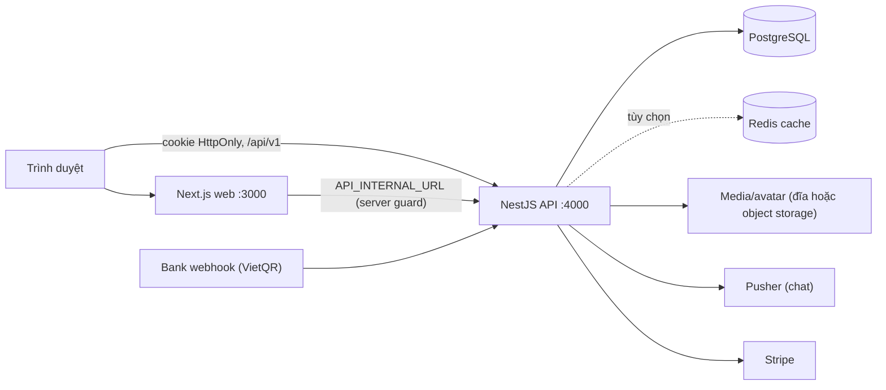

# Shanity — Nền tảng học trực tuyến

Shanity là nền tảng eLearning cho học sinh: học qua video, văn bản và tài liệu, làm bài kiểm tra (trắc nghiệm và tự luận), theo dõi tiến độ, mua khóa học, trao đổi trong khóa và tham gia lớp học trực tiếp. Giáo viên soạn khóa, bài, đề và chấm bài; quản trị viên quản lý người dùng, đơn hàng và nội dung cộng đồng.

Repository là một monorepo pnpm gồm hai ứng dụng:

| Ứng dụng | Công nghệ | Thư mục |
| --- | --- | --- |
| Web | Next.js 16 (App Router), React 19, TypeScript, Tailwind CSS 4, TanStack Query | [`apps/web`](apps/web/README.md) |
| API | NestJS 12, TypeScript (ESM), TypeORM + PostgreSQL 17 | [`apps/api`](apps/api/README.md) |

Hạ tầng đi kèm: Docker Compose (PostgreSQL, migrate, API, web, Redis tùy chọn), pnpm 11.24.0, Node.js 24.

## Tính năng

| Nhóm | Nội dung | Tài liệu |
| --- | --- | --- |
| Tài khoản | Đăng ký/đăng nhập email, Google OAuth, phiên bằng cookie HttpOnly, hồ sơ, đổi mật khẩu, avatar | [authentication](docs/authentication.md) |
| Phân quyền | Bốn vai trò `student`, `instructor`, `admin`, `finance_officer`; kiểm tra theo tài nguyên | [permissions](docs/permissions.md) |
| Khóa học | Danh mục công khai, chương, bài (văn bản/video/tài liệu), xem trước, khóa học tuần tự, ghi danh | [courses-and-lessons](docs/courses-and-lessons.md) |
| Tiến độ | Bắt đầu/hoàn thành bài, tiếp tục học, báo cáo cho giáo viên | [progress](docs/progress.md) |
| Quiz | Trắc nghiệm tự chấm, tự luận giáo viên chấm, hàng chờ chấm, công bố kết quả | [quiz](docs/quiz.md) |
| Thanh toán | Giá khóa học, đơn hàng, VietQR, Stripe, webhook, đối soát, hoàn tiền | [payments](docs/payments.md) |
| Chat | Phòng chat theo khóa, thời gian thực qua Pusher, báo cáo và kiểm duyệt | [chat](docs/chat.md) |
| Blog | Bài viết, chuyên mục, duyệt bài, nhập từ Word/PDF/Markdown, bình luận có kiểm duyệt | [blog](docs/blog.md) |
| Lớp trực tiếp | Lịch học nhúng YouTube/Vimeo/Jitsi, điểm danh bằng heartbeat | [live-classes](docs/live-classes.md) |
| Nhập nội dung | Tạo bài học và quiz từ JSON/Markdown/Excel | [content-import](docs/content-import.md) |

## Bắt đầu nhanh

Yêu cầu: Node.js 24, Corepack (pnpm 11.24.0), Docker (cho PostgreSQL).

```bash
corepack enable
corepack prepare pnpm@11.24.0 --activate
pnpm install --frozen-lockfile

cp .env.example .env        # sửa PGPASSWORD, JWT_SECRET (openssl rand -hex 32)
docker compose up -d --wait postgres
pnpm --filter api db:migrate
pnpm --filter api seed:demo # tùy chọn: 4 tài khoản demo + khóa học, quiz mẫu (từ chối chạy ở production)

pnpm dev:api   # terminal 1 — http://localhost:4000
pnpm dev:web   # terminal 2 — http://localhost:3000
```

Tài khoản demo (`admin@`, `instructor@`, `student@`, `finance@shanity.local`) dùng mật khẩu `SEED_DEMO_PASSWORD` hoặc giá trị mặc định ghi trong [`.env.example`](.env.example). Hướng dẫn đầy đủ, kể cả chạy bằng Docker Compose: [docs/getting-started.md](docs/getting-started.md).

## Cấu trúc thư mục

```text
shanity/
├── apps/
│   ├── api/                  # NestJS
│   │   ├── src/
│   │   │   ├── auth/ users/ avatar/      # tài khoản, phiên, hồ sơ
│   │   │   ├── courses/                  # khóa học, chương, ghi danh, giá
│   │   │   ├── modules/                  # lessons, progress, quiz, payment, chat,
│   │   │   │                             # blog, live, import, instructor, curriculum
│   │   │   ├── common/ cache/ storage/   # envelope, guard, log, cache, lưu trữ media
│   │   │   └── database/                 # data source, migration, seed
│   │   ├── database/                     # CLI migrate/seed và test database
│   │   └── test/                         # e2e (Vitest + PostgreSQL thật)
│   └── web/                  # Next.js
│       ├── src/app/                      # route (nhóm: dashboard, instructor, learning, protected...)
│       ├── src/features/                 # logic và UI theo tính năng
│       ├── src/components/               # ui, layout, shared, brand
│       └── e2e/ tests/                   # Playwright
├── docs/                     # tài liệu (xem docs/README.md)
├── compose.yaml  Dockerfile  .env.example
└── package.json  pnpm-workspace.yaml  pnpm-lock.yaml
```

## Lệnh thường dùng

Chạy từ thư mục gốc.

| Lệnh | Công dụng |
| --- | --- |
| `pnpm dev:web` / `pnpm dev:api` | Chạy web / API ở chế độ phát triển |
| `pnpm build` | Build cả hai ứng dụng |
| `pnpm --filter api test` | Unit test API (Vitest) |
| `pnpm --filter api test:e2e` | E2E API, cần PostgreSQL |
| `pnpm --filter api test:database` | Test migration trên database tên kết thúc `_test` |
| `pnpm --filter api typecheck` / `lint` | Kiểm tra kiểu / oxlint |
| `pnpm --filter web test` | Unit test web (Vitest) |
| `pnpm --filter web test:e2e` | E2E trình duyệt (Playwright) |
| `pnpm --filter web typecheck` / `lint` | Kiểm tra kiểu / ESLint |
| `pnpm --filter api db:migrate` / `db:revert` | Chạy / lùi migration gần nhất |
| `pnpm --filter api db:seed` | Seed phát triển: khóa mẫu, tài khoản demo và super admin (nếu cấu hình `SUPER_ADMIN_*`) |
| `pnpm --filter api seed:course` / `seed:demo` | Chỉ khóa JavaScript mẫu / bốn tài khoản demo cùng nội dung demo |
| `node database/cli.mjs seed-admin` | Chỉ tạo super admin (dùng khi triển khai; Compose gọi lệnh này) |

Chi tiết kiểm thử: [docs/testing.md](docs/testing.md).

## Kiến trúc tóm tắt



Điểm chính: API là ranh giới bảo mật duy nhất (kiểm tra phiên, vai trò và quyền sở hữu tài nguyên ở mọi request); web gọi API qua `/api/v1/<miền>/*` với phản hồi dạng envelope thống nhất; thanh toán chỉ được ghi nhận từ webhook đã xác minh. Xem [docs/architecture.md](docs/architecture.md).

## Tài liệu

Mục lục đầy đủ ở [docs/README.md](docs/README.md). Các tài liệu hay dùng nhất:

- [Bắt đầu và chạy dự án](docs/getting-started.md)
- [Cấu hình và biến môi trường](docs/configuration.md)
- [Kiến trúc](docs/architecture.md) · [Database](docs/database.md) · [Triển khai](docs/deployment.md)

## Quy trình phát triển

1. Mỗi PR nêu mục tiêu, cách chạy thử, thay đổi biến môi trường/migration và ảnh giao diện nếu có.
2. Feature frontend đặt ở `apps/web/src/features/<feature>`, route ở `apps/web/src/app`. Backend chia module nghiệp vụ dưới `apps/api/src`.
3. Mỗi thay đổi schema đi kèm một migration mới (không sửa migration đã áp dụng) và đăng ký trong `database/migrations/index.ts`.
4. Không commit secret hoặc `.env`; thêm tên biến mới vào `.env.example`.
5. Trước khi merge chạy typecheck, lint, build và test liên quan. Với Auth, Quiz và Payment, kiểm tra thêm: truy cập sai quyền, yêu cầu lặp và lỗi mạng.
6. Cập nhật tài liệu tương ứng trong `docs/` khi hành vi thay đổi.
