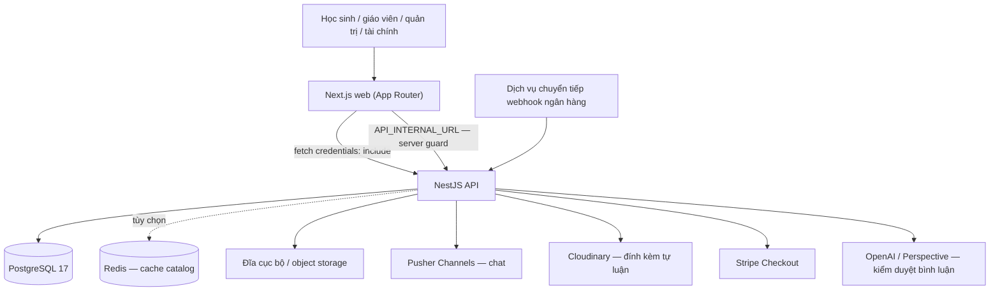

# Kiến trúc

## Tổng quan



- **Web** render giao diện, giữ phiên trong bộ nhớ và chỉ gọi API; không chứa logic phân quyền có hiệu lực bảo mật.
- **API** là ranh giới bảo mật duy nhất. Mọi request được xác thực, kiểm tra vai trò hiện hành trong database và kiểm tra quyền trên tài nguyên cụ thể.
- **PostgreSQL** là nguồn sự thật. Các bất biến quan trọng (tiền, trạng thái đơn, nhật ký kiểm toán, snapshot bài làm) được cưỡng chế bằng ràng buộc và trigger, không chỉ bằng mã ứng dụng. Xem [database](database.md).
- API không giữ socket: chat thời gian thực dùng Pusher nên API chạy được trên hạ tầng serverless/nhiều instance.

## Backend (`apps/api/src`)

NestJS 12, TypeScript ESM, TypeORM 1.1 + `pg`. `AppModule` ghép các module:

| Module | Vai trò |
| --- | --- |
| `DatabaseModule` | `DataSource` dùng chung, migration, `GET /health/db` |
| `AuthModule` (`auth/`, `users/`, `avatar/`) | Đăng ký/đăng nhập, phiên, Google OAuth, hồ sơ, quản lý người dùng, avatar |
| `CoursesModule`, `ChaptersModule` (`courses/`) | Khóa học, chương, ghi danh, giá, catalog công khai, thumbnail |
| `LessonsModule` (`modules/lessons`) | Bài học văn bản/video/tài liệu, kiểm tra quyền truy cập, phát media |
| `ProgressModule` | Tiến độ bài/khóa, tiếp tục học |
| `InstructorModule` | Báo cáo tiến độ học viên cho giảng viên |
| `QuizModule` | Soạn quiz, làm bài, chấm, hàng chờ chấm, công bố kết quả |
| `ContentImportModule` (`modules/import`) | Nhập bài học/quiz từ tệp |
| `PaymentModule` | Đơn hàng, checkout, provider, webhook, đối soát, quản trị đơn |
| `ChatModule` | Chat theo khóa, kiểm duyệt, Pusher |
| `BlogModule` | Bài viết, chuyên mục, nhập tài liệu, bình luận kiểm duyệt |
| `LiveSessionModule` | Lớp trực tiếp và điểm danh |
| `CurriculumEventsModule` | Sự kiện đổi nội dung để vô hiệu hóa cache |
| `CacheModule`, `StorageModule`, `CommonModule` | Cache, lưu trữ media, middleware/guard/filter dùng chung |

### Pipeline của một request

Thứ tự trong `setup.ts` (`configureApp`): logger pino → CORS (chỉ `WEB_ORIGIN`, có credentials) → `requestContextMiddleware` (correlation id) → access log → `cookie-parser` → `apiV1Middleware` (viết lại `/api/v1/...` về route gốc) → `legacyDeprecationMiddleware` → router. Sau đó: guard miền (`DomainAccessGuard`) → guard của controller (`OriginGuard`, `SessionGuard`, guard theo tài nguyên) → `ValidationPipe` toàn cục (whitelist + `forbidNonWhitelisted`, đăng ký trong `AuthModule`) → handler → `ResponseEnvelopeInterceptor` → `AllExceptionsFilter`. `rawBody` được bật vì cổng thanh toán ký chính các byte của webhook.

### Bề mặt API

Hai dạng URL cùng tồn tại:

- **Route gốc** (không tiền tố, ví dụ `/courses`, `/quizzes/:id/take`): giữ nguyên hình dạng phản hồi cũ.
- **`/api/v1/<miền>/*`**: bí danh của đúng một route gốc, định nghĩa trong `src/common/api-v1-routes.ts` (nguồn duy nhất, hơn 100 alias). Middleware viết lại URL nên **cùng handler, guard và validation** chạy; phản hồi được bọc envelope.

| Miền | Ai gọi được |
| --- | --- |
| `public` | Không cần đăng nhập |
| `student`, `me` | Mọi người đã đăng nhập (handler vẫn thu hẹp bằng `@Roles`) |
| `instructor` | `instructor`, `admin` |
| `admin` | `admin`, `finance_officer` |

`DomainAccessGuard` (APP_GUARD) cưỡng chế vai trò theo miền ngay ở tầng router, **chỉ có thể thu hẹp quyền, không bao giờ mở rộng**. Quyền sở hữu tài nguyên vẫn do guard theo tài nguyên đảm nhiệm (`CourseOwnershipGuard`, `LessonOwnershipGuard`, `QuizAuthorizationGuard`, `LessonAccessGuard`, `CourseEnrollmentGuard`, `CourseOwnerGuard`…).

Cố ý **không** có alias: `/auth/*` (redirect URI OAuth đã đăng ký với Google), luồng stream media/avatar có chữ ký, `/health/*`, và các route thanh toán vốn đã nằm dưới `/api/v1/*`. Một test ép buộc mọi route gốc phải được xếp vào "có alias" hoặc "cố ý không alias".

**Gỡ route cũ.** Route gốc có alias trả thêm `Deprecation` và `Link: <url mới>; rel="successor-version"` (khi đặt `LEGACY_ROUTES_DEPRECATED_SINCE`), và `Sunset`; từ `LEGACY_ROUTES_SUNSET` chúng trả `410 Gone` kèm vị trí mới. Mỗi route cũ được log cảnh báo `LegacyRoute` một lần mỗi tiến trình để biết còn ai gọi. Web đã gọi `/api/v1` cho mọi lời gọi nghiệp vụ.

### Envelope phản hồi

Mọi route `/api/v1/<miền>/*` trả:

```json
{
  "success": true,
  "statusCode": 200,
  "message": "Success",
  "data": {},
  "meta": { "page": 1, "limit": 20, "total": 0, "totalPages": 0 },
  "correlationId": "…"
}
```

`meta` chỉ có với danh sách phân trang (cả dạng phẳng `{items, page, limit, total}` lẫn dạng lồng `{<list>, pagination}` đều được chuẩn hóa). Lỗi có `success: false`, `data: null` hoặc chi tiết, và `errors?: string[]`. Hai nhóm thanh toán gốc `/api/v1/{admin,student}/orders` giữ hình dạng riêng; client web đọc được cả hai dạng.

### Lỗi và log

- `AllExceptionsFilter` luôn trả hình dạng ổn định kèm `X-Correlation-Id`. Lỗi nội bộ trả 500 chung. **Không bao giờ log nguyên văn thông điệp lỗi** (có thể chứa câu truy vấn/tham số/credential): chỉ ghi tên lỗi, mã driver an toàn và stack frame.
- `pino` qua Nest logger, một dòng JSON mỗi sự kiện trên stdout. `AsyncLocalStorage` gắn `correlationId` vào mọi dòng log của request, kể cả từ service. Id do client gửi chỉ được nhận nếu khớp `^[A-Za-z0-9._-]{8,64}$`. Access log mỗi request một dòng (chỉ path, không query); `/health` ở mức debug.
- Gỡ lỗi báo cáo của người dùng: lấy **mã tham chiếu** trên màn hình lỗi (hoặc header `X-Correlation-Id`) rồi tìm đúng giá trị đó trong log.
- Không bật SQL debug hay log body/cookie/`Authorization`/query callback ở proxy/APM.

### Cache

Cổng `CacheStore` có hai cài đặt: bộ nhớ trong tiến trình (giới hạn 500 mục) và Redis (`ioredis`, tiền tố `shanity:cache:`, timeout lệnh 500 ms). `CacheService.remember` là **fail-open** (Redis lỗi chỉ mất cache hit), **single-flight** (nhiều request cùng khóa chỉ chạy một loader) và vô hiệu hóa theo phiên bản nhóm: `CatalogInvalidator` nghe `CurriculumEvents` nên xuất bản/sửa nội dung có hiệu lực ngay, TTL chỉ chặn độ cũ. Chỉ catalog công khai (danh sách, chi tiết, đề cương) được cache; tìm kiếm tự do và 404 thì không. Có Redis khi chạy nhiều instance API; không có thì cache riêng từng instance. Rate limiter của chat cũng có hai cài đặt (bộ nhớ/Redis).

### Tác vụ nền

Chạy trong tiến trình API bằng `setInterval` (không có hàng đợi ngoài), mỗi lượt quét idempotent nên nhiều instance cùng chạy vẫn an toàn:

- `PaymentExpirationWorker` — hết hạn đơn `PENDING` quá hạn, mỗi 5 phút.
- `PaymentReconciliationWorker` — vá webhook thất lạc và listener cấp quyền thất bại, mỗi 5 phút.

### Quy ước dữ liệu

- Khóa chính UUID; mọi bảng có thể sửa kế thừa `AuditedEntity` (`id`, `created_at`, `updated_at`; trigger `set_updated_at()` giữ `updated_at` đúng cả với SQL thuần). Ngoại lệ (sổ cái chỉ-thêm, snapshot bất biến, bảng khóa tự nhiên) được liệt kê kèm lý do trong test `audit-standard.spec.ts`.
- Tiền là số nguyên đơn vị nhỏ nhất (`bigint`; VND đồng, USD cent), đọc về `number` qua `bigintNumberTransformer` và ném lỗi nếu vượt `Number.MAX_SAFE_INTEGER`.
- Không soft delete đồng loạt: vòng đời dùng `status` (khóa học), vô hiệu hóa (người dùng), sổ cái chỉ-thêm (tiền) và khóa ngoại `RESTRICT` để lịch sử không bị xóa dây chuyền. Nếu một aggregate cần thùng rác, thêm `deleted_at` riêng cho nó cùng partial index và một điểm truy cập duy nhất.
- Sự kiện miền: bus in-process cho thanh toán (`OrderCompletedEvent`) và `CurriculumEvents`. Bus không bền; độ tin cậy dựa vào worker đối soát (xem [payments](payments.md)).

## Frontend (`apps/web/src`)

Next.js 16 App Router, React 19, Tailwind CSS 4, TanStack Query. Next.js 16 có thay đổi so với phiên bản bạn có thể quen; đọc `node_modules/next/dist/docs/` trước khi viết mã (xem `apps/web/AGENTS.md`).

```text
src/
├── app/            # route; nhóm (admin-auth) (dashboard) (instructor) (learning) (protected)
├── features/       # logic + UI theo tính năng (api.ts, hooks, component, test)
├── components/     # ui (primitive), layout, shared (QueryBoundary, EmptyState…), brand, learning
├── config/         # navigation.config.ts, breadcrumbs.ts, site.config.ts, brand.config.ts
├── lib/            # api.ts (client), server-session.ts, admin-access.ts, auth-redirect.ts
├── providers/      # query, theme, toast
├── hooks/          # useOptimisticMutation, useDebounce, useOnlineStatus…
├── proxy.ts        # chặn guest ở route bảo vệ
└── styles/         # color, theme, typography, responsive, base
```

Nguyên tắc:

- **Một nguồn điều hướng**: `config/navigation.config.ts` cấp menu cho học viên, giảng viên, admin, tài khoản, hành động nhanh và footer; breadcrumb ở `config/breadcrumbs.ts`. Test đối chiếu cấu hình với cây `src/app` để không có liên kết chết.
- **Bảo vệ route hai lớp**: `proxy.ts` chuyển hướng 307 tới `/login?redirect=…` khi thiếu access cookie; server layout/page gọi `requireUser()`/`requireRole()` (`lib/server-session.ts`) để xác minh thật với API. Bảo vệ thật nằm ở API.
- **State dữ liệu**: `QueryBoundary` là máy trạng thái loading → lỗi (kèm mã tham chiếu cho lỗi 5xx) → rỗng → thành công; `ToastProvider`/`useToast` cho thông báo; `useOptimisticMutation` cho cập nhật lạc quan có rollback.
- **Giao diện**: theme sáng/tối, token ngữ nghĩa, tương phản WCAG AA được test. Xem [frontend](frontend.md).
- URL cũ `/my-quiz-attempts` chuyển vĩnh viễn sang `/quiz-attempts`.

## Quyết định kiến trúc đáng nhớ

| Quyết định | Lý do ngắn |
| --- | --- |
| Cookie HttpOnly thay vì bearer token ở frontend | Token không chạm JavaScript; cần web và API cùng hostname ([authentication](authentication.md)) |
| `/api/v1` là bí danh của route cũ | Không nhân bản logic; web và test cũ tiếp tục chạy |
| Role đọc từ database mỗi request | Thu hồi quyền/khóa tài khoản có hiệu lực ngay, không đợi token hết hạn |
| Quiz là aggregate độc lập, bài làm có snapshot | Sửa đề không đổi điểm cũ ([quiz](quiz.md)) |
| Order và order item chụp giá tại thời điểm đặt | Đổi giá không ảnh hưởng đơn đã tạo ([payments](payments.md)) |
| Webhook là nguồn duy nhất xác nhận thanh toán | Trang chuyển hướng của trình duyệt không đáng tin |
| Pusher thay vì WebSocket tự quản | API không giữ socket, chạy được serverless ([chat](chat.md)) |
