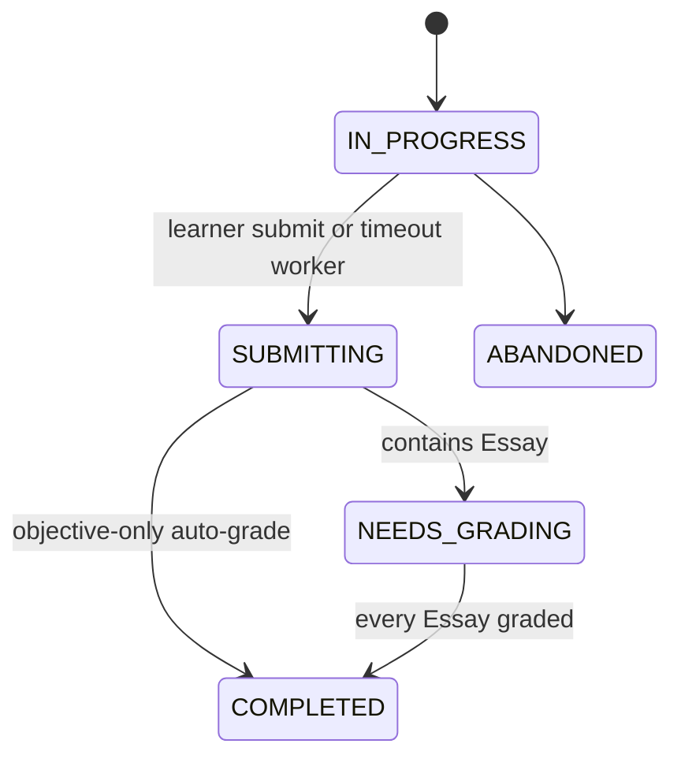

# ADR: Sprint 9 Essay Extension for the Quiz Engine

- Status: Accepted for E2-E4 implementation
- Date: 2026-10-08
- Owners: Quiz / Assessment domain
- Detailed audit: [Sprint 9 Quiz Domain Audit](./sprint9-quiz-domain-audit.md)

## Context

Sprint 7 already has one Quiz aggregate, an immutable attempt snapshot, timer,
idempotent submission lease, auto-grading and progress integration. Sprint 9
must add KaTeX-capable text and image/PDF Essay submissions without duplicating
that infrastructure and without breaking existing choice quizzes.

The physical tables are `quiz_questions`, `quiz_attempts`, and
`attempt_answers`. Current answers store only selected option IDs; current submit
always computes a final result.

## Decision

Use single-table extension with nullable JSONB columns:

- add `ESSAY` to the existing question type enum while retaining
  `SINGLE_CHOICE` and `MULTIPLE_CHOICE`;
- add `quiz_questions.essay_config`;
- add `attempt_answers.essay_answer` and `attempt_answers.grading`;
- copy `essayConfig` into snapshot schema v2 and grade exclusively against the
  frozen snapshot;
- keep one Quiz, one Attempt and one Answer table for mixed question types;
- do not create Essay-specific question, answer, attempt or submission tables.

Old MCQ rows use null in the new columns, so the migration is additive and does
not rewrite historical data. Application-level discriminated schemas enforce
the JSONB shapes; database checks enforce object/null and type consistency.

## Attempt transitions

`SUBMITTING` remains an internal idempotency lease. On mixed submission, choice
answers are auto-graded and Essay answers stay `UNGRADED`. Only finalization sets
official totals and `isPassed`. Thus `PASSED` / `FAILED` are derived outcomes of
`COMPLETED`, not attempt lifecycle states. Timeout is retained as a completion
reason; legacy `SUBMITTED` and `TIMED_OUT` rows are read as completed during a
zero-downtime compatibility window.

## Consequences

Positive consequences:

- Existing MCQ API/data remain valid and no second timer/attempt engine appears.
- JSONB supports evolving rubrics and attachment metadata with additive changes.
- One answer row remains the transaction and authorization boundary.
- Snapshot isolation continues to guarantee reproducible grading.

Trade-offs:

- Deep JSON invariants require explicit versioned runtime validation.
- Rubric analytics are less convenient than fully relational tables.
- Triggers, result DTOs, progress queries and review policy must recognize
  `NEEDS_GRADING` and defer official outcomes.

Class-table inheritance is deferred until Essay data needs independent relational
queries at demonstrated scale. EAV is rejected because it weakens types,
constraints, TypeORM mapping and atomic updates.

## Future extension

Audio and Code questions will plug into the same discriminator, snapshot,
AttemptAnswer and finalization pipeline. Audio payloads reference authorized media
objects; Code payloads reference language/test-set versions and an isolated runner
result. External processors are grading adapters, not alternate Quiz systems.
Payloads remain versioned and old snapshot readers remain supported. If modality
growth makes Essay-named columns awkward, generic JSONB envelopes can be added and
dual-read in a later additive migration without replacing the core tables.
