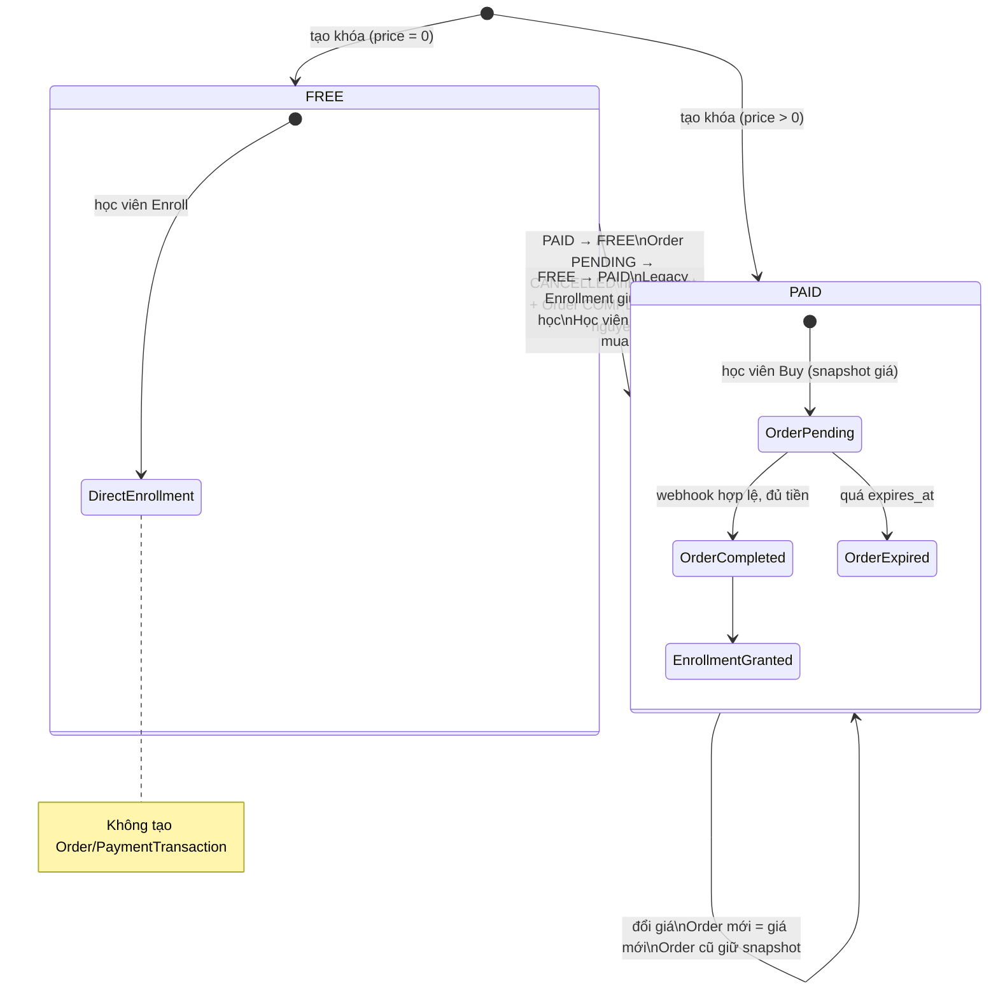
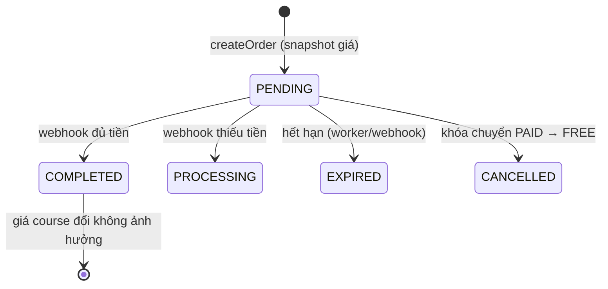
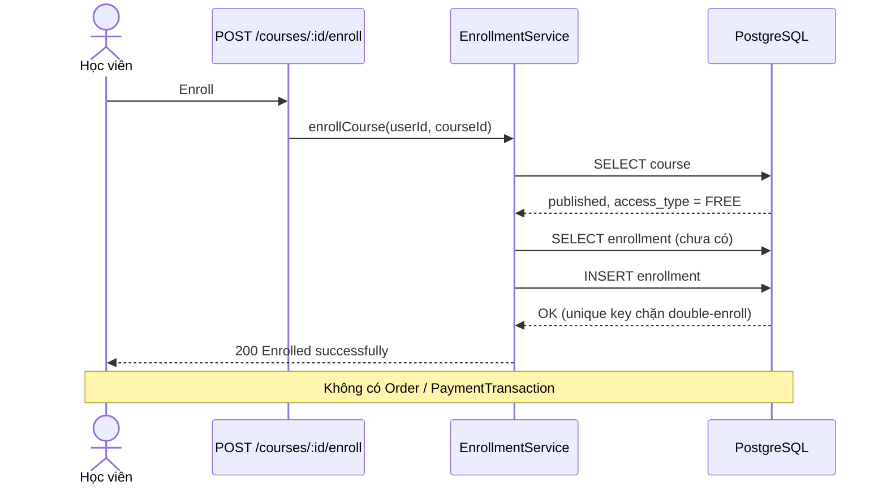

# PAY2: Course Pricing Model và Pricing Transition Engine

## 1. Mục tiêu và bất biến cốt lõi

PAY2 định nghĩa mô hình giá của khóa học, cách phân loại `FREE`/`PAID`, hành
vi hệ thống khi Instructor đổi giá hoặc đổi loại khóa học, và nhật ký kiểm toán
giá. Tài liệu mở rộng `sprint-payment-vietqr.md` (luồng Order → Payment →
Enrollment đã có).

| # | Bất biến | Cơ chế bảo đảm |
| --- | --- | --- |
| 1 | **Lock-in price**: giá của Order bị đóng băng lúc tạo Order | `order_items.unit_price_snapshot` + `orders.amount/currency` độc lập với `courses`; khóa dòng course `FOR SHARE` khi tạo Order |
| 2 | **FREE fast-path**: khóa FREE không tạo Order/PaymentTransaction | `EnrollmentService.enrollCourse` ghi Enrollment trực tiếp; `createOrder` từ chối `COURSE_IS_FREE` |
| 3 | **PAID strict-path**: khóa PAID luôn qua Order → Payment → Enrollment | `enrollCourse` ném `402 PAYMENT_REQUIRED`; chỉ webhook ngân hàng đã xác thực mới tạo Enrollment |
| 4 | **Giá nhất quán với loại**: FREE ⇔ `price = 0`, PAID ⇔ `price > 0` | `CHECK courses_access_type_price_check` ở database + `resolveNextPricing` ở service |
| 5 | **Mọi thay đổi giá đều có dấu vết** | `CoursePricingService.applyPricing` ghi `course_price_logs` trong cùng transaction |

## 2. Tiền tệ và chuẩn lưu trữ giá

| Tiền tệ | Đơn vị lưu (minor unit) | Ví dụ | Giá trị | Trần giá |
| --- | --- | --- | --- | --- |
| `VND` (mặc định) | đồng, số nguyên | `500000` | 500.000 ₫ | 10.000.000.000 |
| `USD` | cent, số nguyên | `1999` | $19.99 | 100.000.000 (= $1.000.000) |

- Giá luôn là số nguyên (`bigint`), không dùng số thực.
- `price` là `bigint`; driver `pg` trả chuỗi nên entity dùng
  `bigintNumberTransformer` (`database/bigint-number.transformer.ts`), ném lỗi
  nếu giá trị vượt `Number.MAX_SAFE_INTEGER`. Các trần ở bảng trên nằm xa dưới
  ngưỡng này.
- Khóa PAID: `price > 0`. Khóa FREE: `price = 0`.
- `currency` là `varchar(3)` với `CHECK (currency IN ('VND','USD'))`. Dùng
  varchar + CHECK thay vì enum để thêm tiền tệ mới không cần `ALTER TYPE`.
- **Giới hạn thanh toán**: VietQR chỉ thanh toán bằng VND. Khóa PAID có
  `currency = 'USD'` vẫn được định giá và hiển thị, nhưng `createOrder` trả
  `400 UNSUPPORTED_PAYMENT_CURRENCY` cho tới khi có payment method hỗ trợ USD.

## 3. Mô hình dữ liệu

Migration: `202610100001_course_pricing.ts` (`CoursePricing1791590400001`).

### 3.1. `courses` (mở rộng)

| Cột | Kiểu | Ghi chú |
| --- | --- | --- |
| `access_type` | enum `CourseAccessType` (`FREE`,`PAID`) | mặc định `FREE`; backfill `PAID` nếu `price > 0` |
| `price` | `bigint` | đổi từ `integer`; giữ nguyên giá trị |
| `currency` | `varchar(3)` | mặc định `VND` |

Ràng buộc: `courses_currency_check`, `courses_access_type_price_check`.

**`is_published`**: không thêm cột. Trạng thái xuất bản đã có nguồn sự thật duy
nhất là `courses.status` (`published`) cùng `published_at`; một cột boolean thứ
hai sẽ cho phép hai giá trị mâu thuẫn. Entity `Course` expose getter
`isPublished` (`status === PUBLISHED`) để code nghiệp vụ dùng cùng tên.

### 3.2. `course_price_logs` (mới, append-only)

| Cột | Kiểu |
| --- | --- |
| `id` | `uuid` PK |
| `course_id` | `uuid` FK → `courses` `ON DELETE RESTRICT` |
| `old_price`, `new_price` | `bigint` |
| `old_currency`, `new_currency` | `varchar(3)` |
| `old_access_type`, `new_access_type` | `CourseAccessType` |
| `cancelled_pending_orders` | `integer` — số Order PENDING bị hủy bởi thay đổi này |
| `changed_by_user_id` | `uuid` FK → `users` `ON DELETE RESTRICT` |
| `created_at` | `timestamptz` |

Index `(course_id, created_at)`. `RESTRICT` giữ nhật ký đối soát không bị xóa
theo course/user. Bản ghi được ghi cho mọi thay đổi thật sự (kể cả đổi
currency) và **không** ghi khi yêu cầu không làm thay đổi gì.

`old_currency/new_currency` và `cancelled_pending_orders` là cột bổ sung so với
yêu cầu ban đầu: thiếu chúng thì log không đủ để giải thích đổi tiền tệ hoặc
tác động lên Order.

### 3.3. `orders` và `order_items`

- `orders.amount`: `integer` → `bigint`; thêm `orders.currency`.
  `payment_transactions.amount` cũng đổi sang `bigint` để so sánh cùng kiểu.
- `order_items` (mới): `order_id`, `course_id`, `unit_price_snapshot bigint`,
  `currency`; unique `(order_id, course_id)`. Order hiện tại luôn có đúng một
  item; cấu trúc cho phép giỏ hàng nhiều khóa sau này.
- Order cũ được backfill một `order_item` với `unit_price_snapshot = orders.amount`
  (giá thật đã đóng băng), **không** lấy từ `courses.price`.
- Không bảng nào trong luồng thanh toán join sang `courses.price` để tính tiền.

## 4. Access type và luồng chuyển trạng thái

```text
FREE : Enroll ──► (published? chưa enroll?) ──► Enrollment ngay lập tức
PAID : Buy ──► Order(PENDING, snapshot) ──► Payment ──► Webhook/Reconciliation ──► Enrollment
```

Mã lỗi của các cổng chặn:

| Tình huống | Phản hồi |
| --- | --- |
| `enroll` khóa PAID | `402` `{ code: 'PAYMENT_REQUIRED', checkout: { method: 'POST', path: '/orders', body: { courseId } } }` |
| `createOrder` khóa FREE | `400 COURSE_IS_FREE` |
| `createOrder` currency ≠ VND | `400 UNSUPPORTED_PAYMENT_CURRENCY` |
| Khóa chưa publish | `409 Course is not published` (enroll) / `404 COURSE_NOT_FOUND` (order) |
| Đã ghi danh | `409 Already enrolled` / `400 ALREADY_ENROLLED` |

## 5. Hành vi khi Instructor đổi giá

`CoursePricingService.updateCoursePricing(courseId, dto, updatedBy)` thực hiện
trong **một transaction**: khóa dòng course `FOR UPDATE` → validate và tính
trạng thái mới → phân loại transition → (nếu cần) hủy Order → cập nhật course
→ ghi `course_price_logs`.

| Transition | Order mới | Order PENDING cũ | Order COMPLETED | Enrollment |
| --- | --- | --- | --- | --- |
| PAID → PAID (đổi giá/tiền tệ) | giá mới | **giữ snapshot cũ**, vẫn thanh toán được | giữ nguyên | giữ nguyên |
| PAID → FREE | không tạo được (dùng fast-path) | **`CANCELLED`** (ghi số lượng vào log) | giữ nguyên | giữ nguyên; người mua vẫn học |
| FREE → PAID | bắt buộc mua | — | — | **Legacy Enrollment giữ nguyên quyền học**; học viên mới phải mua |
| Không đổi gì | — | — | — | không ghi log |

Chi tiết quan trọng:

- **Không có race giữa đổi giá và tạo Order.** `createOrder` đọc course bằng
  `FOR SHARE` trong cùng transaction với việc chèn Order + OrderItem; đổi giá
  dùng `FOR UPDATE` trên cùng dòng. Một Order luôn chụp giá *trước* hoặc *sau*
  thay đổi, không bao giờ lẫn.
- **Không có race giữa hủy Order và webhook.** Webhook khóa dòng Order
  (`pessimistic_write`) và chỉ hoàn tất khi `status = PENDING`; câu `UPDATE`
  hủy chờ khóa rồi đánh giá lại `status`. Order đã `COMPLETED` không bị hủy.
- Order `PROCESSING` (đã nhận một phần tiền) **không** bị hủy tự động vì có tiền
  thật đang treo; xử lý bằng đối soát thủ công.
- Dùng `CANCELLED` (không phải `EXPIRED`) cho Order bị hủy do đổi loại khóa để
  phân biệt với hết hạn tự nhiên trong báo cáo.
- **Khoảng trống đã biết**: tiền chuyển vào cho Order đã `CANCELLED`/`EXPIRED`
  được webhook trả `IGNORED` (hành vi có sẵn của PAY1) và chỉ lưu
  `reference_code`; cần quy trình hoàn tiền/đối soát thủ công theo
  `bank_webhook_logs`. Ghi nhận payload thô cho trường hợp này chưa thuộc PAY2.

### Tương thích `PATCH /courses/:id`

Frontend hiện gửi `price` qua endpoint cập nhật khóa học. `CoursesService.update`
tách `price` ra và gọi `applyPricing` (`price > 0` ⇒ PAID, `0` ⇒ FREE) trong
**cùng transaction** với các field còn lại, nên đường cũ vẫn có audit log và hủy
Order PENDING. `CoursesService.create` cũng suy ra `access_type` từ `price`.

## 6. API

| Endpoint | Quyền | Mô tả |
| --- | --- | --- |
| `PATCH /courses/:id/pricing` | instructor sở hữu / admin | Body `{ accessType, price?, currency? }`; trả `{ transition, cancelledPendingOrders, ... }` |
| `GET /courses/:id/pricing-history` | instructor sở hữu / admin | 100 bản ghi mới nhất của `course_price_logs` |
| `POST /courses/:courseId/enroll` | student | Chỉ khóa FREE; PAID → `402` |
| `POST /orders` | đã đăng nhập | Chỉ khóa PAID, tiền tệ VND |

Quy tắc body `PATCH /pricing`:

- `FREE`: `price` bỏ trống hoặc `0` (khác 0 → `400 FREE_COURSE_PRICE_MUST_BE_ZERO`).
- `PAID`: `price` là số nguyên `> 0` và không vượt trần
  (`400 PAID_COURSE_PRICE_MUST_BE_POSITIVE` / `COURSE_PRICE_TOO_HIGH`).
- `currency` bỏ trống ⇒ giữ tiền tệ hiện tại.

## 7. Thành phần mã nguồn

| File | Vai trò |
| --- | --- |
| `courses/course-access-type.ts`, `course-currency.ts` | enum và trần giá |
| `courses/course.entity.ts` | thêm `accessType`, `price: bigint`, `currency`, `isPublished` |
| `courses/course-price-log.entity.ts` | entity `course_price_logs` |
| `courses/pricing/course-pricing.rules.ts` | hàm thuần: `resolveNextPricing`, `classifyTransition` |
| `courses/pricing/course-pricing.service.ts` | `updateCoursePricing`, `applyPricing`, `listPriceHistory` |
| `courses/pricing/course-pricing.controller.ts` | `PATCH pricing`, `GET pricing-history` |
| `courses/enrollment.service.ts` | `enrollCourse` (FREE fast-path, PAID → 402) |
| `courses/payment-required.exception.ts` | `402 PAYMENT_REQUIRED` |
| `modules/payment/entities/order-item.entity.ts` | `unit_price_snapshot` |
| `modules/payment/payment.service.ts` | `createOrder` chụp giá trong transaction |
| `database/migrations/202610100001_course_pricing.ts` | migration |

## 8. Sơ đồ

### 8.1. State diagram: chuyển đổi FREE ↔ PAID



Vòng đời Order bị tác động bởi chuyển đổi:



### 8.2. Sequence diagram: Enroll khóa FREE



### 8.3. Sequence diagram: Mua khóa PAID

```mermaid
sequenceDiagram
    actor S as Học viên
    participant C as CoursesController
    participant O as POST /orders (PaymentService)
    participant DB as PostgreSQL
    participant B as Ngân hàng/Webhook

    S->>C: Enroll (khóa PAID)
    C-->>S: 402 PAYMENT_REQUIRED + checkout /orders
    S->>O: Buy (courseId)
    O->>DB: BEGIN; SELECT course FOR SHARE
    DB-->>O: PAID, price, currency
    O->>DB: INSERT order(PENDING, amount, currency)
    O->>DB: INSERT order_item(unit_price_snapshot)
    O->>DB: COMMIT
    O-->>S: orderId, amount, QR (VietQR)
    S->>B: Chuyển khoản (nội dung = order code)
    B->>O: Webhook (x-api-key)
    O->>DB: claim bank_webhook_logs (idempotent)
    O->>DB: SELECT order FOR UPDATE
    alt PENDING và đủ tiền
        O->>DB: payment_transaction SUCCESS, order COMPLETED
        O->>DB: INSERT enrollment (ON CONFLICT DO NOTHING)
    else đã CANCELLED/EXPIRED hoặc thiếu tiền
        O->>DB: ghi nhận, không cấp Enrollment
    end
    S->>O: GET /orders/:id/status
    O-->>S: COMPLETED
```

### 8.4. Sequence diagram: Instructor đổi giá

```mermaid
sequenceDiagram
    actor I as Instructor
    participant P as CoursePricingService
    participant DB as PostgreSQL

    I->>P: PATCH /courses/:id/pricing
    P->>DB: BEGIN; SELECT course FOR UPDATE
    P->>P: resolveNextPricing + classifyTransition
    opt PAID → FREE
        P->>DB: UPDATE orders SET status=CANCELLED WHERE status=PENDING
    end
    P->>DB: UPDATE courses (access_type, price, currency)
    P->>DB: INSERT course_price_logs
    P->>DB: COMMIT
    P-->>I: { transition, cancelledPendingOrders }
```

## 9. Kiểm thử và xác minh

- Unit test: `course-pricing.rules.spec.ts` (validate giá, phân loại transition,
  USD cents) và `enrollment.service.spec.ts` (FREE đua đồng thời, PAID → 402).
- Đã xác minh trên PostgreSQL 16: migration up/down/up với dữ liệu cũ, CHECK
  constraint, snapshot giá qua đổi giá, webhook hoàn tất Order cũ ở giá cũ,
  PAID → FREE chỉ hủy Order PENDING, FREE → PAID giữ Legacy Enrollment, audit
  log đúng thứ tự, và 6 `createOrder` đồng thời với 3 lần đổi giá không deadlock
  hay lệch snapshot.
- Rollback migration thu hẹp `bigint` về `integer`; sẽ thất bại có chủ đích nếu
  có giá > 2³¹−1 thay vì cắt cụt tiền.
