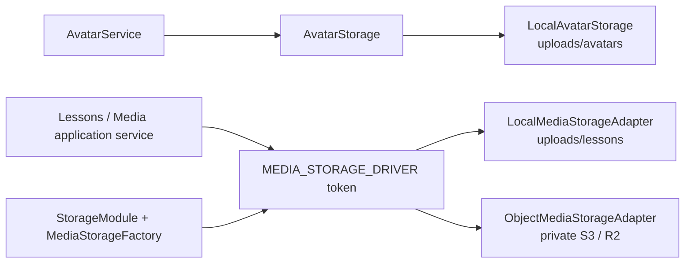
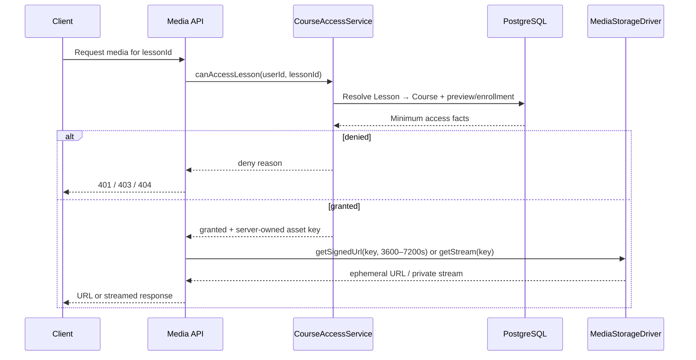

# Lesson Media Storage Architecture (L7)

- **Status:** Accepted
- **Date:** 2026-10-05
- **Scope:** Storage boundary, adapters, validation, private delivery, metadata, and lifecycle. Cloud credentials, upload endpoints, transcoding, and the cleanup scheduler are deferred.

## 1. Decision

Shanity has two intentionally separate storage domains. `AvatarStorage` remains a small, public-image service rooted at `uploads/avatars`. `MediaStorageDriver` owns large, private Lesson video and document objects rooted at `uploads/lessons` locally or in a private object-storage bucket in production. Neither domain may import or reuse the other's driver, keys, directory, limits, or delivery policy.



`LessonsModule` imports `StorageModule`; consumers depend only on the `MEDIA_STORAGE_DRIVER` token and `MediaStorageDriver` contract. `STORAGE_DRIVER=local` selects the functional local adapter. `STORAGE_DRIVER=s3` selects a fail-closed stub until provider credentials and SDK wiring are implemented.

## 2. Driver contract

The port supports `upload`, idempotent `delete`, short-lived `getSignedUrl`, and `getStream`. Stored paths are opaque server-generated keys, never client-authoritative filesystem paths or public URLs. Local storage uses exclusive creation, mode `0600`, path traversal rejection, SHA-256 checksums, and an HMAC-signed delivery URL. A delivery controller added in L8 must validate the signature and expiry before calling `getStream`.

The object adapter must eventually map the same contract to a private bucket, server-side encryption, multipart upload, abort/retry handling, and provider-native presigned URLs. It must never enable public-read ACLs.

## 3. Metadata standard

Every media asset record should persist the following independently of provider-specific response fields:

| Field | Rule |
| --- | --- |
| `id` | Server-generated UUID; public domain identity, not a bucket key |
| `storageKey` | Opaque server-generated key; never accepted from an untrusted client |
| `lessonId` | Nullable while pending; immutable after attachment except an explicit detach workflow |
| `uploaderId`, `courseId` | Server-resolved ownership scope |
| `kind` | `video` or `document` |
| `originalName` | Display/audit only; never used as a storage path |
| `contentType`, `sizeBytes` | Values verified from bytes and actual buffer/stream length |
| `checksumSha256` | Integrity/deduplication aid; not malware detection |
| `status` | `PENDING_ATTACHMENT`, `ATTACHED`, or `DELETED` |
| `createdAt`, `attachedAt`, `deletedAt` | UTC audit timestamps |
| `providerMetadata` | Namespaced JSON for ETag/version/transcode facts; never credentials or signed URLs |

Recommended key tree:

```text
uploads/
├── avatars/
│   └── <avatar-uuid>.webp
└── lessons/
    ├── pending/<course-uuid>/<asset-uuid>.<verified-ext>
    └── attached/<course-uuid>/<lesson-uuid>/<asset-uuid>.<verified-ext>
```

Object storage uses the same logical prefixes inside a dedicated private bucket. Moving from `pending` to `attached` may be a metadata/status transition rather than a physical object copy when the provider supports stable keys.

## 4. Upload validation and limits

| Domain/kind | Maximum | Accepted formats |
| --- | ---: | --- |
| Avatar | 2 MiB | JPEG, PNG, WebP; decoded and normalized by `sharp` |
| Lesson document | 50 MiB | PDF, DOCX, ZIP |
| Lesson video | 2 GiB | MP4, WebM, MOV |

Lesson uploads require agreement between the claimed MIME type, filename extension, and detected binary signature. Extension or `Content-Type` alone is never authoritative. `file-type` magic detection is a best-effort format check, not antivirus or proof that complex containers are harmless. Production promotion from quarantine must additionally perform malware scanning, ZIP expansion limits, DOCX/ZIP structure validation, and media parser/transcoder validation.

The current local adapter accepts buffered files for development and tests. Production video uploads must use multipart streaming/direct-to-private-object-storage; a 2 GiB file must never be buffered in the NestJS heap.

## 5. Authorization and private delivery



Possession of a Lesson ID, filename, asset ID, or stale URL is not authorization. The API must call the shared `CourseAccessService.canAccessLesson` policy before every URL issuance or stream start. Signed URLs are bearer capabilities, are never persisted, and should last one to two hours at most. Revocation affects new grants immediately; already-issued URLs remain bounded by their short TTL.

## 6. Attachment and deletion lifecycle

1. An authorized Course owner/admin starts upload; the server resolves `courseId` and `uploaderId` and creates `PENDING_ATTACHMENT` metadata.
2. Bytes are validated, quarantined/scanned where applicable, and written under a server-generated key.
3. Saving the Lesson atomically verifies that the asset is pending, owned by the same Course/uploader scope, correct for the Lesson type, and not already attached; status becomes `ATTACHED`.
4. Replacing/deleting media first commits the Lesson/asset metadata transition. Physical deletion is an idempotent asynchronous job so a storage outage cannot corrupt the Lesson transaction.
5. Successful physical deletion records `DELETED` and `deletedAt`. Retries are safe because driver deletion is idempotent.

An hourly scheduled cleanup job should claim `PENDING_ATTACHMENT` rows older than 24 hours in bounded batches using `FOR UPDATE SKIP LOCKED`, delete their objects, and mark them `DELETED`. It must recheck status/attachment inside the transaction before deletion, record attempts/errors, use exponential retry, and emit metrics for age, failures, and orphan volume. Bucket lifecycle rules are a final safety net, not the authoritative attachment policy.

## 7. Production rollout

Before setting `STORAGE_DRIVER=s3`, implement and review the object adapter, KMS/encryption, least-privilege IAM, private bucket policy, CORS, multipart limits, checksum verification, malware quarantine, access logging, lifecycle/version retention, and signed-URL tests. Startup must fail closed for an unknown driver; the current S3 stub returns 503 for every operation so staging cannot silently fall back to local/public storage.
