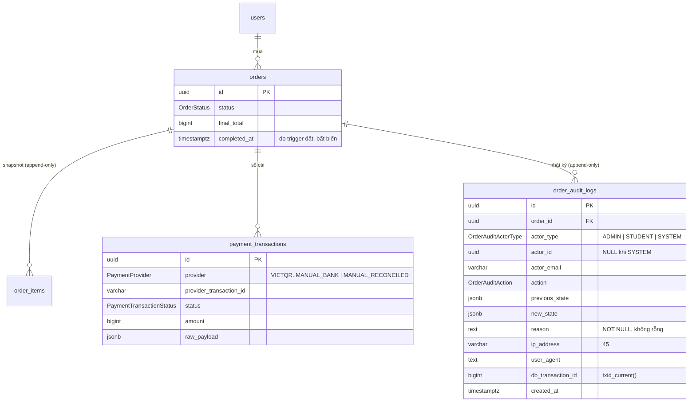
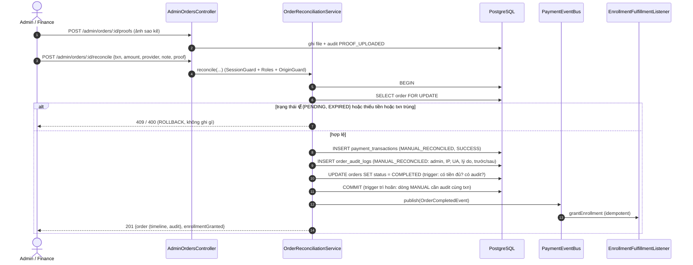
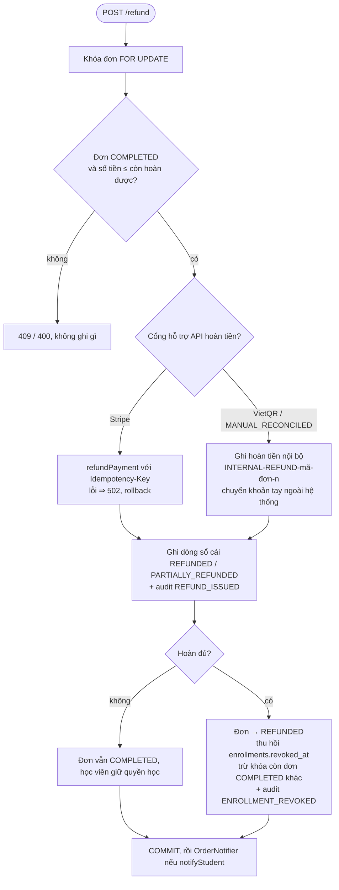

# PAY17: Quản trị đơn hàng, Đối soát thủ công và Nhật ký kiểm toán bất biến

## 1. Ba nguyên tắc bất biến

| # | Nguyên tắc | Bảo đảm bởi |
| --- | --- | --- |
| 1 | **Cấm ghi đè trạng thái trực tiếp.** Không có `PATCH/PUT/DELETE` đơn hàng, không có nút/endpoint "đánh dấu đã thanh toán". Admin chỉ có hai đường làm đổi trạng thái: *đối soát thủ công* và *hoàn tiền* | `AdminOrdersController` chỉ khai báo `GET` + `POST …/reconcile`, `POST …/refund`, `POST/GET …/proofs`; test duyệt toàn bộ route của ứng dụng (không có `PATCH/PUT/DELETE` nào dưới `orders`); PostgreSQL từ chối `COMPLETED` nếu sổ cái chưa có tiền `SUCCESS` đủ tổng đơn |
| 2 | **Đối soát chỉ qua quy trình có kiểm toán.** Phải nhập mã giao dịch ngân hàng thật, lý do bắt buộc (≥ 10 ký tự), chứng từ (UI bắt buộc) — trong **một** transaction: ghi `payment_transactions` (`MANUAL_RECONCILED`) → ghi `order_audit_logs` → mới đổi trạng thái đơn | `OrderReconciliationService` (khóa `FOR UPDATE`); trigger trì hoãn `payment_transactions_require_audit` không cho commit dòng `MANUAL_RECONCILED` / dòng hoàn tiền nếu thiếu dòng audit cùng transaction |
| 3 | **Nhật ký chỉ ghi thêm.** Mọi can thiệp thủ công, lượt xem chi tiết, hoàn tiền, đối soát đều có dòng audit với người thực hiện, IP, user-agent, lý do, trạng thái trước/sau | `order_audit_logs`: trigger từ chối `UPDATE`/`DELETE`/`TRUNCATE`; `reason` không rỗng (CHECK); dòng `ADMIN` bắt buộc có IP (CHECK); mọi lần đổi `orders.status` đều kéo theo dòng audit cùng transaction (trigger) |

## 2. Mô hình dữ liệu

Migration `202610150001_order_audit_logs.ts`.

### `order_audit_logs`

| Cột | Ghi chú |
| --- | --- |
| `action` | `CREATED`, `STATUS_CHANGED`, `MANUAL_RECONCILED`, `REFUND_ISSUED`, `ENROLLMENT_REVOKED`, `NOTE_ADDED` + hai giá trị bổ sung: `DETAIL_VIEWED` (xem chi tiết/chứng từ — yêu cầu "xem chi tiết phải được ghi" cần một action) và `PROOF_UPLOADED` (đăng ký chứng từ thuộc đơn nào) |
| `actor_type` / `actor_id` | `ADMIN` (admin hoặc finance officer), `STUDENT` (người mua tự tạo đơn), `SYSTEM` (webhook, job hết hạn…). Yêu cầu nêu `actorId` là "Admin id hoặc `'SYSTEM'`": cột `uuid` không chứa được chữ `SYSTEM` nên `SYSTEM` ⇔ `actor_id IS NULL` (CHECK), API trả `actorId: "SYSTEM"`. Không có FK tới `users` để nhật ký tồn tại lâu hơn tài khoản |
| `actor_email` | ảnh chụp email tại thời điểm hành động |
| `previous_state` / `new_state` | JSONB; mọi dòng đổi trạng thái chứa `status` |
| `reason` | `NOT NULL` + CHECK không rỗng. Hành động của admin: lý do do admin nhập; xem chi tiết: văn bản cố định; hệ thống: mô tả chuyển trạng thái |
| `ip_address varchar(45)`, `user_agent` | lấy từ request (`req.ip`, `User-Agent`) |
| `db_transaction_id` | `txid_current()`; cho phép trigger kiểm tra "audit cùng transaction" |

### Các trigger bảo vệ (PostgreSQL)

| Trigger | Tác dụng |
| --- | --- |
| `order_audit_logs_append_only` (+ `no_truncate`) | `UPDATE`/`DELETE`/`TRUNCATE` ⇒ `restrict_violation` (23001) |
| `orders_audit_created` | `INSERT orders` ⇒ dòng `CREATED` (actor `STUDENT`) |
| `orders_audit_status_change` | mỗi lần đổi `status`, nếu transaction chưa có dòng audit tương ứng ⇒ tự ghi `STATUS_CHANGED` (actor `SYSTEM`). Workflow tự ghi dòng giàu thông tin *trước* nên không bị ghi trùng |
| `orders_guard_update` (mở rộng) | `→ COMPLETED` chỉ khi tổng `SUCCESS` ≥ `final_total`; `→ REFUNDED` chỉ khi tổng dòng hoàn ≥ tổng đã thu; `completed_at` do DB đặt một lần, không sửa được |
| `payment_transactions_require_audit` (deferred) | dòng `MANUAL_RECONCILED` cần audit `MANUAL_RECONCILED`; dòng `REFUNDED`/`PARTIALLY_REFUNDED` cần audit `REFUND_ISSUED` — cùng transaction, kiểm tra lúc COMMIT |

> Hệ quả: dù ai đó chạy SQL trực tiếp, không thể đưa đơn sang `COMPLETED` mà không có tiền
> trong sổ cái, và không thể đổi trạng thái mà không để lại dấu vết.

### Quyết định thiết kế đáng chú ý

* **`MANUAL_RECONCILED`** là giá trị mới của enum DB `PaymentProvider` và là kiểu `LedgerProvider`
  trong code, **không** thuộc `PaymentProviderEnum` — nên không bao giờ là lựa chọn checkout và không có adapter.
  Kênh thật mà học viên đã dùng (`VIETQR`, `STRIPE`, …) nằm trong `raw_payload.reconciliation.declaredProvider`
  và audit `new_state.declaredProvider`.
* **Một giao dịch ngân hàng chỉ chống lưng cho một khoản thanh toán**: đối soát bị từ chối
  (`PROVIDER_TRANSACTION_ALREADY_RECORDED`) nếu mã đó đã có trong sổ cái dưới kênh khai báo hoặc `MANUAL_RECONCILED`.
  Webhook thật đến muộn sau khi đã đối soát chỉ tạo dòng `FAILED/IGNORED`, không tạo thêm `SUCCESS`.
* **`PARTIALLY_REFUNDED` là trạng thái của sổ cái, không phải của đơn**: hoàn một phần giữ đơn `COMPLETED`
  (học viên vẫn học), dòng sổ cái là `PARTIALLY_REFUNDED`, và `summary.refundStatus` suy ra từ sổ cái.
  Hoàn đủ ⇒ đơn `REFUNDED` + thu hồi quyền học.
* **`completedAt`** là cột mới `orders.completed_at` do trigger đặt (được backfill cho đơn cũ), để lọc/sắp xếp theo ngày hoàn tất.
* **Đơn cũ** được backfill một dòng `CREATED` (actor `SYSTEM`).
* **Vai trò `finance_officer`** được seed trong `roles`; guard của `/admin/orders` nhận `admin` và `finance_officer`.
  API quản lý người dùng nhận thêm `FINANCE_OFFICER` để gán vai trò.
* Tên khóa học luôn lấy từ **snapshot** `order_items.course_title_snapshot`; module admin không JOIN `courses`.

## 3. API

Mọi route phục vụ ở cả `/admin/orders` và `/api/v1/admin/orders`; yêu cầu session, vai trò `admin|finance_officer`;
các route `POST` yêu cầu `Origin` hợp lệ. `:id` là UUID hoặc mã đơn.

| Method + đường dẫn | Mô tả |
| --- | --- |
| `GET /admin/orders` | Danh sách: `q` (mã đơn, email/tên học viên, tên khóa học snapshot, `providerTransactionId`), `status`, `provider`, `dateField` (`createdAt`\|`completedAt`) + `dateFrom`/`dateTo`, `amountMin`/`amountMax`, `sortBy` (whitelist), `sortOrder`, `page`, `limit ≤ 100`. Ký tự `% _ \` trong ô tìm kiếm là chữ thường |
| `GET /admin/orders/:id` | Chi tiết: học viên, snapshot từng khóa, tóm tắt tài chính, sổ cái, **timeline**, nhật ký audit, cờ `actions`. Việc mở chi tiết ghi `DETAIL_VIEWED` |
| `POST /admin/orders/:id/reconcile` | `{providerTransactionId, amountReceived, provider, note, proofImageUrl?}` → `201 {order, enrollmentGranted}` |
| `POST /admin/orders/:id/refund` | `{refundAmount, reason, notifyStudent}` → `201 {order, refund}` |
| `POST /admin/orders/:id/proofs` | upload chứng từ (png/jpg/webp/pdf ≤ 5 MB, kiểm tra magic bytes) → `{proofKey, proofImageUrl}`; ghi `PROOF_UPLOADED` |
| `GET /admin/orders/:id/proofs/:key` | đọc chứng từ (chỉ khi `PROOF_UPLOADED` thuộc đúng đơn); ghi `DETAIL_VIEWED` |
| `GET /orders/:ref` (có sẵn) | nhánh dành cho staff nay cũng ghi `DETAIL_VIEWED` |

Mã lỗi (`message`): `ORDER_NOT_FOUND` 404; `ORDER_NOT_RECONCILABLE`, `ORDER_NOT_REFUNDABLE`,
`PROVIDER_TRANSACTION_ALREADY_RECORDED` 409; `AMOUNT_BELOW_ORDER_TOTAL`, `REFUND_EXCEEDS_REFUNDABLE`,
`PROOF_NOT_FOUND`, `PROOF_URL_INVALID`, `PROOF_TYPE_NOT_SUPPORTED`, `PROOF_REQUIRED` 400; `PROOF_TOO_LARGE` 413;
lỗi cổng hoàn tiền 502 (không ghi gì).

Đã đối chiếu yêu cầu: `amountReceived`/`refundAmount` là số nguyên an toàn (đơn vị nhỏ nhất) trong JSON thay vì `bigint`;
`proofImageUrl` là tùy chọn ở API (đúng đặc tả) nhưng UI bắt buộc tải chứng từ lên.

## 4. Quy trình đối soát

## 5. Quy trình hoàn tiền

Gọi cổng diễn ra khi đang giữ khóa đơn và trước mọi lần ghi; khóa idempotency là
`sha256(refund:<orderId>:<đã hoàn>:<số tiền>)` nên gọi lại sau khi mất phản hồi trả về cùng một lần hoàn.
`notifyStudent` được lưu vào audit và gọi cổng `OrderNotifier`; hệ thống chưa có kênh email nên adapter mặc định
chỉ ghi log (thay bằng adapter thật khi có hạ tầng thư).

`GrantEnrollment` đã được chỉnh để **kích hoạt lại** enrollment đã thu hồi (giữ nguyên id và tiến độ học)
khi học viên mua lại và thanh toán được xác minh.

## 6. Timeline giao dịch

Suy ra (không lưu riêng) từ sổ cái + audit + enrollment bởi `buildTimeline`:
`ORDER_CREATED → PAYMENT_INITIATED → WEBHOOK_RECEIVED | PAYMENT_FAILED | MANUAL_RECONCILED → ORDER_COMPLETED → ENROLLMENT_GRANTED → REFUND_ISSUED → ENROLLMENT_REVOKED`
(+ `ORDER_EXPIRED`, `ORDER_CANCELLED`). Mốc thời gian dùng đồng hồ DB (`now()`), nên các sự kiện trong cùng transaction
(ghi sổ cái, hoàn tất đơn) cùng mốc và giữ đúng thứ tự nhân quả.

## 7. Kiểm thử

| Tầng | Tệp | Chứng minh |
| --- | --- | --- |
| Tích hợp API + DB | `apps/api/test/modules/payment/admin-orders.spec.ts` | không có route sửa trạng thái; DB từ chối `COMPLETED` không có tiền, dòng thủ công/hoàn tiền không có audit; SQL đổi trạng thái vẫn để lại audit; phân quyền (401/403/Origin); đối soát: thành công, EXPIRED, trạng thái không hợp lệ, validate, trùng giao dịch, tranh chấp đồng thời, rollback khi audit lỗi, webhook đến muộn không nhân đôi; chứng từ (upload, riêng tư, URL độc hại); hoàn tiền một phần/toàn phần/vượt mức/đồng thời/qua Stripe/cổng lỗi; audit append-only, ràng buộc CHECK, vòng đời, ghi lượt xem; tìm kiếm/lọc/sắp xếp/phân trang |
| Đơn vị | `admin-order-timeline.spec.ts`, `stripe-provider.adapter.spec.ts` (refund) | dựng timeline, escape LIKE, hoàn tiền Stripe |
| Web (vitest) | `apps/web/src/features/admin-orders/*.test.tsx`, `src/lib/admin-access.test.ts` | lọc/bảng/drawer/modal, phân quyền finance officer, không có lời gọi `PATCH/PUT/DELETE` hay điều khiển đổi trạng thái |
| E2E (Playwright, stack thật) | `apps/web/e2e/admin-orders.spec.ts` | học viên mua → admin tìm đơn → đối soát có chứng từ → học viên được cấp quyền → hoàn tiền một phần → hoàn đủ và thu hồi quyền; finance officer chỉ thấy console đơn hàng; học viên bị chặn. Chạy cả desktop và mobile. Cần `E2E_ADMIN_EMAIL`, `E2E_FINANCE_EMAIL`, `E2E_STAFF_PASSWORD` |

## 8. Giới hạn đã biết

* Chỉ ghi nhận can thiệp đã commit; các nỗ lực bị từ chối (409/400/403) không tạo dòng audit
  (chúng không thay đổi dữ liệu). Nếu cần giám sát nỗ lực thất bại, thêm log truy cập/WAF riêng.
* Tìm kiếm dùng `ILIKE '%…%'` (không dùng `pg_trgm`); đủ cho khối lượng quản trị, cần chỉ mục trigram khi bảng đơn rất lớn.
* Ứng dụng và DB dùng chung một tài khoản DB nên "append-only" dựa vào trigger; môi trường production nên tách
  vai trò DB và `REVOKE UPDATE, DELETE, TRUNCATE ON order_audit_logs` khỏi vai trò ứng dụng.
* Chưa có kênh email cho `notifyStudent` (xem mục 5).
* `ip_address` là `req.ip` (IP socket). Theo `docs/auth.md` không bật `trust proxy` tùy ý; khi triển khai sau reverse proxy
  phải cấu hình proxy tin cậy để nhật ký ghi IP người dùng thật thay vì IP proxy.
* Mỗi lần mở chi tiết ghi một dòng `DETAIL_VIEWED` (kể cả mở lại); UI không tự tải lại chi tiết để tránh làm đầy nhật ký.
