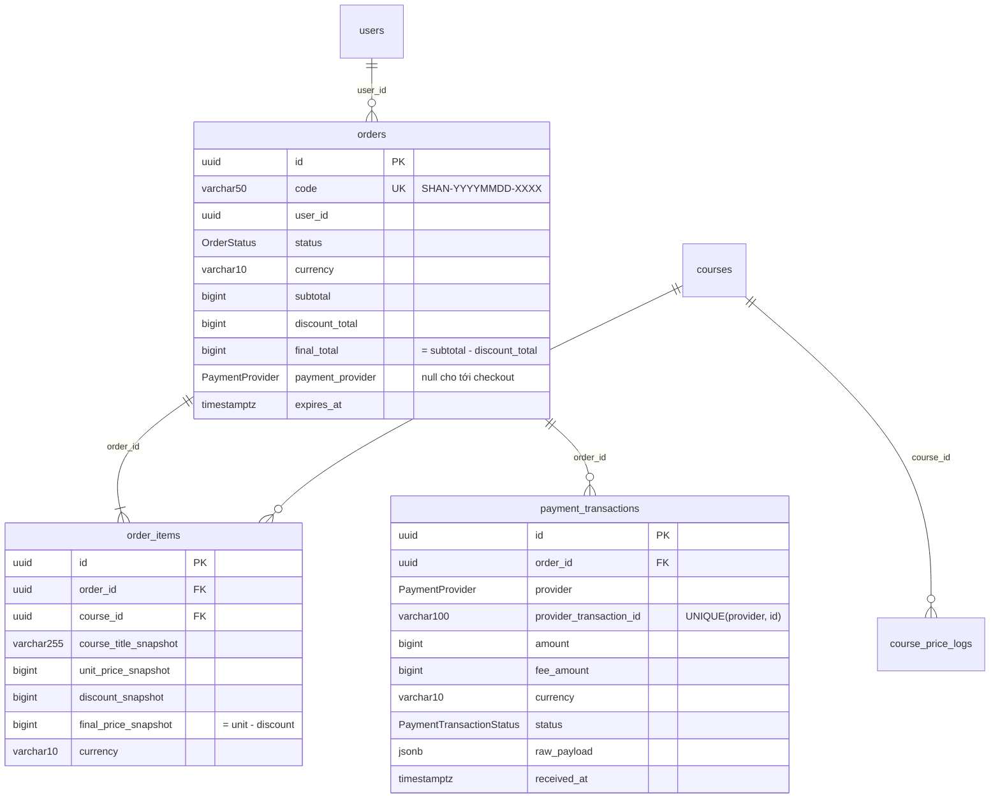

# PAY3–PAY5: Persistence thanh toán, Data Snapshot và Audit Ledger

## 1. Bất biến persistence

> Mọi `Order` và `OrderItem` **chụp lại** dữ liệu tại thời điểm giao dịch. Không
> bao giờ dùng giá/tên hiện tại của `Course` hay JOIN tới `courses` để tính lại
> số tiền của một đơn đã tạo.

Ví dụ: T1 học viên A tạo đơn mua khóa A giá 499.000đ; T2 giảng viên đổi giá
thành 799.000đ và đổi tên thành "Khóa học A (2026 Edition)". Đơn của A vẫn là
`unitPriceSnapshot = 499000`, `courseTitleSnapshot = "Khóa học A"`; đơn tạo ở T2
nhận 799.000đ. Bất biến này được bảo đảm ở **ba tầng**:

| Tầng | Cơ chế |
| --- | --- |
| Ghi | `buildOrderSnapshot` (hàm thuần) tạo dữ liệu đóng băng; `OrderFactoryService` ghi header + items trong **một transaction**, đọc `courses` bằng `FOR SHARE` (xem §6) |
| Đọc | `OrderQueryService` chỉ đọc `orders`, `order_items`, `payment_transactions`; test tĩnh cấm file này nhắc tới `Course`/bảng `courses`/join |
| Cơ sở dữ liệu | Trigger: item bất biến và append-only; header tài chính bất biến; tổng đơn phải bằng tổng item (kiểm tra lúc COMMIT); máy trạng thái đơn |

## 2. Mô hình dữ liệu

Migration `202610110001_payment_persistence.ts`. Tiền luôn là số nguyên đơn vị
nhỏ nhất (`bigint`), TypeORM đọc về `number` qua `bigintNumberTransformer` (ném
lỗi nếu vượt `MAX_SAFE_INTEGER`).

### 2.1. `orders`
`orders.amount` → `final_total`; thêm `subtotal`, `discount_total`; `course_id`
chuyển xuống `order_items` (đơn nhiều khóa). `code varchar(50)` duy nhất.
`status`: `PENDING`, `PROCESSING`, `COMPLETED`, `CANCELLED`, `EXPIRED`,
`REFUNDED`. `currency varchar(10)` (CHECK `VND|USD`). Ràng buộc:
`final_total = subtotal - discount_total`, `0 ≤ discount_total ≤ subtotal`.

### 2.2. `order_items` (snapshot)
`position` (thứ tự người mua chọn; đơn trước migration hardening đều là 0), tên khóa (≤255 ký tự, cắt theo code point), giá niêm yết, giảm giá riêng và giá
cuối; unique `(order_id, course_id)`. CHECK `final = unit - discount`,
`0 ≤ discount ≤ unit`, tên không rỗng. Đơn cũ được backfill: giá lấy từ
`orders.amount` cũ (đúng số đã đóng băng); **tên** của đơn cũ chỉ có thể lấy
từ tên khóa học hiện tại (trước PAY3 chưa từng được lưu).

### 2.3. `payment_transactions` (sổ cái dòng tiền)
Mỗi dòng là một **sự kiện thanh toán**: `provider` (`VIETQR|STRIPE|MOMO|VNPAY|
MANUAL_BANK`), `provider_transaction_id` duy nhất **theo cổng**, số tiền cổng
thực ghi nhận, `fee_amount`, `currency`, `status`
(`INITIATED|SUCCESS|FAILED|REFUNDED|PARTIALLY_REFUNDED`), `raw_payload` (JSONB
nguyên bản webhook/API), `received_at`, `updated_at`. Hoàn tiền là **dòng mới**
(`REFUNDED`/`PARTIALLY_REFUNDED`, `amount` = số tiền hoàn), không sửa dòng
`SUCCESS` gốc. "FAILED" nghĩa là "lần thanh toán này không dẫn tới cấp quyền":
kể cả khoản tiền thật đã về nhưng đơn không còn hoàn tất được (hết hạn, đã hủy,
đã trả…) — payload thô được giữ để hoàn tiền/đối soát.

## 3. Bảo đảm ở tầng cơ sở dữ liệu

| Đối tượng | Trigger / ràng buộc |
| --- | --- |
| `order_items` | `BEFORE UPDATE OR DELETE` → từ chối (`restrict_violation`, `23001`); `BEFORE INSERT` chỉ cho đơn đang `PENDING` |
| `orders` | UPDATE không được đổi `code, user_id, currency, subtotal, discount_total, final_total, created_at`; DELETE bị từ chối |
| Trạng thái đơn | Chỉ `PENDING→{PROCESSING,COMPLETED,EXPIRED,CANCELLED}`, `PROCESSING→{COMPLETED,EXPIRED,CANCELLED}`, `EXPIRED→COMPLETED` (thanh toán trong cửa sổ, webhook đến muộn), `COMPLETED→REFUNDED`; trùng với `canTransitionOrder` |
| Tổng đơn | `CONSTRAINT TRIGGER … DEFERRABLE INITIALLY DEFERRED` trên `orders` và `order_items`: lúc COMMIT đơn phải có ≥1 item, tổng `unit/discount/final` khớp header, cùng tiền tệ |
| `payment_transactions` | Chỉ dòng `INITIATED` được cập nhật (một lần, sang trạng thái cuối); `order_id`, `provider`, `created_at` luôn bất biến; DELETE bị từ chối |

`down()` của migration từ chối (không mất dữ liệu) khi tồn tại đơn nhiều
item, đơn có giảm giá, giao dịch không phải VietQR hoặc bản ghi hoàn tiền.

## 4. Mã đơn hàng

`SHAN-YYYYMMDD-XXXX` (ngày UTC, 4 ký tự từ bảng chữ không gây nhầm lẫn). Ngân
hàng hay xóa ký tự đặc biệt, nên nội dung chuyển khoản/QR là mã **bỏ dấu
gạch**; `extractOrderCode` chuẩn hóa nội dung chuyển khoản (không phân biệt hoa
thường, chấp nhận dấu cách/gạch) về dạng chuẩn và vẫn nhận mã cũ `SHAN`+6 ký tự.
Va chạm mã (duy nhất bởi `orders_code_key`) làm lại **cả transaction** với mã mới
(tối đa 5 lần, sau đó `409 ORDER_CODE_GENERATION_FAILED`).

## 5. Services

| Service | Trách nhiệm |
| --- | --- |
| `OrderFactoryService.createOrder(userId, { courseIds })` | Khóa các khóa học `FOR SHARE` theo thứ tự id, kiểm tra (đã publish, `PAID`, chưa ghi danh, cùng tiền tệ), `buildOrderSnapshot`, ghi order + items nguyên tử |
| `OrderQueryService.getOrderDetails(orderId, access)` / `listUserOrders` (`access` bắt buộc: `{ userId }` hoặc `{ staff: true }`, không có mặc định) | Đọc từ snapshot, `REPEATABLE READ` để header/items/payments nhất quán; không bao giờ trả `raw_payload` |
| `PaymentTransactionService` | `record` (idempotent theo `(provider, providerTransactionId)`), `settle` (hoàn tất dòng `INITIATED` tại chỗ), `recordRefund` (khóa order, không hoàn quá số đã thu, `REFUNDED` toàn phần chuyển đơn sang `REFUNDED`) |

Hoàn tiền hiện chỉ ghi sổ cái và đổi trạng thái đơn; **không** thu hồi
enrollment (quyết định chính sách truy cập, cần chốt riêng).

## 6. Đồng thời

- Tạo đơn đọc `courses` bằng `FOR SHARE`; đổi giá khóa học dùng
  `FOR NO KEY UPDATE`. Hai khóa này loại trừ nhau (đơn luôn chụp giá trước
  *hoặc* sau thay đổi) nhưng `FOR NO KEY UPDATE` **không** chặn `FOR KEY SHARE`
  mà khóa ngoại của `enrollments`/`order_items` lấy trên `courses` — nếu dùng
  `FOR UPDATE`, webhook (đang giữ khóa order, cần key-share course) và đổi giá
  (giữ khóa course, cần update order) sẽ deadlock.
- Webhook/hoàn tiền khóa dòng `orders` (`pessimistic_write`); giao hàng trùng
  được chuỗi hóa.

## 7. API

| Endpoint | Mô tả |
| --- | --- |
| `POST /orders` `{ courseIds }` | Tạo đơn (1–20 khóa, không trùng; tối đa 10 đơn PENDING chưa hết hạn/người; cần `Origin`) |
| `GET /orders`, `GET /orders/:id` | Lịch sử/chi tiết từ snapshot (chủ đơn; admin xem mọi đơn) |
| `GET /orders/:id/status` | Trạng thái |

## 8. Kiểm thử

- `src/modules/payment/order-snapshot.spec.ts`: hàm thuần (snapshot, tổng,
  title 255 code point, mã đơn, chuẩn hóa memo, máy trạng thái).
- `test/modules/payment/order-snapshot.spec.ts` (PostgreSQL thật): kịch bản
  T1/T2 qua HTTP và qua SQL trực tiếp (kể cả đổi khóa sang FREE), đơn nhiều
  khóa và rollback nguyên tử, va chạm mã, trigger từ chối sửa/xóa, tổng không
  khớp bị chặn lúc COMMIT, sổ cái idempotent, hoàn tiền một phần/toàn phần,
  hủy đơn khi khóa học thành FREE, đua checkout × đổi giá × webhook.
