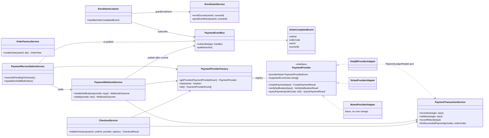

# PAY6–PAY9: Checkout và Payment Provider Abstraction Layer

## 1. Mục tiêu và bất biến kiến trúc

Tách **Core Payment Domain** (Order, Enrollment, sổ cái giao dịch) khỏi **cổng
thanh toán cụ thể** (VietQR, Stripe, MoMo, VNPay) bằng một lớp trừu tượng và
Strategy Pattern.

| # | Bất biến | Cơ chế bảo đảm |
| --- | --- | --- |
| 1 | Core chỉ phụ thuộc interface `PaymentProvider`, không import SDK/logic của cổng | `CheckoutService`, `PaymentWebhookService`, `PaymentReconciliationService`, `EnrollmentService/Listener` chỉ nhận `PaymentProviderFactory`; test kiến trúc quét import và từ khóa `stripe/vietqr/momo/...` trong các file core |
| 2 | Plug & Play: thêm cổng chỉ cần thêm một Strategy | Thêm một class `implements PaymentProvider` và một dòng trong `PaymentModule`; test dựng cổng MoMo giả chạy trọn luồng checkout → webhook → enrollment mà không sửa dòng nào của core |
| 3 | Mọi kết quả bất đồng bộ phải qua `verifyNotification` | `PaymentWebhookService.handleNotification` gọi `verifyNotification` trước mọi thao tác; `isValid: false` → `401` ngay, không ghi sổ cái, không đổi Order |

## 2. Cấu trúc mã nguồn

`apps/api/src/modules/payment/`

| Đường dẫn | Vai trò |
| --- | --- |
| `interfaces/payment-provider.enum.ts` | `PaymentProviderEnum`, `PaymentStatusEnum` (nguồn duy nhất, entity dùng chung) |
| `interfaces/payment-provider.interface.ts` | `PaymentProvider`, các DTO, `PaymentLedgerReader`, token `PAYMENT_PROVIDERS` |
| `payment-provider.factory.ts` | `PaymentProviderFactory` — registry, `getProvider(enum)` |
| `providers/vietqr/*` | `VietQRProviderAdapter` + URL QR + parser thông báo ngân hàng |
| `providers/stripe/*` | `StripeProviderAdapter` + xác minh chữ ký + ánh xạ sự kiện |
| `checkout.service.ts` | `CheckoutService.initiateCheckout` |
| `payment-webhook.service.ts` | `PaymentWebhookService` (xác minh → khóa order → ghi sổ cái → hoàn tất → phát sự kiện) |
| `webhook.controller.ts` | `POST /payments/webhook/:provider` |
| `events/*` | `OrderCompletedEvent`, `PaymentEventBus`, `PaymentEventsModule` |
| `payment-reconciliation.service.ts`, `.worker.ts` | Lưới an toàn: webhook thất lạc, listener thất bại |
| `courses/enrollment.service.ts` | `EnrollmentService.grantEnrollment(userId, courseId)` |
| `courses/enrollment.listener.ts` | `EnrollmentListener` — lắng nghe `OrderCompletedEvent` |

> `OrderService` trong mô tả yêu cầu tương ứng với nhóm `OrderFactoryService`
> (tạo đơn, chụp giá), `OrderQueryService` (đọc đơn) và `CheckoutService`
> (bắt đầu thanh toán). Không có lớp trung gian thứ tư: chúng đều chỉ biết
> interface.

## 3. Hợp đồng `PaymentProvider`

```ts
interface PaymentProvider {
  readonly providerName: PaymentProviderEnum;
  readonly supportedCurrencies: readonly string[];
  createPayment(input: CreatePaymentInput): Promise<CreatePaymentResult>;
  verifyNotification(input: VerifyNotificationInput): Promise<VerifyNotificationResult>;
  queryPayment(orderCode: string, providerTransactionId?: string): Promise<QueryPaymentResult>;
}
```

Tiền là `bigint` theo đơn vị nhỏ nhất (VND đồng, USD cent). Cột của sổ cái và
đơn là số nguyên an toàn; `money.ts` chuyển qua lại và ném lỗi nếu vượt
`Number.MAX_SAFE_INTEGER`. Mọi `rawPayload` phải là JSON thuần (không `bigint`).

**Bổ sung so với đặc tả ban đầu** (mỗi mục đều có lý do an toàn):

| Trường thêm | Lý do |
| --- | --- |
| `PaymentProvider.supportedCurrencies` | Luật "cổng nào thu được tiền gì" thuộc về cổng; `CheckoutService` kiểm tra trước khi gọi. Nhờ đó `POST /orders` không còn ràng buộc VND (trước đây do VietQR) |
| `VerifyNotificationResult.currency`, `QueryPaymentResult.currency` | So số tiền mà không so tiền tệ là lỗi nghiêm trọng (1999 USD-cent ≠ 1999 đồng) |
| `VerifyNotificationResult.memo?` | Nội dung chuyển khoản của người trả, lưu vào `payment_transactions.transfer_content` để đối soát |
| `CreatePaymentResult.expiresAt?` | Thời điểm cuối cùng người mua còn thanh toán được qua lần thử này (Stripe tối thiểu 30 phút) |

**Ngữ nghĩa trạng thái** (`PaymentStatusEnum`): `SUCCESS`; `FAILED`/`CANCELLED`/
`EXPIRED` (lần thử thất bại — Order vẫn `PENDING` để đổi cổng); `PENDING`
(chưa có gì để thanh toán, hoặc sự kiện không liên quan — core trả `200
ACKNOWLEDGED` để cổng không retry).

**Quy tắc ngoại lệ**: một yêu cầu giả mạo/sai chữ ký **không bao giờ ném lỗi**
mà trả `isValid: false` (mọi trường còn lại bị bỏ qua). Payload đã xác thực
nhưng sai định dạng ném `400 INVALID_NOTIFICATION_PAYLOAD`. Mọi phương thức
`async` nên lỗi luôn là Promise bị reject, không ném đồng bộ.

## 4. Provider Factory và cách thêm một cổng

```ts
@Injectable()
class PaymentProviderFactory {
  constructor(@Inject(PAYMENT_PROVIDERS) providers: readonly PaymentProvider[]);
  getProvider(name: PaymentProviderEnum): PaymentProvider; // 404 PAYMENT_PROVIDER_UNAVAILABLE
  has(name): boolean;
  list(): PaymentProviderEnum[];
}
```

Đăng ký trùng `providerName` làm ứng dụng không khởi động. Thêm MoMo:

1. Viết `MomoProviderAdapter implements PaymentProvider` trong `providers/momo/`.
2. Khai báo nó trong `providers` và trong `inject` của `PAYMENT_PROVIDERS` ở
   `payment.module.ts` (đây là *composition root*, được phép biết cổng cụ thể).
3. Xong — enum DB `PaymentProvider` đã có sẵn `MOMO`; route
   `POST /payments/webhook/momo` hoạt động ngay.

## 5. Các Strategy mẫu

### 5.1. `VietQRProviderAdapter` (chuyển khoản ngân hàng)

- `createPayment`: sinh QR động `img.vietqr.io` hoặc `qr.sepay.vn`
  (`VIETQR_QR_FORMAT=sepay`) chứa số tiền đã đóng băng và nội dung chuyển
  khoản là mã đơn **bỏ dấu gạch** (ngân hàng thường xóa ký tự đặc biệt).
  `providerTransactionId = VIETQR-<orderCode>` nên bắt đầu checkout lại là
  idempotent. Thiếu `VIETQR_ACCOUNT_NO/BANK_ID` → `503` (không sinh QR sai).
- `verifyNotification`: khóa chia sẻ `x-api-key` hoặc `Authorization: Apikey
  <key>` (so sánh thời gian hằng); nếu đặt `BANK_WEBHOOK_HMAC_SECRET` thì còn
  bắt buộc `x-signature` = HMAC-SHA256 của **raw body**. Thiếu khóa cấu hình →
  từ chối (fail-closed). Hiểu hai dạng payload: gốc
  `{ transactionId, amount, transferContent }` và SePay
  `{ id, referenceCode, transferType, transferAmount, content }`; giao dịch
  ghi nợ (`out`) chỉ được xác nhận, không bao giờ thanh toán đơn. Nội dung
  không chứa mã đơn → `orderCode: ''` → core bỏ qua (`IGNORED`).
- `queryPayment`: chuyển khoản là kênh đẩy, không có API hỏi ngược; adapter
  trả lời từ các thông báo **đã xác minh** trong sổ cái (qua port
  `PaymentLedgerReader`).

### 5.2. `StripeProviderAdapter` (Checkout hosted page)

- Gọi REST `POST /v1/checkout/sessions` (không dùng SDK: ít phụ thuộc, test
  xác định bằng `fetch` giả, không đụng lockfile). `client_reference_id` =
  mã đơn; `metadata[order_id|order_code]`; `unit_amount` là đơn vị nhỏ nhất
  của Stripe, trùng đơn vị nền tảng (VND là zero-decimal, USD là cent).
  `expires_at = now + 31 phút` (Stripe yêu cầu ≥ 30). Lỗi cổng → `502` với mã
  chung, chi tiết chỉ ghi log.
- `verifyNotification`: header `Stripe-Signature: t=…,v1=…` — HMAC-SHA256 của
  `"<t>.<raw body>"` với `whsec_…`, so sánh hằng-thời-gian với mọi `v1`, dung
  sai 300 giây chống replay. JSON được parse **từ chính các byte đã ký**.
  Ánh xạ: `checkout.session.completed` + `paid` → `SUCCESS`; `completed` +
  `unpaid` (thanh toán trễ) → `PENDING`; `async_payment_succeeded` →
  `SUCCESS`; `async_payment_failed` → `FAILED`; `expired` → `EXPIRED`; sự kiện
  khác → `PENDING` không mã đơn.
- `queryPayment`: `GET /v1/checkout/sessions/{id}`; từ chối trả lời nếu
  `client_reference_id` không khớp mã đơn (không lộ session của đơn khác).

## 6. Checkout — `CheckoutService.initiateCheckout(userId, orderId, provider, { returnUrl?, cancelUrl? })`

`POST /orders/:id/checkout` `{ provider, returnUrl?, cancelUrl? }`

1. Lấy provider qua factory (`404` nếu chưa đăng ký, `400` nếu giá trị không
   thuộc enum).
2. Đọc Order của chính người dùng (`404` nếu không phải chủ); yêu cầu
   `PENDING` (`409 ORDER_NOT_PAYABLE`) và chưa hết hạn (`409 ORDER_EXPIRED`);
   tiền tệ phải thuộc `supportedCurrencies` (`400
   PAYMENT_CURRENCY_NOT_SUPPORTED`).
3. `returnUrl/cancelUrl` phải **cùng origin** với `WEB_ORIGIN` (chống open
   redirect, `400 INVALID_REDIRECT_URL`); mặc định
   `<origin>/orders/<id>?checkout=success|cancelled`.
4. Gọi `provider.createPayment(...)` **ngoài** transaction DB: cổng chậm không
   giữ khóa Order và không chặn webhook của chính đơn đó. Mô tả sản phẩm lấy
   từ tên khóa học **đã chụp** trong `order_items`.
5. Transaction ngắn: khóa Order (`pessimistic_write`), kiểm tra lại còn
   thanh toán được (trong lúc gọi cổng đơn có thể đã được trả/hủy), ghi dòng
   sổ cái `INITIATED`, cập nhật `orders.payment_provider`, và **gia hạn
   `expires_at` đến hết cửa sổ của cổng** (tối đa 24 giờ) để khoản thanh toán
   thực hiện trong cửa sổ đó vẫn được ghi nhận.
6. Trả `paymentUrl` hoặc `qrCodeUrl`.

Người mua có thể đổi cổng khi đơn còn `PENDING`; các lần thử cũ để nguyên.

## 7. Webhook và hoàn tất đơn

`POST /payments/webhook/:provider` (không guard phiên: tính xác thực do chính
provider kiểm tra). `rawBody` được bật (`rawBody: true` trong `main.ts`).

```text
handleNotification(provider, {headers, payload, rawBody})
  verified = provider.verifyNotification(...)
  if !verified.isValid                      -> 401 INVALID_WEBHOOK_SIGNATURE   (không side effect)
  settle(provider, fact)
    PENDING                                 -> ACKNOWLEDGED
    không có mã đơn / không tìm thấy order  -> IGNORED
    TRANSACTION
      SELECT order FOR UPDATE (pessimistic)
      fact != SUCCESS                       -> sổ cái FAILED, order giữ PENDING     -> PAYMENT_FAILED
      order PENDING nhưng quá hạn           -> EXPIRED
      sai tiền tệ                           -> sổ cái FAILED                        -> CURRENCY_MISMATCH
      order không còn PENDING               -> sổ cái FAILED (bằng chứng)           -> IGNORED
      amount < finalTotal                   -> sổ cái FAILED, order VẪN PENDING     -> PARTIAL_AMOUNT
      đủ tiền                               -> sổ cái SUCCESS, order COMPLETED      -> COMPLETED
    COMMIT
    nếu COMPLETED: publish OrderCompletedEvent (SAU commit)
```

- **Idempotency** nằm ở sổ cái: `UNIQUE(provider, provider_transaction_id)`.
  `PaymentTransactionService.settle` hoàn tất dòng `INITIATED` tại chỗ (khớp
  theo id của cổng, nếu không thì lần thử mới nhất của đơn cho cổng đó), hoặc
  thêm dòng mới (thanh toán không qua checkout, ví dụ quét QR có sẵn). Một sự
  kiện đã chốt trả về `created: false` → `ALREADY_PROCESSED`; giao hàng trùng
  đồng thời được chuỗi hóa bởi khóa Order.
- **Bằng chứng thanh toán muộn**: tiền về cho đơn không còn hoàn tất được (hết
  hạn, đã hủy, đã trả, đã hoàn) được lưu ở trạng thái `FAILED` kèm
  `raw_payload`, không cấp thêm quyền; bộ phận tài chính hoàn tiền thủ công.
- Số tiền và quyền học luôn lấy từ `orders`/`order_items` đã chụp, không từ
  `courses`.

## 8. Sự kiện và cấp quyền học

```text
PaymentWebhookService --publish--> PaymentEventBus --> EnrollmentListener
                                                          └─ EnrollmentService.grantEnrollment(userId, courseId) × N
```

- `OrderCompletedEvent { orderId, orderCode, userId, courseIds, completedAt }`.
- `PaymentEventBus` là bus in-process có kiểu; `publish` **chờ mọi handler**
  (nên khi webhook trả 200 thì quyền học đã được cấp) và **không ném lỗi** ra
  người phát (đơn đã commit); lỗi handler được ghi log và trả về.
- `EnrollmentListener` nằm trong context `courses`, chỉ biết sự kiện; cấp quyền
  cho từng khóa, gom mọi lỗi (`AggregateError`).
- `grantEnrollment` idempotent (`INSERT … ON CONFLICT DO NOTHING`), không kiểm
  tra thanh toán — chỉ gọi từ fulfilment hoặc công cụ admin.
- **Vì sao sau commit chứ không trong transaction**: listener thấy dữ liệu bền
  vững và một settlement bị rollback không thể cấp quyền.

### Độ tin cậy: lưới an toàn

Bus in-process không bền qua sự cố; `PaymentReconciliationWorker` (5 phút/lần,
không chồng lấn) bù hai lỗ hổng:

| Lỗ hổng | Cách vá |
| --- | --- |
| Tiến trình chết/handler lỗi sau commit → đơn `COMPLETED` nhưng thiếu enrollment | `republishUnfulfilledOrders`: tìm đơn `COMPLETED` (30 ngày gần nhất) có item chưa có enrollment, phát lại `OrderCompletedEvent` (idempotent) |
| Webhook không bao giờ tới | `reconcilePendingCheckouts`: với dòng `INITIATED` của đơn `PENDING` (≥ 2 phút, ≤ 24 giờ) gọi `provider.queryPayment` và đi qua cùng `settle` |

## 9. Sơ đồ

### 9.1. Class diagram



### 9.2. Sequence diagram: Student Buy → Checkout → Webhook → Completed → Grant

```mermaid
sequenceDiagram
    actor S as Học viên
    participant API as OrdersController
    participant OF as OrderFactoryService
    participant CO as CheckoutService
    participant PF as PaymentProviderFactory
    participant P as PaymentProvider (Strategy)
    participant GW as Cổng thanh toán
    participant WH as WebhookController / PaymentWebhookService
    participant DB as PostgreSQL
    participant BUS as PaymentEventBus
    participant EL as EnrollmentListener
    participant ES as EnrollmentService

    S->>API: POST /orders {courseIds}
    API->>OF: createOrder (chụp tên + giá)
    OF->>DB: INSERT order(PENDING) + order_items
    OF-->>S: order (giá đã đóng băng)

    S->>API: POST /orders/:id/checkout {provider}
    API->>CO: initiateCheckout(userId, orderId, provider)
    CO->>PF: getProvider(provider)
    PF-->>CO: PaymentProvider
    CO->>DB: đọc order, kiểm PENDING + chưa hết hạn
    CO->>P: createPayment(orderCode, amount, currency, ...)
    P->>GW: tạo QR / Checkout Session
    GW-->>P: providerTransactionId, url/QR
    P-->>CO: CreatePaymentResult
    CO->>DB: BEGIN; khóa order; ledger INITIATED; gia hạn expires_at; COMMIT
    CO-->>S: paymentUrl / qrCodeUrl

    S->>GW: thanh toán
    GW->>WH: POST /payments/webhook/:provider (+ chữ ký)
    WH->>PF: getProvider(provider)
    WH->>P: verifyNotification(headers, payload, rawBody)
    alt chữ ký/HMAC không hợp lệ
        P-->>WH: isValid = false
        WH-->>GW: 401 (không side effect)
    else hợp lệ
        P-->>WH: {orderCode, txId, amount, currency, status}
        WH->>DB: BEGIN; SELECT order FOR UPDATE
        WH->>DB: ledger INITIATED → SUCCESS (idempotent theo provider+txId)
        WH->>DB: order → COMPLETED
        WH->>DB: COMMIT
        WH->>BUS: publish(OrderCompletedEvent)
        BUS->>EL: handle(event)
        loop mỗi courseId trong đơn
            EL->>ES: grantEnrollment(userId, courseId)
            ES->>DB: INSERT enrollment ON CONFLICT DO NOTHING
        end
        WH-->>GW: 200 {status: COMPLETED}
    end
```

### 9.3. Vòng đời dòng sổ cái của một lần thử

```mermaid
stateDiagram-v2
    [*] --> INITIATED: checkout (createPayment)
    INITIATED --> SUCCESS: thông báo hợp lệ, đủ tiền
    INITIATED --> FAILED: thất bại/hết hạn, thiếu tiền, sai tiền tệ, đơn không còn thanh toán được
    SUCCESS --> [*]: bất biến; hoàn tiền là dòng mới (REFUNDED/PARTIALLY_REFUNDED)
    FAILED --> [*]: bất biến, giữ raw_payload làm bằng chứng
```



## 10. API và mã lỗi

| Endpoint | Ghi chú |
| --- | --- |
| `POST /orders` `{ courseIds }` | Tạo đơn trung lập với cổng; không còn trả QR |
| `POST /orders/:id/checkout` | `201 { provider, providerTransactionId, paymentUrl?, qrCodeUrl?, amount, currency, expiresAt }` |
| `POST /payments/webhook/:provider` | `vietqr`, `stripe`, … ; `200 { status }` |

| Mã | Khi nào |
| --- | --- |
| `401 INVALID_WEBHOOK_SIGNATURE` | `verifyNotification` trả `isValid: false` |
| `404 PAYMENT_PROVIDER_UNAVAILABLE` | Cổng chưa đăng ký (route webhook hoặc checkout) |
| `400 PAYMENT_CURRENCY_NOT_SUPPORTED` | Cổng không thu được tiền tệ của đơn |
| `400 INVALID_REDIRECT_URL` | `returnUrl/cancelUrl` khác origin web |
| `409 ORDER_NOT_PAYABLE` / `ORDER_EXPIRED` | Đơn không `PENDING` / quá hạn |
| `503 PAYMENT_PROVIDER_NOT_CONFIGURED` | Thiếu cấu hình bí mật/tài khoản |
| `502 PAYMENT_PROVIDER_REQUEST_FAILED / _UNREACHABLE / _BAD_RESPONSE` | Lỗi từ cổng |

Webhook `status`: `COMPLETED`, `ALREADY_PROCESSED`, `IGNORED`, `PARTIAL_AMOUNT`,
`PAYMENT_FAILED`, `CURRENCY_MISMATCH`, `ACKNOWLEDGED`.

## 11. Cấu hình

| Biến | Dùng cho |
| --- | --- |
| `VIETQR_BANK_ID`, `VIETQR_ACCOUNT_NO`, `VIETQR_ACCOUNT_NAME` | Tài khoản nhận tiền; thiếu → `503` |
| `VIETQR_QR_FORMAT` | `vietqr` (mặc định) hoặc `sepay` |
| `BANK_WEBHOOK_API_KEY` | Bắt buộc để chấp nhận webhook ngân hàng |
| `BANK_WEBHOOK_HMAC_SECRET` | Tùy chọn: bắt buộc thêm `x-signature` |
| `STRIPE_SECRET_KEY`, `STRIPE_WEBHOOK_SECRET` | Bật Stripe (thiếu → không tạo được phiên / từ chối webhook) |
| `STRIPE_API_BASE` | Chỉ để trỏ tới mock khi phát triển |
| `WEB_ORIGIN` | Origin được phép nhận người mua quay lại |

## 12. Thay đổi dữ liệu

Migration `202610120001_checkout_providers.ts`:

- `orders.payment_method` (enum `PaymentMethod`, NOT NULL) → `orders.payment_provider`
  (enum dùng chung `PaymentProvider`, nullable cho tới khi checkout).
- Dòng sổ cái `INITIATED` được phép cập nhật cả `currency` khi hoàn tất (số
  liệu cổng thực nhận), các trigger khác giữ nguyên.
- Index một phần cho hai lượt quét của reconciler.
Migration `202610130001_payment_hardening.ts` (từ review): `order_items.position`
giữ thứ tự khóa học người mua chọn; `orders.currency` có lại `DEFAULT 'VND'`;
trigger chỉ cho thêm item vào đơn còn `PENDING`.

Các biện pháp khác: `OrdersController` dùng `OriginGuard` (mutating route cần
đúng `Origin`); mỗi người mua giữ tối đa 10 đơn `PENDING` chưa hết hạn
(`429 TOO_MANY_PENDING_ORDERS`) để mã đơn 4 ký tự/ngày không bị vét cạn; UUID
chữ hoa được chuẩn hóa; `offset` bị chặn; việc hủy/hết hạn đơn khóa các dòng
theo thứ tự `id` để không deadlock.
- `bank_webhook_logs` không còn được ghi: idempotency do sổ cái đảm nhiệm. Bảng
  được giữ lại (không phá dữ liệu) và có thể xóa ở migration sau.

## 13. Giới hạn đã biết

- Bắt đầu checkout Stripe nhiều lần tạo nhiều phiên còn hiệu lực; nếu người
  mua trả ở cả hai, khoản thứ hai kết thúc ở sổ cái dạng `FAILED` (bằng chứng)
  để hoàn tiền, đơn không bị cấp quyền hai lần.
- Thanh toán ngoài cửa sổ hiệu lực của đơn không tự hoàn tất (xem "bằng chứng
  thanh toán muộn"); cần hoàn tiền thủ công. Hoàn tiền qua provider API chưa
  thuộc phạm vi (PAY5 chỉ ghi nhận hoàn tiền vào sổ cái).
- Bus in-process không bền: độ trễ tối đa để vá một listener thất bại là chu kỳ
  của worker (5 phút) + tuổi tối thiểu 1 phút. Muốn đảm bảo mạnh hơn cần
  transactional outbox.
- Chuyển thiếu tiền được ghi vào sổ cái nhưng **không** đóng băng đơn (trạng thái `PROCESSING` không còn do webhook đặt; trước đây ai biết mã đơn đều có thể khóa người mua bằng một khoản chuyển nhỏ). Khoản thiếu không được cộng dồn với lần chuyển sau; cần hoàn tiền thủ công.
- Nhiều instance API đều chạy worker: các lượt quét idempotent nên an toàn,
  nhưng có thể gọi cổng trùng lặp.

## 14. Kiểm thử

- Đơn vị: chữ ký Stripe (vector, replay, nhiều `v1`, hoán đổi timestamp),
  ánh xạ sự kiện Stripe, parser thông báo ngân hàng + URL QR, hai adapter với
  `fetch` giả, factory (đăng ký trùng, cổng thứ ba), event bus.
- Tích hợp (`test/modules/payment/checkout-webhook.spec.ts`, PostgreSQL thật):
  checkout idempotent, hoàn tất dòng INITIATED tại chỗ, từ chối checkout, Stripe
  đầy đủ với chữ ký thật (đủ/thiếu tiền, sai tiền tệ, thanh toán trễ, hết hạn,
  giao hàng trùng đồng thời), từ chối giả mạo không side effect, HMAC, sự kiện
  sau commit và listener lỗi, hồi phục enrollment, reconcile webhook thất lạc,
  kiểm tra kiến trúc (core không nhắc tới cổng), và cổng MoMo giả plug-and-play.
