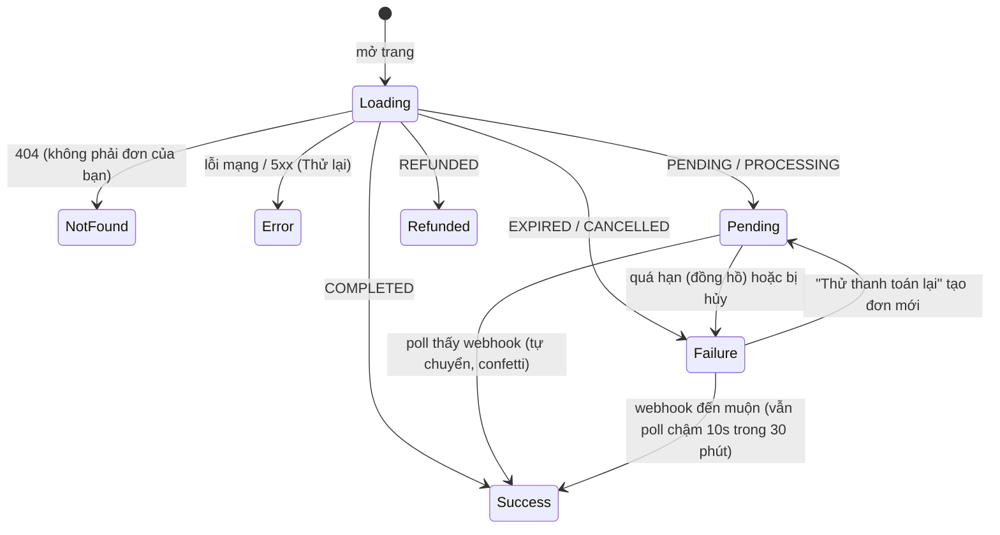

# PAY14–PAY16: Trải nghiệm thanh toán của học viên

## 1. Bất biến UX

| # | Bất biến | Hiện thực |
| --- | --- | --- |
| 1 | CTA thay đổi theo người xem và loại khóa học | `features/courses/course-cta.tsx` (§2) |
| 2 | Trang thanh toán tự phát hiện webhook, không cần F5 | hook `useOrderStatus` poll `GET /api/v1/orders/:code/status` mỗi 3 giây (§4) |
| 3 | Học viên xem lại toàn bộ đơn và tiếp tục thanh toán đơn chưa hết hạn | `/account/orders` (§5) |

Giao diện dùng bộ primitive sẵn có trong `components/ui` (Button, Badge, Alert,
Card, Table, Skeleton… theo phong cách shadcn/ui); dự án chưa cài shadcn/ui nên
không thêm phụ thuộc mới.

## 2. Trang chi tiết khóa học — `CourseCta`

| Người xem | Khóa | Hiển thị | Khi bấm |
| --- | --- | --- | --- |
| Chưa đăng nhập | PAID / FREE | Giá + **Mua khóa học** / **Đăng ký ngay** | `/login?redirect=/courses/<slug>` (quay lại đúng khóa học) |
| Đang kiểm tra phiên/quyền | bất kỳ | Skeleton (không nháy sai nút) | — |
| Đã sở hữu (free hoặc paid) | bất kỳ | “✓ Bạn đã sở hữu” + **Vào học ngay** (hoặc “Tiếp tục học (Bài: …)”) | `/learn/<slug>[/<bài>]` |
| Chưa sở hữu | FREE | “Miễn phí” + **Đăng ký học miễn phí** | `POST /api/v1/enrollments/free` → mở phòng học |
| Chưa sở hữu | PAID | `499.000 ₫` + **Mua khóa học** | `POST /api/v1/orders` → `/checkout/<orderCode>` |

Lỗi hiển thị bằng tiếng Việt ngay dưới nút (ví dụ quá 10 đơn chưa thanh toán),
nút bấm hai lần không tạo hai đơn (disabled khi đang gửi; backend còn idempotent:
cùng người, cùng tập khóa học, đơn chưa hết hạn ⇒ trả lại đơn cũ). Giá hiển thị
là giá công khai tại lúc tải trang; giá thực tế thanh toán là giá **đã đóng băng**
trong đơn.

> Đường dẫn phòng học hiện có là `/learn/[courseSlug]` (không phải
> `/courses/[slug]/learn`).

## 3. Trang `/checkout/[orderCode]`

Một trang, nhiều view theo trạng thái thực (đã hiệu chỉnh theo đồng hồ máy chủ):



- **Pending**: Tóm tắt đơn (tên + giá đã chụp, mã đơn có nút Sao chép, đồng hồ
  đếm ngược tới `expiresAt`), chọn phương thức (VietQR, Stripe, MoMo, VNPay),
  panel chuyển khoản.
  - VietQR: QR động (đã chứa số tiền và nội dung), các ô Sao chép cho số tài
    khoản, chủ tài khoản, số tiền, nội dung; thông báo “Hệ thống đang chờ ngân
    hàng xác nhận giao dịch…” và lưu ý có thể đóng trang. QR được yêu cầu tự động
    khi chọn VietQR (idempotent nên reload vẫn thấy lại).
  - Stripe: nút **Thanh toán với Stripe** chuyển sang trang Stripe; quay lại
    `/checkout/<code>?checkout=success` sẽ hiện “Đang xác nhận thanh toán”.
  - Cổng chưa cấu hình/chưa xây: vẫn hiện nhưng bị khóa (“Tạm thời chưa khả
    dụng” / “Sắp ra mắt”).
- **Success**: banner xanh, confetti (tắt khi người dùng chọn giảm chuyển động),
  mã giao dịch, số tiền, phương thức, danh sách khóa học, nút **Bắt đầu học ngay**.
- **Expired/Cancelled**: lý do, ghi chú “nếu đã chuyển khoản hệ thống vẫn ghi
  nhận”, nút **Thử thanh toán lại** (tạo đơn mới cho cùng các khóa) và **Liên hệ
  hỗ trợ** (mailto từ `NEXT_PUBLIC_SUPPORT_EMAIL`, nếu chưa đặt thì dẫn tới đơn
  hàng của tôi).

## 4. `useOrderStatus(orderCode)`

```ts
const { snapshot, status, isPaid, error, fatal, clockOffsetMs, nowMs, refetch } =
  useOrderStatus(orderCode, { enabled, intervalMs: 3000 });
```

- Lên lịch lượt poll kế tiếp **sau khi** lượt trước hoàn tất (không bao giờ chồng
  request); dừng khi `COMPLETED`/`CANCELLED`/`REFUNDED`.
- Tab ẩn thì không poll, quay lại tab thì poll ngay (`visibilitychange`).
- Lỗi mạng: exponential backoff (3s×2ⁿ, tối đa 30s) nhưng giữ snapshot cũ;
  `401/403/404` dừng hẳn (`fatal`).
- `EXPIRED`: poll chậm (10s) trong 30 phút vì thông báo ngân hàng có thể đến muộn.
- Đồng hồ: dùng `serverTime` từ API để tính độ lệch, nên đồng hồ máy lệch không
  làm đơn “hết hạn sớm”; tự re-render đúng thời điểm quá hạn mà không cần poll.
- Cleanup an toàn: unmount hoặc đổi mã đơn ⇒ abort request đang bay, xóa mọi timer
  và listener; state gắn theo mã đơn nên không rò rỉ sang đơn khác.

## 5. `/account/orders` (và `/orders` chuyển hướng)

Bảng (≥ md) hoặc thẻ (< md): Mã đơn, Ngày tạo, Khóa học (tên đã chụp), Tổng tiền,
Trạng thái, Mã giao dịch, Thao tác. Tab lọc **Tất cả | Đang chờ | Hoàn tất | Đã
hủy** và trang được lưu trên URL (`?status=pending&page=2`). `PENDING` chưa hết hạn
có **Thanh toán ngay** (mở lại `/checkout/<code>`); đơn hoàn tất có **Vào học**.
Có đủ trạng thái đang tải (skeleton), rỗng (từng tab một thông điệp), lỗi (Thử
lại) và phân trang. “Còn hạn” được tính lại ở client mỗi 30 giây.

## 6. API backend cho giao diện

Mọi route phục vụ cả `/x` và `/api/v1/x`.

| Endpoint | Mô tả |
| --- | --- |
| `GET /public/courses/:slug` | Thêm `course.accessType`, `price`, `currency` |
| `POST /api/v1/enrollments/free` `{ courseId }` | Ghi danh khóa FREE ngay; PAID ⇒ `402` kèm gợi ý checkout |
| `POST /api/v1/orders` `{ courseIds }` | Tạo (hoặc trả lại) đơn chưa thanh toán |
| `GET /api/v1/orders/:ref` | Chi tiết đơn (`ref` = mã đơn hoặc UUID): snapshot, `courseSlug`, `canResume`, `providerTransactionId` |
| `GET /api/v1/orders/:ref/status` | `{ status, isPaid, expiresAt, serverTime }` — một truy vấn theo index, không join, `no-store` |
| `POST /api/v1/orders/:ref/checkout` `{ provider }` | Trả `qrCodeUrl`/`paymentUrl` và `transfer` (số tài khoản, tên, số tiền, nội dung) |
| `GET /api/v1/payments/methods?currency=` | Mỗi cổng: `registered`, `available`, `supportsCurrency` |
| `GET /api/v1/student/orders?status=&page=&limit=` | Danh sách phân trang của chính học viên (`status`: `all|pending|completed|cancelled`; `limit` ≤ 50) |

Nhóm lọc: `pending` = PENDING + PROCESSING; `completed` = COMPLETED + REFUNDED;
`cancelled` = CANCELLED + EXPIRED. Danh sách và chi tiết chỉ đọc dữ liệu đã chụp;
cột duy nhất lấy từ `courses` là `slug` để dựng liên kết (không chứa tiền).
`status` trả thêm `expiresAt` và `serverTime` (ngoài `status`, `isPaid` theo yêu
cầu) để đồng hồ đếm ngược chính xác khi poll.

Mã lỗi hiển thị cho học viên: xem `paymentErrorMessage` (`order-model.ts`).

## 7. Biến môi trường

| Biến | Dùng cho |
| --- | --- |
| `NEXT_PUBLIC_SUPPORT_EMAIL` | Nút “Liên hệ hỗ trợ” (tùy chọn) |
| `VIETQR_BANK_NAME` | Tên ngân hàng hiển thị cạnh số tài khoản (mặc định `VIETQR_BANK_ID`) |

## 8. Kiểm thử

- Vitest (jsdom): định dạng tiền/đếm ngược, mô hình trạng thái, **`useOrderStatus`**
  (fake timers: chu kỳ 3s, dừng khi thanh toán xong, không chồng request, cleanup
  khi unmount, tab ẩn, backoff, 401/403/404, poll chậm sau hết hạn, đồng hồ máy
  chủ lệch, đổi mã đơn), `CheckoutView` (QR + copy + đồng hồ, chuyển sang SUCCESS
  khi poll thấy webhook, hết hạn/hủy/hoàn tiền, 404/lỗi, Stripe, mất mạng),
  `OrdersHistory` (cột, tab, phân trang, rỗng/lỗi, thẻ mobile) và `CourseCta`.
- Playwright trên stack thật (`e2e/payment-checkout.spec.ts`, desktop + mobile):
  mua → QR → webhook ngân hàng → trang tự chuyển SUCCESS → phòng học → lịch sử;
  thanh toán khi đã đóng tab; tiếp tục đơn từ lịch sử (bấm Mua lần nữa dùng lại
  đơn cũ); không tràn ngang trên mobile; mã đơn lạ. Điều kiện chạy ở đầu file.
- Backend: `test/modules/payment/student-orders.spec.ts`.
