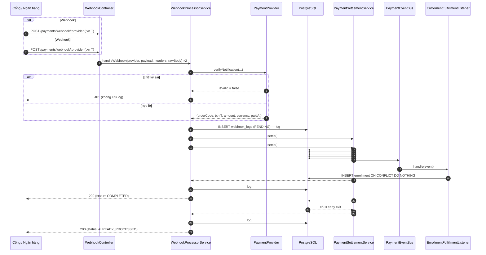
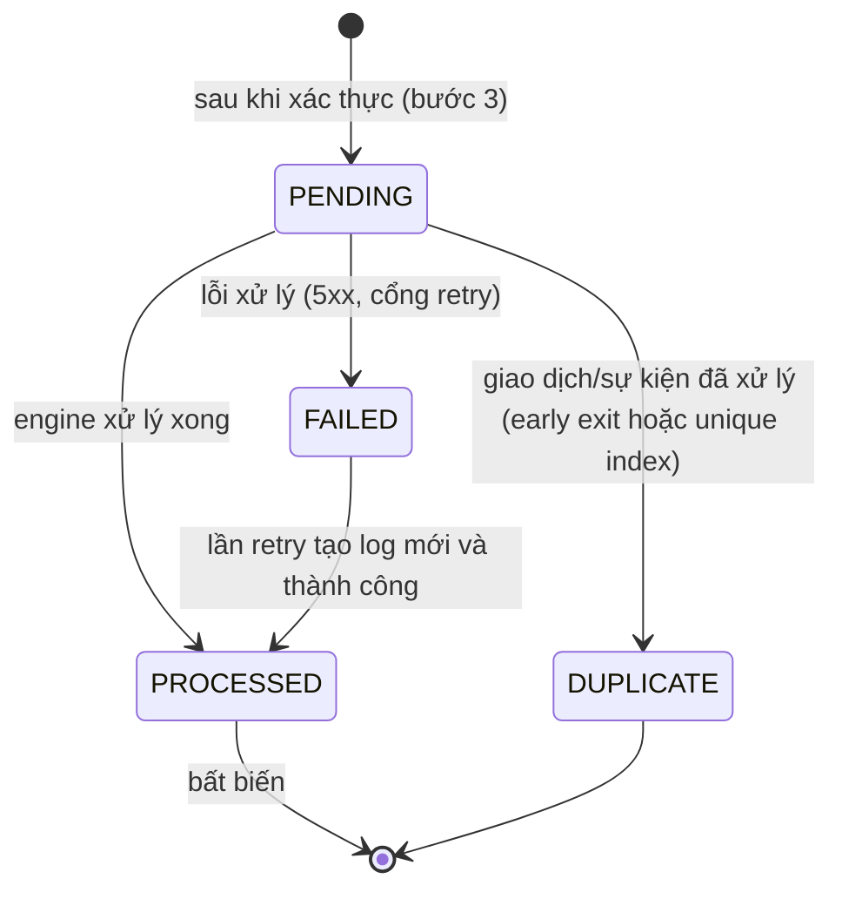

# PAY10–PAY13: Webhook Engine, Idempotency, Concurrency và Off-Page Fulfillment

## 1. Hai nguyên tắc bất biến

| # | Nguyên tắc | Bảo đảm bởi |
| --- | --- | --- |
| 1 | **Strict idempotency**: N webhook đồng thời cho cùng một giao dịch → đúng 1 Order `COMPLETED`, 1 dòng `payment_transactions` `SUCCESS`, 1 Enrollment; N−1 webhook còn lại nhận `200` và là no-op | Khóa `FOR UPDATE` trên Order + early exit; `UNIQUE(provider, provider_transaction_id)` ở sổ cái; `webhook_logs` với unique index một phần; `INSERT … ON CONFLICT DO NOTHING` khi cấp enrollment |
| 2 | **Off-page fulfillment**: hoàn tất đơn và cấp quyền học chạy hoàn toàn ở backend, không phụ thuộc trình duyệt của học viên, dù webhook đến sau 10 giây hay 2 giờ | Không có bước nào đọc phiên/trình duyệt; luật `canFulfil` dựa trên *thời điểm thanh toán*, không phải thời điểm webhook đến |

## 2. Pipeline 6 bước

```text
POST /payments/webhook/:provider   (cũng phục vụ /api/v1/payments/webhook/:provider)
 1 Receive           WebhookController: headers + body đã parse + raw body (rawBody: true)
 2 Verify            provider.verifyNotification(...)  — sai chữ ký ⇒ 401, KHÔNG lưu gì
 3 Persist raw event INSERT webhook_logs(status=PENDING, payload nguyên bản)   (commit riêng)
 4 Idempotency+Lock  BEGIN; SELECT order ... FOR UPDATE; ledger đã chốt giao dịch này? ⇒ early exit
 5 State transition  PENDING|EXPIRED ⇒ COMPLETED, ledger SUCCESS (cùng transaction)   COMMIT
 6 Fulfil            publish OrderCompletedEvent ⇒ EnrollmentFulfillmentListener ⇒ grantEnrollment
 ↳ finalize log      PROCESSED | DUPLICATE | FAILED
```

Phân vai: `WebhookProcessorService.handleWebhook(provider, payload, headers, rawBody?)`
điều phối bước 2–3 và hoàn tất log; `PaymentSettlementService.settle` thực hiện
bước 4–6 và chỉ làm việc với `SettlementFact` trung lập cổng.

### Hợp đồng với cổng thanh toán

| Tình huống | Phản hồi | Ghi chú |
| --- | --- | --- |
| Chữ ký/HMAC/khóa sai | `401` | Không tạo `webhook_logs`, không ghi sổ cái, không đổi đơn |
| Giao dịch mới, thành công | `200 {status:"COMPLETED"}` | |
| Giao hàng lặp (tuần tự hoặc đồng thời) | `200 {status:"ALREADY_PROCESSED"}` | No-op; log `DUPLICATE` |
| Sự kiện không liên quan / không gắn được đơn | `200 {status:"ACKNOWLEDGED"|"IGNORED"}` | Để cổng ngừng retry |
| Lỗi xử lý (DB…) | `5xx` | Log `FAILED` + `error_message`; cổng retry, mọi thứ idempotent |

Ghi chú: yêu cầu nêu trạng thái log "PROCESSING"; enum yêu cầu lại là
`PENDING|PROCESSED|FAILED|DUPLICATE`, nên `PENDING` chính là "đang xử lý".

## 3. Dữ liệu: `webhook_logs`

Migration `202610140001_webhook_logs.ts`, entity `WebhookLog`.

| Cột | Ghi chú |
| --- | --- |
| `id uuid` | PK |
| `provider "PaymentProvider"` | enum dùng chung |
| `event_id varchar(150) NULL` | id sự kiện của cổng (Stripe `evt_…`) |
| `provider_transaction_id varchar(150) NULL` | mã giao dịch ngân hàng/cổng |
| `payload jsonb NOT NULL` | dữ liệu thô đã xác thực |
| `status "WebhookLogStatus"` | `PENDING`, `PROCESSED`, `FAILED`, `DUPLICATE` |
| `outcome varchar(40) NULL` | quyết định của engine (`COMPLETED`, `IGNORED`, …) — cột bổ sung |
| `error_message text NULL`, `processed_at`, `created_at` | |

Index:

```sql
CREATE UNIQUE INDEX idx_webhook_unique_event    ON webhook_logs(provider, provider_transaction_id) WHERE status = 'PROCESSED';
CREATE UNIQUE INDEX idx_webhook_unique_event_id ON webhook_logs(provider, event_id) WHERE status = 'PROCESSED' AND event_id IS NOT NULL;
```

- Mỗi giao hàng được xác thực là **một dòng** (kể cả bản lặp), nên log là bản ghi
  kiểm toán đầy đủ: 100 giao hàng ⇒ 1 `PROCESSED` + 99 `DUPLICATE`.
- Chỉ giao dịch **đã để lại dòng sổ cái** mới "chiếm" `provider_transaction_id`.
  Một sự kiện chỉ để xác nhận (ví dụ `checkout.session.completed` chưa trả tiền)
  được `PROCESSED` với `provider_transaction_id = NULL`, để lần
  `async_payment_succeeded` thật sau đó cùng session id không bị chặn.
- Trigger `webhook_logs_guard`: `provider`, `event_id`, `payload`, `created_at`
  bất biến; DELETE bị từ chối; một dòng `PROCESSED` là cuối cùng.
- Migration cũng cho phép chuyển `EXPIRED → COMPLETED` (xem §5).

## 4. Idempotency và đồng thời — từng lớp phòng thủ

1. **Khóa Order** (`manager.findOne(Order, { lock: { mode: 'pessimistic_write' } })`
   trong `QueryRunner` thủ công). Mọi giao hàng cho cùng đơn xếp hàng trên khóa này.
2. **Early exit**: sau khi giữ khóa, nếu sổ cái đã có dòng *đã chốt* (không còn
   `INITIATED`) cho `(provider, provider_transaction_id)` của đúng đơn này ⇒ rollback
   nhẹ và trả `ALREADY_PROCESSED`, không ghi gì. Dòng sổ cái và việc chuyển trạng
   thái đơn nằm cùng một transaction nên "đã có dòng chốt" ⇔ "đã xử lý".
3. **Sổ cái**: `UNIQUE(provider, provider_transaction_id)`; `settle` trả
   `created:false` cho sự kiện đã chốt thay vì ghi lại.
4. **Unique index của `webhook_logs`**: nếu hai log cùng lúc cố thành `PROCESSED`
   cho một giao dịch/sự kiện, vi phạm `23505` được bắt riêng
   (`isProcessedDuplicate`) và log đó chuyển `DUPLICATE`, phản hồi vẫn `200`.
5. **Enrollment**: `INSERT … ON CONFLICT (user_id, course_id) DO NOTHING`, nên
   ngay cả khi sự kiện được phát lại (reconciler) cũng chỉ có một enrollment.

Hai giao dịch **khác nhau** cùng đến cho một đơn (khách chuyển hai lần): giao
dịch thắng khóa hoàn tất đơn; giao dịch còn lại thấy đơn đã `COMPLETED`, được ghi
sổ cái `FAILED` kèm payload (bằng chứng để hoàn tiền) và nhận `200 IGNORED`.

## 5. Off-page / late webhook

Không có đoạn nào của bước 4–6 đọc phiên hay trình duyệt người học; học viên
đóng tab ngay sau khi quét QR không ảnh hưởng gì. Vấn đề thật sự là đơn có hạn
(`expires_at`, mặc định 15 phút) trong khi webhook có thể đến rất muộn, nên luật
hợp lệ dựa trên **lúc thanh toán**:

`canFulfil(order, paidAt, now)`:

| Trạng thái đơn | Điều kiện để hoàn tất |
| --- | --- |
| `PENDING`, chưa quá hạn | luôn được |
| `PENDING` quá hạn (sweeper chưa chạy) hoặc `EXPIRED` | có `paidAt` ⇒ `paidAt ≤ expires_at + 60s`; không có `paidAt` ⇒ webhook đến trong vòng **24 giờ** sau `expires_at` |
| `CANCELLED`, `COMPLETED`, `REFUNDED`, `PROCESSING` | không (ghi bằng chứng) |

`paidAt` do cổng cung cấp qua `VerifyNotificationResult.paidAt`: Stripe dùng
`event.created`; SePay dùng `transactionDate` (giờ Việt Nam, UTC+7); payload
VietQR dạng gốc không có nên dùng cửa sổ 24 giờ. Thanh toán thực hiện sau hạn,
hoặc cho đơn đã hủy, **không** tự hoàn tất — tiền được giữ làm bằng chứng
(`FAILED` + `raw_payload`) để hoàn tiền thủ công. Hệ quả: máy trạng thái đơn cho
phép thêm `EXPIRED → COMPLETED` (trigger và `canTransitionOrder`).

Phát sự kiện sau COMMIT; nếu tiến trình chết giữa COMMIT và listener,
`PaymentReconciliationService` phát lại (xem
[payment-provider-abstraction.md](payment-provider-abstraction.md) §8).

## 6. Sequence diagram

Hai webhook #1 và #2 cho cùng một giao dịch đến đồng thời:



### Trạng thái một dòng `webhook_logs`



## 7. Khác biệt so với đặc tả ban đầu

| Yêu cầu | Thực hiện | Lý do |
| --- | --- | --- |
| `@OnEvent('order.completed')` | `PaymentEventBus.subscribe(OrderCompletedEvent, …)` | Dự án chưa dùng `@nestjs/event-emitter`; bus riêng **chờ handler** và không nuốt lỗi (log + reconciler), đồng bộ với pipeline |
| `enrollmentRepository.save(...)` | `INSERT … ON CONFLICT DO NOTHING` (`EnrollmentService.grantEnrollment`) | Idempotent và an toàn khi đua, không cần find-then-save |
| Route `/api/v1/payments/webhook/:provider` | Phục vụ cả `/payments/webhook/:provider` (đang dùng) và `/api/v1/…` | Giữ tương thích với cấu hình cổng hiện có |
| Trạng thái log `PROCESSING` | `PENDING` | Enum yêu cầu không có `PROCESSING` |
| Cột `webhook_logs.outcome` | Thêm | Ghi quyết định của engine để đối soát |

## 8. Kiểm thử — `test/modules/payment/webhook-concurrency.spec.ts`

PostgreSQL thật, giao hàng đồng thời bằng `Promise.all`:

- **5 giao hàng đồng thời** vào `WebhookProcessorService`: đúng 1 `COMPLETED` + 4
  `ALREADY_PROCESSED`; 1 order `COMPLETED`; 1 dòng sổ cái; 1 enrollment; sự kiện
  fulfilment chạy đúng 1 lần; log = 1 `PROCESSED` + 4 `DUPLICATE`.
- **100 giao hàng đồng thời qua HTTP** (cả hai route): tất cả `200`, cùng kết quả.
- Replay muộn là no-op tuyệt đối (`updated_at` không đổi); hai giao dịch khác nhau
  đua cho một đơn; cùng sự kiện Stripe ×10; sự kiện Stripe không liên quan ×6
  kết thúc `PROCESSED` + `DUPLICATE` nhờ unique index theo `event_id`; log
  `PROCESSED` đã tồn tại ⇒ `DUPLICATE` chứ không 500.
- Giả mạo ⇒ `401`, không có log/sổ cái/thay đổi đơn.
- Off-page: hoàn tất không cần phiên người học; thanh toán trong cửa sổ nhưng
  webhook đến sau 2 giờ vẫn cấp quyền; không tự hoàn tất thanh toán sau hạn, đơn
  đã hủy, hoặc quá 24 giờ khi không có `paidAt`.
- Lỗi xử lý ⇒ log `FAILED` + `error_message`, `500`, retry thành công; log kiểm
  toán không sửa/xóa được.
