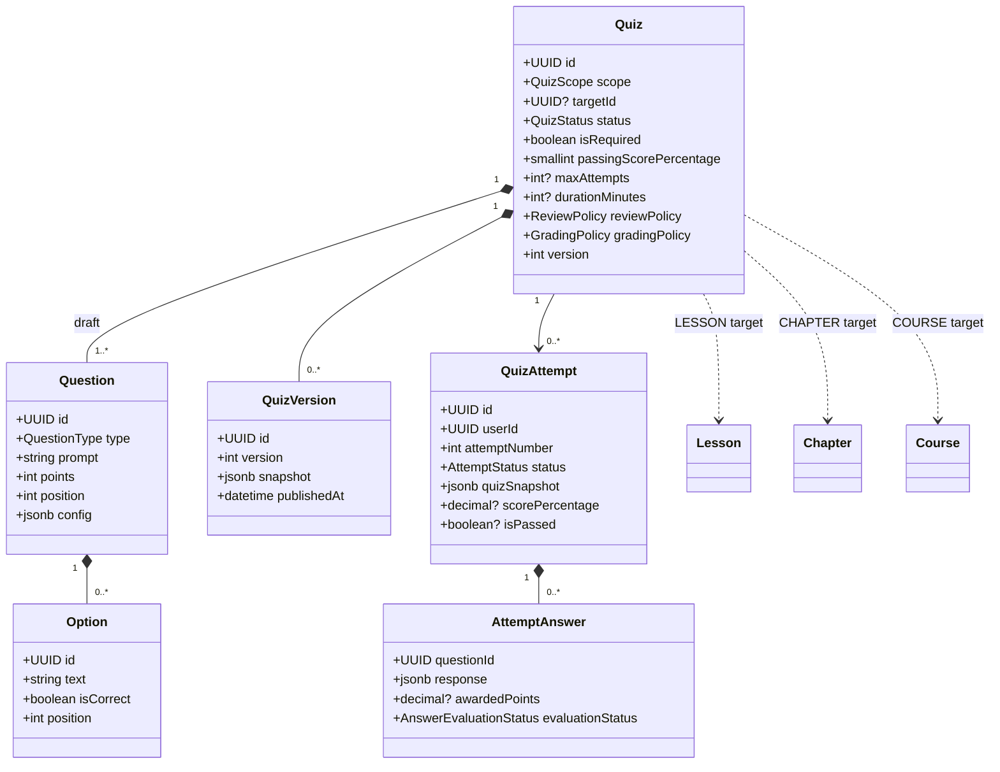
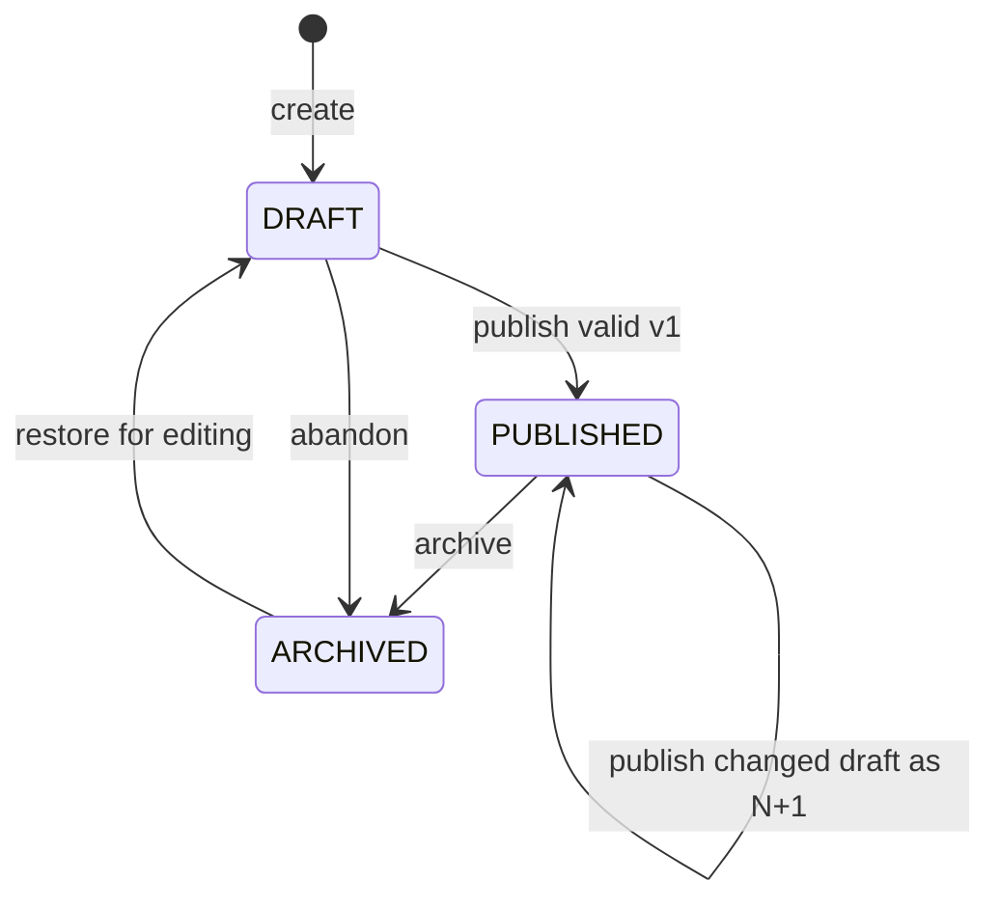
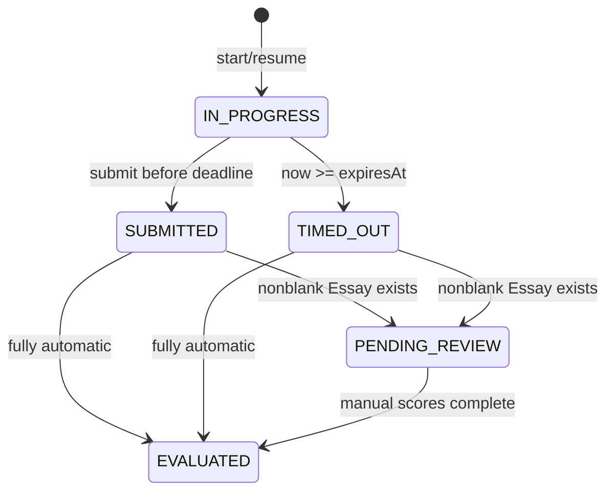

# Sprint 7 — Quiz Domain and Scope Architecture Specification (Q1)

- **Status:** Accepted architecture baseline; approved for Q2/Q3 design
- **Date:** 2026-10-06
- **Scope:** Domain model, aggregate boundaries, target scopes, lifecycle, versioning, assessment rules, progress integration, and persistence/API invariants. No migration or feature code is authorized here.
- **Normative terms:** **MUST**, **MUST NOT**, **SHOULD**, and **MAY** are requirements. This ADR supersedes any proposal that makes Quiz a one-to-one child of `Lesson(type=QUIZ)`.

## 1. Final architectural decision

`Quiz` is an independent aggregate root. It owns its identity, lifecycle, settings, draft Questions and Options, immutable published Versions, and Attempts. Course, Chapter, and Lesson do not own it; deleting a target MUST NOT cascade-delete Quiz content or Attempt history.

A Quiz has exactly one execution context:

```text
Quiz.scope    = LESSON | CHAPTER | COURSE | STANDALONE
Quiz.targetId = matching target UUID; null for STANDALONE
```

`scope + targetId` is a typed reference, not ownership. PostgreSQL has no polymorphic foreign key, so Q2 MUST enforce existence/type through a deferred constraint trigger or a dedicated binding table hidden behind this domain contract. Application-only validation is insufficient.

The existing `LessonType` remains `TEXT | VIDEO | DOCUMENT`; this ADR does **not** add `QUIZ`. A Lesson Quiz supplements an ordinary Lesson. Legacy rows formerly called Quiz and later migrated to `TEXT` require an explicit reviewed backfill list; they MUST NOT be inferred from `TEXT` alone.

### 1.1 Aggregate ownership

| Aggregate | Owns | References |
| --- | --- | --- |
| `Quiz` | settings, draft Questions/Options, Versions | one target, author/owner |
| `QuizVersion` | immutable assessment/policy snapshot | parent Quiz identity |
| `QuizAttempt` | frozen snapshot, answers, evaluation | Quiz, learner, frozen target identity |
| Course/Chapter/Lesson | curriculum and existing progress | Quizzes targeting that node |

Questions and Options change only through the Quiz aggregate. Attempts are a separate transactional boundary. Publishing creates an immutable Version; starting creates an independent Attempt snapshot.

## 2. Scope matrix and binding rules

| Scope | `targetId` | Availability prerequisite | Required completion effect |
| --- | --- | --- | --- |
| `LESSON` | existing `lessons.id` | learner can access the Lesson and its earlier sequential prerequisites are complete | Lesson completes only after normal content evidence **and** every required published Lesson Quiz passes |
| `CHAPTER` | existing `chapters.id` | all published required Lessons in that Chapter are complete | next curriculum node unlocks only after all required published Chapter Quizzes pass |
| `COURSE` | existing `courses.id` | all required Lessons and required Chapter Quiz gates in the Course are complete | course assessment/certificate gate requires all required published Course Quizzes to pass |
| `STANDALONE` | null | Quiz published and authenticated learner has an explicit standalone grant | no curriculum progress; assessment result only |

For Sprint 7, standalone `targetId` is strictly null. Organization/Topic is a future scope or association, not an ambiguous UUID.

Binding invariants:

- Contextual scopes require a non-null existing target of the matching type; standalone requires null.
- A Quiz has one binding. A target MAY have multiple Quizzes. Completion uses an **all-of** rule across its required, published, non-archived Quizzes.
- Binding may change only while `DRAFT` and before any Version or Attempt exists. Otherwise clone the Quiz to a new identity/target.
- Contextual authority comes from the target Course's owner/instructor; admin retains repository-standard override. Standalone stores an explicit `ownerUserId`.
- Target deletion is `RESTRICT` while a non-archived Quiz is bound. An archive/detach workflow may preserve a frozen target descriptor, but never deletes history.
- A contextual Quiz cannot publish unless its target exists and the actor owns its Course. If target/Course becomes unpublished, new learner Attempts are unavailable but history remains.
- `isRequired` defaults to true for contextual scopes and MUST be false for standalone.

Contextual learner access evaluates: resolve typed target → Quiz published/version present → target and Course learner-visible → existing authentication/enrollment/preview policy → scope prerequisite → active/max-attempt policy. Standalone requires authentication plus an explicit grant; anonymous Attempts are out of scope.

## 3. Domain model

### 3.1 Class diagram



### 3.2 Enums

```text
QuizScope               = LESSON | CHAPTER | COURSE | STANDALONE
QuizStatus              = DRAFT | PUBLISHED | ARCHIVED
QuestionType            = SINGLE_CHOICE | MULTIPLE_CHOICE | TRUE_FALSE | ESSAY
ReviewPolicy            = ALWAYS | AFTER_PASS | AFTER_EXHAUSTED | NEVER
GradingPolicy           = HIGHEST | LATEST
AttemptStatus           = IN_PROGRESS | SUBMITTED | TIMED_OUT | PENDING_REVIEW | EVALUATED
AnswerEvaluationStatus  = NOT_REQUIRED | PENDING | EVALUATED
SubmissionReason        = USER | TIMEOUT
```

The persistence model supports all four Question types. Initial delivery MAY feature-flag Essay, but adding it later must not replace tables or invalidate snapshots.

### 3.3 Quiz fields and settings

| Field | Type/invariant |
| --- | --- |
| `id` | UUID PK |
| `scope`, `targetId` | binding from §2 |
| `ownerUserId` | standalone owner or audit copy; target Course ownership stays authoritative |
| `status` | initially `DRAFT` |
| `isRequired` | contextual default true; standalone false |
| `passingScorePercentage` | integer `0..100`, default 80 |
| `maxAttempts` | positive integer or null (unlimited); zero is invalid |
| `durationMinutes` | positive integer or null (untimed); zero is invalid |
| `reviewPolicy` | default `AFTER_PASS` |
| `gradingPolicy` | default `HIGHEST` |
| `shuffleQuestions`, `shuffleOptions` | boolean, default false |
| `version` | positive integer, initialized to 1; first publication is version 1 |
| `currentVersionId` | nullable immutable Version FK |
| `hasUnpublishedChanges` | true initially and after versioned edits |
| `lockVersion` | optimistic edit token, separate from domain version |
| timestamps | created/updated; nullable published/archived |

All execution, grading, and review settings plus Questions/Options are versioned. Scope, target, owner, and required flag are placement data and are frozen separately into each Attempt.

### 3.4 Question rules and future-proof response model

Every Question has positive integer points, nonblank prompt, optional explanation, unique nonnegative position, and type-specific `config` validated by snapshot schema version.

| Type | Options | Response | Evaluation |
| --- | --- | --- | --- |
| `SINGLE_CHOICE` | ≥2; exactly one correct | zero/one Option ID | exact, automatic |
| `MULTIPLE_CHOICE` | ≥2; ≥1 correct and ≥1 incorrect | set of Option IDs | exact set, no partial/negative credit |
| `TRUE_FALSE` | exactly canonical true/false; one correct | zero/one Option ID | exact, automatic |
| `ESSAY` | none | trimmed UTF-8 text with configured max length | manual `0..points`; optional rubric |

Objective unanswered/incorrect Questions earn zero. Nonblank Essay answers are pending until an authorized grader records points and feedback; blank Essays earn zero without review. `AttemptAnswer.response` is discriminated JSONB so future answer types do not alter the table. Unknown schema versions fail closed.

Options use stable UUIDs. Duplicate normalized text is rejected. Keys, explanations, rubrics, and grader feedback are protected review data.

## 4. Persistence contract for Q2/Q3

Minimum logical tables:

```text
quizzes
quiz_questions
quiz_options
quiz_versions
quiz_attempts
quiz_attempt_answers
quiz_grants
quiz_idempotency_records
```

Required constraints/indexes:

- unique Question `(quiz_id, position)`; Option `(question_id, position)`; Version `(quiz_id, version)`;
- unique Attempt `(quiz_id,user_id,attempt_number)` and partial unique `(quiz_id,user_id) WHERE status='IN_PROGRESS'`;
- unique Answer `(attempt_id,question_id)`;
- indexes `(status,expires_at)` and `(user_id,quiz_id,evaluated_at DESC)`;
- target null/type/existence enforcement from §1–2;
- state-dependent checks for timestamps/results;
- database immutability for Version snapshots and Attempt snapshot/order fields.

An Attempt freezes Quiz/version IDs, scope/target, contextual Course ID, all policies/settings, Questions, Options, keys, points, explanations/rubrics, schema version, and randomized order in `quizSnapshot JSONB`. Answer question/option IDs reference snapshot identities, not mutable authoring FKs. Grading and review read only the snapshot and answers.

## 5. Quiz lifecycle and versioning



- `DRAFT`: editable; cannot start Attempts.
- `PUBLISHED`: current Version executable. Editing draft rows marks dirty but learners continue using the last published Version.
- `ARCHIVED`: no new Attempts; active Attempts may finish/timeout and history remains reviewable.

Publish is transactional: lock aggregate/draft, validate binding/settings/questions, create canonical immutable snapshot, use v1 initially or N+1 when changed, set current Version/status, and clear dirty flag. Unchanged publish is idempotent. Restoring archived sets `DRAFT`/dirty; republish creates N+1 rather than mutating/reactivating an old Version.

Starting copies the complete current Version plus placement metadata. Later editing, publication, archival, or target state cannot change that Attempt's content, deadline, limit, grading, threshold, or review policy.

## 6. Attempt lifecycle and concurrency



At most one active Attempt exists per Quiz/user. Starts serialize on that pair: resume active with 200 or create with 201. An Attempt counts immediately; timeout/abandonment consumes it and is not refunded. Attempt number is count + 1 under the same lock.

The current published Version's limit governs a new start; all historical Attempts count across versions. Lowering it can exhaust a learner immediately; an existing active Attempt remains valid. Null means unlimited.

Use authoritative server/database time. `expiresAt = startedAt + durationMinutes`, or null when untimed. At `now >= expiresAt`, timeout wins. Save/submit lazily expires first. A worker uses `FOR UPDATE SKIP LOCKED`; worker/request races are idempotent. Answers freeze after leaving `IN_PROGRESS`. Evaluation failures remain durably closed for retry.

## 7. Grading and official result

Objective grading is exact/all-or-nothing. Essay points are in `[0, question.points]` with grader audit. When every response is evaluated:

```text
earnedPoints = sum(awarded points)
totalPoints = sum(snapshot points)  // must be > 0
scorePercentage = roundHalfUp(earnedPoints * 100 / totalPoints, 2)
isPassed = scorePercentage >= snapshot.passingScorePercentage
```

Persist `numeric(5,2)`. Evaluation/result write is atomic and retry-safe.

Only evaluated Attempts participate:

- `HIGHEST`: greatest percentage; tie earliest evaluation, then lowest attempt number.
- `LATEST`: greatest evaluation time; tie greatest attempt number.

The newly evaluated Attempt's frozen policy controls recomputation across evaluated history. The selected Attempt's frozen `isPassed` is authoritative; never compare it with another Version's threshold. Achieved curriculum completion is monotonic and is not revoked by a later failing `LATEST` result.

## 8. Review policy

Summary score/pass is visible after evaluation. Detailed review includes correct keys, per-question result/points, explanations/rubrics, and grader feedback. The Attempt's frozen policy controls details:

- `ALWAYS`: after `EVALUATED`;
- `AFTER_PASS`: after evaluation only when that Attempt passed;
- `AFTER_EXHAUSTED`: after evaluation only when its frozen finite limit has been consumed and no further Attempt may start;
- `NEVER`: never.

`AFTER_EXHAUSTED` with unlimited attempts is invalid at publication. Later Versions do not change old Attempt disclosure. Nothing bypasses `EVALUATED`; pre-review learner payloads omit keys and all fields that infer correctness.

## 9. Required completion and Sprint 6 integration

```text
quizSatisfied = !isRequired OR official evaluated Attempt isPassed
targetQuizGateSatisfied = every published, non-archived required target Quiz is satisfied
```

Drafts do not gate. Archival removes a Quiz from future gate calculation without erasing results. A newly published required Quiz gates incomplete learners but MUST NOT regress persisted completion or revoke certificates.

### Lesson

```text
lessonComplete = ordinaryContentEvidenceSatisfied AND lessonQuizGateSatisfied
```

Sprint 6 currently writes final `LessonProgress.COMPLETED` directly. Before required Lesson Quizzes ship, Q3 MUST persist content completion evidence separately (for example `content_completed_at`) and centralize final completion. Content endpoints cannot complete while a required Quiz is unsatisfied. Passing the last Quiz completes if content evidence exists. Existing completed rows remain completed during migration.

### Chapter

Chapter Quizzes unlock after all published required Lessons in that Chapter complete. Later curriculum unlocks only after required Chapter Quiz gates. Chapter completion may be derived, but one shared policy service must own the rule.

### Course and certificates

Course Quizzes unlock after required Lessons and Chapter gates. Sprint 6 learning percentage remains based on required Lessons; assessment gate is returned separately. Certificate eligibility requires content completion, all required Lesson/Chapter/Course Quiz gates, and any other Certificate Engine rules. Certificate issuance is not owned by Quiz.

### Standalone

Standalone results never create LessonProgress, unlock curriculum, alter Course percentage, or issue a Course certificate.

## 10. Command/query semantics

Authoring must support create, optimistic settings update, Question/Option CRUD/reorder, validate/publish, archive, restore-to-draft, and clone-to-new-target. Stale writes return `409 QUIZ_EDIT_CONFLICT`; rebinding after a Version/Attempt is rejected.

Learner operations must support safe availability, start/resume, frozen Attempt retrieval, idempotent per-Question response replacement, submit, policy-redacted review, and own history. Start/submit accept user-and-command-scoped `Idempotency-Key`.

Stable errors include `QUIZ_NOT_PUBLISHED`, `QUIZ_ARCHIVED`, `TARGET_UNAVAILABLE`, `PREREQUISITE_NOT_COMPLETED`, `MAX_ATTEMPTS_EXCEEDED`, `ATTEMPT_EXPIRED`, `ATTEMPT_NOT_IN_PROGRESS`, `QUESTION_NOT_IN_SNAPSHOT`, `INVALID_RESPONSE_TYPE`, and `REVIEW_NOT_AVAILABLE`.

## 11. Security, operations, and edge cases

- Publish observes one locked consistent draft; start locks the user/Quiz namespace; save/submit lock the Attempt.
- Snapshot/order data is immutable. Grading/review never queries live authoring rows.
- Correctness keys/full snapshots never enter learner payloads, logs, or analytics before authorization.
- Version/Attempt deletion is restricted. Q2 must decide user-erasure FK behavior explicitly.
- Timeout age/count, automated evaluation errors, manual-review backlog, and retries are observable.
- Progress/certificate effects use an outbox or equivalent idempotent mechanism and invalidate Sprint 6 caches.

| Scenario | Required result |
| --- | --- |
| edit during Attempt | frozen Attempt remains unchanged |
| dirty published Quiz | new Attempts use last published Version |
| simultaneous starts | one create, other resumes |
| submit exactly at expiry | timeout, then grade saved answers |
| worker/submit race | one idempotent closure |
| last Attempt has Essay | pending review; exhaustion details wait for evaluation |
| unlimited + `AFTER_EXHAUSTED` | publication rejected |
| archive required Quiz | future gate removed; history retained |
| publish new required Quiz after completion | no retroactive regression/revocation |
| target unpublished | no new Attempt; existing Attempt may close/evaluate |
| enrollment revoked mid-Attempt | learner mutations denied; worker may close for integrity |
| delete target | restricted until archive/detach workflow |
| rebind used Quiz | reject; clone instead |
| new Version changes key/threshold | no historical regrading |
| later `LATEST` failure after pass | official score may fail; achieved completion remains |

## 12. Q2/Q3 approval gates

Q2/Q3 must:

- implement independent Quiz plus all four scopes without `LessonType.QUIZ`;
- enforce target type/existence/nullability at the database boundary;
- implement lifecycle, immutable Versions/Attempt snapshots, and non-cascading target deletion;
- support Single Choice, Multiple Choice, True/False, and Essay/manual evaluation in schema;
- enforce attempt/deadline concurrency and idempotency;
- implement four review policies including finite-limit validation;
- separate Lesson content evidence from final completion before required Lesson Quizzes ship;
- centralize Chapter/Course gates for sequential access/certificates;
- test every scope, invalid binding, ownership, archival, concurrency, timeout, isolation, disclosure, grading boundary, Essay review, and monotonic progress;
- explicitly migrate any legacy Quiz-like `TEXT` rows without guessing.

## 13. Approval statement

The architectural question is closed: **Quiz is an independent Aggregate Root linked to exactly one execution context through `scope` and `targetId`; Course, Chapter, and Lesson reference it but do not own it.** Scope, binding integrity, lifecycle, snapshot isolation, required completion, grading, review, and Sprint 6 integration are frozen. Changing ownership, scope semantics, snapshot immutability, or monotonic progress requires a new ADR.
