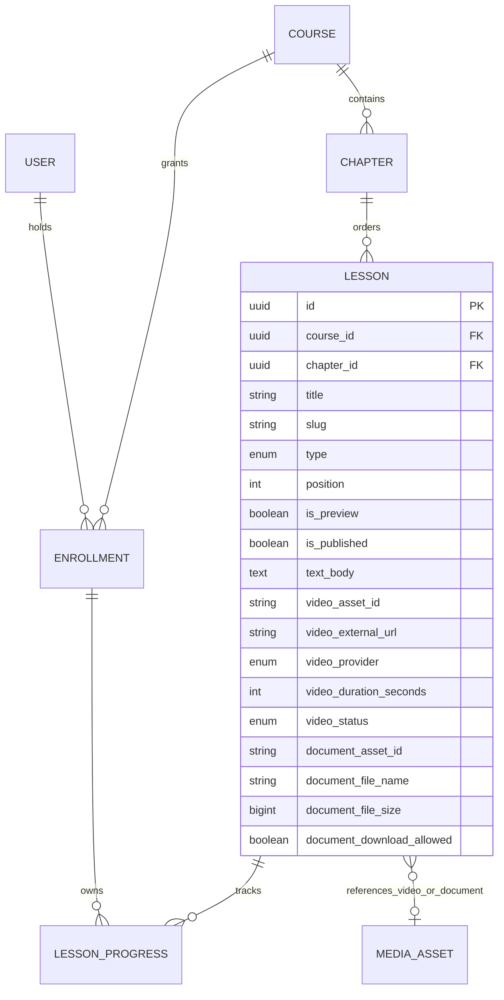
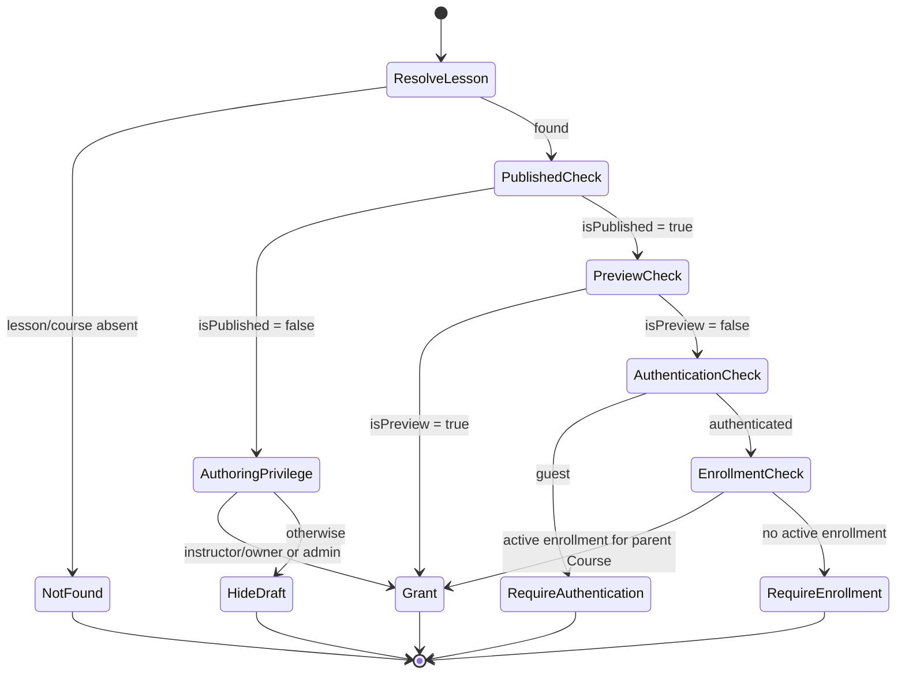

# Sprint 5 — Lesson Domain Architecture (L1)

- **Status:** Accepted for Sprint 5 implementation planning
- **Date:** 2026-10-02
- **Scope:** Architecture and domain model only; this RFC does not authorize a migration, DTO, endpoint, or feature implementation.
- **Related baseline:** Sprint 4 C1–C16, especially Course schema (C2), Chapter/Enrollment (C3–C4), Instructor Portal (C14), and `CourseAccessService.canAccessLesson` (C15).

## 1. Context and audit findings

The Sprint 4 repository already contains a legacy `lessons` table and working curriculum/enrollment flows. This RFC therefore describes a **target contract**, not the current database.

| Existing decision/invariant | Evidence in Sprint 4 | Consequence for Sprint 5 |
| --- | --- | --- |
| Course owns curriculum; Chapter belongs to exactly one Course | `courses`, `chapters`; composite `(chapter.id, course_id)` relationship | A Lesson belongs to one Chapter and cannot cross its Course boundary. Keep `course_id` as a denormalized integrity key unless a later migration proves it can be removed safely. |
| Old content may use `course_sections`, while new instructor content uses `chapters` | `lessons_parent_check` permits exactly one of `section_id`/`chapter_id` | Migration design must explicitly convert or preserve legacy rows. This RFC does not silently drop `section_id`. |
| Current lesson types are `Article`, `Video`, `Quiz` | C14 migration and instructor controller | Target values are `TEXT`, `VIDEO`, `DOCUMENT`. `Article → TEXT`; `Video → VIDEO`; `Quiz` has no lossless mapping and needs a separate Quiz bounded context or an explicit migration product decision. |
| Current Lesson has `body`, `video_storage_key`, `duration_seconds`, `position`, `is_preview`; it has no `slug` or lesson publication flag | Foundation, C14, C15 migrations | Sprint 5 must add/normalize the target fields through a separately reviewed migration. |
| Enrollment uniqueness is `(user_id, course_id)` and validity means `revoked_at IS NULL` | Enrollment entity/migrations and C15 access query | Access policy must reuse this definition rather than create Lesson-specific enrollment state. |
| `lesson_progress` verifies Lesson and Enrollment against the same `course_id` | Foundation composite foreign keys | Preserve Lesson–Course consistency in any future schema change. |
| Instructor edits are protected by role plus Course ownership; admin is allowed by the route role policy | C14 ownership guard/controller | Unpublished Lesson access is an authoring privilege, separate from learner enrollment. |
| C15 grants preview before authentication but does not check Lesson publication | `CourseAccessService.canAccessLesson` | Extend the policy in place; do not create a second access implementation. |
| Course thumbnail bytes currently live in `course_media`; lesson video accepts an HTTP(S) URL | C14 | These are transitional implementations, not the target Lesson media boundary. No new Lesson upload/transcode responsibility may be added to Lesson Domain. |

The broader C1–C16 baseline also establishes server-side authorization, deny-by-default resource checks, HttpOnly sessions, PostgreSQL/TypeORM with explicit migrations, Course lifecycle, and public Course visibility. This proposal retains those conventions.

## 2. ADR-001 — One content type per Lesson

### Decision

Sprint 5 uses a **single discriminator per Lesson**: `TEXT`, `VIDEO`, or `DOCUMENT`. A Lesson is not an ordered collection of heterogeneous blocks.

The discriminator determines one and only one payload:

| Type | Required payload | Optional metadata | Forbidden payload |
| --- | --- | --- | --- |
| `TEXT` | `text_body` (Markdown or sanitized rich-text source; one canonical format must be selected before implementation) | none | video and document fields |
| `VIDEO` | Stable media reference: preferably `video_asset_id`; an approved external provider reference/URL is allowed for YouTube/Vimeo | `video_provider ∈ {S3, YOUTUBE, VIMEO}`, `video_duration_seconds ≥ 0`, `video_status ∈ {PROCESSING, READY}` | text and document fields |
| `DOCUMENT` | Stable media reference: preferably `document_asset_id` | `document_file_name`, `document_file_size ≥ 0`, `document_download_allowed` | text and video fields |

`PROCESSING` applies to managed uploads/transcodes. An external provider may be marked `READY` only after its reference is validated. A Lesson may be saved as an authoring draft while its required asset is absent or processing, but it cannot become published until its type-specific invariant is satisfied.

### Why this option

- It matches the Sprint 5 MVP UI and validation model: one editor, renderer, and readiness rule per Lesson.
- It avoids block ordering, nested validation, versioning, partial updates, block-level media cleanup, and a new block authorization surface.
- Queries for curriculum, publication readiness, progress, and access remain predictable.
- The model can later evolve: introduce `lesson_blocks` behind a new content-version contract and migrate each single payload into one initial block.

### Trade-offs accepted

- A mixed article containing inline video and attachments cannot be modeled natively. Authors must split it into adjacent Lessons.
- Type changes are destructive unless the product preserves drafts elsewhere. The future command must require explicit replacement/clearing of the old payload.
- Sparse type-specific columns require database checks. Separate subtype tables would be stricter but add joins and transactional complexity without enough MVP benefit.
- `DOCUMENT` is singular in Sprint 5. Multiple attachments belong to a later block/asset-list decision, not an overloaded `lesson_assets` contract.

### Rejected alternative: block-based content

Blocks provide flexible composition and future authoring features, but require a block schema, stable ordering, per-block validation/versioning, renderer compatibility, and asset lifecycle rules now. That cost and migration surface are disproportionate to Sprint 5. Reconsider when mixed-content authoring is a validated requirement, not pre-emptively.

## 3. Proposed Lesson schema

This is a logical/data-schema proposal. Exact PostgreSQL types, constraint names, rollout/backfill, and rollback belong to a later migration RFC.

| Column | Logical definition | Rule |
| --- | --- | --- |
| `id` | UUID PK | Stable identity |
| `course_id` | UUID FK → `courses.id` | Internal consistency/progress key; must equal the Chapter's Course |
| `chapter_id` | UUID FK → `chapters.id` | Required for the Sprint 5 aggregate |
| `title` | varchar(255) | Trimmed, non-blank |
| `slug` | varchar | Trimmed normalized slug; unique within Chapter |
| `type` | enum/check | `TEXT`, `VIDEO`, `DOCUMENT` |
| `position` | integer | Zero-based, non-negative; unique within Chapter (deferrable uniqueness is useful for reorder) |
| `is_preview` | boolean | Default `false`; bypasses enrollment only, never publication |
| `is_published` | boolean | Default `false`; learner-visible content gate |
| `text_body` | text nullable | Present only for `TEXT` |
| `video_asset_id` | UUID/string nullable | Stable Media Asset reference; nullable while authoring/processing |
| `video_external_url` | text nullable | Only for approved external providers; mutually exclusive with managed asset ID |
| `video_provider` | enum/check nullable | `S3`, `YOUTUBE`, `VIMEO` |
| `video_duration_seconds` | integer nullable | Non-negative |
| `video_status` | enum/check nullable | `PROCESSING`, `READY` |
| `document_asset_id` | UUID/string nullable | Stable Media Asset reference |
| `document_file_name` | text nullable | Display metadata, not a storage path |
| `document_file_size` | bigint nullable | Non-negative bytes |
| `document_download_allowed` | boolean nullable | Required for `DOCUMENT`, default chosen during migration design |
| `created_at`, `updated_at` | timestamptz | Operational audit timestamps consistent with current entities |

Recommended constraints/indexes:

1. Composite FK `(chapter_id, course_id) → chapters(id, course_id)` prevents cross-Course attachment.
2. Unique `(chapter_id, position)` and unique `(chapter_id, slug)`; index `course_id`, `chapter_id`, and learner listing `(chapter_id, is_published, position)`.
3. A discriminator `CHECK` prevents fields from other types. Publication validation additionally requires:
   - `TEXT`: non-blank `text_body`;
   - `VIDEO`: exactly one managed asset or approved external reference, provider present, status `READY`;
   - `DOCUMENT`: asset reference, file name/size, and download policy present.
4. Do not persist expiring signed URLs. Persist an opaque asset ID/key or a validated external provider reference; resolve a signed delivery URL at read time after authorization.
5. `slug` is chapter-scoped because learner URLs can carry Course/Chapter context and titles commonly repeat across chapters. If the public URL later omits Chapter, revisit uniqueness explicitly.

`MEDIA_ASSET` is drawn as an external logical reference, not a Lesson-owned foreign-key aggregate. Cross-service referential integrity is enforced by application workflow, not a cross-context database FK.

## 4. ADR-002 — Bounded-context boundaries

### Decision

Lesson owns curriculum meaning and publication. Media/Storage owns binary lifecycle and delivery. Access Control owns the authorization decision and uses Enrollment as an input. These boundaries apply even if the MVP is deployed as one NestJS process.

| Concern | Lesson Domain | Media/Storage Context | Access/Enrollment Policy |
| --- | --- | --- | --- |
| Lesson title, slug, type, order, preview/publication flags | **Owns** | — | Reads minimum projection |
| Type-specific semantic metadata | **Owns** (`duration`, provider, filename, size, download policy, readiness snapshot) | Supplies authoritative asset metadata/status | May redact delivery details |
| Receive bytes, validate file, virus scan, store, transcode, retry | — | **Owns** | — |
| Bucket/key layout, credentials, CDN, signed URL generation/expiry | Stores only opaque reference; never credentials or expiring signed URL | **Owns** | Requires prior authorization before private URL issuance |
| Asset deletion/retention/orphan cleanup | Requests detach/delete; does not delete storage directly | **Owns** idempotent lifecycle | — |
| Course ownership and authoring access | Supplies Lesson/Course identity | — | **Owns/evaluates** instructor/admin privilege |
| Enrollment creation/revocation/validity | — | — | **Owns**; valid currently means same Course and `revoked_at IS NULL` |
| Learner Lesson authorization | Provides publication/preview/Course facts | Issues media only after grant | **Owns** `canAccessLesson(user, lesson)` |
| HTTP response semantics/audit | Maps domain result at application edge | Logs asset operations | Stable deny reasons and security audit |

Integration contract:

1. Client uploads to Media/Storage through an authenticated upload workflow.
2. Media/Storage returns a stable `assetId` plus safe metadata/status—not a durable signed URL.
3. Lesson attaches the reference only after verifying asset existence, ownership/scope, media kind, and attachability.
4. A learner first passes `canAccessLesson`; only then may the application request a short-lived signed delivery URL.
5. Detach/delete uses an idempotent command or outbox/event pattern. A database rollback must not accidentally delete a shared/valid object.

This isolates provider changes and long-running processing from the Lesson transaction. It also closes a security gap where possession of a stored signed URL could outlive enrollment revocation.

## 5. ADR-003 — Lesson access policy and evaluation order

### Decision

Reuse and evolve the C15 policy entry point, `canAccessLesson(user, lesson)`. Controllers and Media delivery must not reimplement the rules.

Normative evaluation order:

1. Resolve Lesson and its parent Course. If absent, return `LESSON_NOT_FOUND` (HTTP 404 at the application edge).
2. If `lesson.isPublished !== true`, grant only when the authenticated principal is an authorized Course instructor/owner or admin; otherwise deny. To avoid leaking draft existence, learner/public endpoints should map this denial to 404. Authoring endpoints may return 403.
3. If `lesson.isPreview === true`, grant to guests and authenticated users. Preview never overrides step 2.
4. If no authenticated user, deny with `AUTHENTICATION_REQUIRED` (HTTP 401).
5. If an active Enrollment exists for the Lesson's parent Course (`user_id`, `course_id`, `revoked_at IS NULL`), grant.
6. Otherwise deny with `ENROLLMENT_REQUIRED` (HTTP 403).

Course visibility is an upstream invariant: learner delivery must also require a learner-visible parent Course (normally `PUBLISHED`). Instructor/admin authoring preview follows Course ownership/admin policy. This check may be loaded in the same policy query, but it must not be confused with the Lesson publication flag.

Policy result codes should be stable domain outcomes (`GRANTED`, `LESSON_NOT_FOUND`, `AUTHENTICATION_REQUIRED`, `ENROLLMENT_REQUIRED`, and an internal unpublished/authoring denial). HTTP mapping belongs to the delivery layer. Do not return media references or Lesson body before the decision is granted.

### Trade-offs

- A single policy service prevents drift between Lesson content and Media endpoints, but becomes a critical dependency and needs focused unit/integration tests.
- Returning 404 for hidden drafts reduces resource enumeration; it is less explicit than 403 for learners, hence authoring APIs keep explicit authorization feedback.
- Lesson-level publication enables staged release inside a published Course, but adds a second lifecycle flag. Course publication remains the outer gate; Lesson publication is the inner gate.
- Preview access is intentionally public after publication. Therefore preview content and its media delivery URLs must be treated as publicly obtainable, although URLs may remain short-lived.

## 6. Aggregate invariants and lifecycle

- Lesson identity belongs to exactly one Chapter/Course for its lifetime in Sprint 5. Moving between Chapters should be an explicit command that revalidates Course and ordering.
- Reordering is a Chapter aggregate operation and must submit the full membership or otherwise use a concurrency-safe ordering protocol, preserving the C14 transaction/lock behavior.
- `is_preview` changes entitlement only; it does not publish content and does not make a draft Course public.
- Publishing is rejected unless the selected payload is complete and any managed Media Asset is `READY`.
- Unpublishing immediately blocks learners, including enrolled users and previews. It does not delete progress or media.
- Enrollment revocation immediately affects new access evaluations and signed-URL issuance. Already issued URLs are bounded by their short TTL.
- `document_download_allowed=false` means the product does not expose a download action and uses inline delivery where supported; it is not DRM and cannot guarantee a user cannot save rendered bytes.

## 7. Compatibility and deferred implementation work

The implementation task following this RFC must produce a separate migration/backfill plan covering:

- mapping `Article → TEXT` and `Video → VIDEO`;
- deciding the fate of existing `Quiz` rows before enforcing the new discriminator;
- generating collision-safe chapter-scoped slugs;
- setting `is_published` for existing rows based on an explicit product rule (do not infer silently from `is_preview`);
- reconciling legacy `section_id` Lessons with Chapter-only target ownership;
- replacing durable/direct managed-media URLs or keys with stable Media Asset references without persisting signed URLs;
- preserving `lesson_progress` composite integrity and existing IDs;
- defining failure/retry behavior for Media attachment and orphan cleanup.

Deferred beyond Sprint 5: multi-block documents, multiple document attachments per Lesson, Lesson revisions/scheduling, DRM, offline licenses, asset sharing semantics, and Quiz modeling. None should be smuggled into the Sprint 5 Lesson table as ad-hoc JSON.

## 8. Acceptance criteria for the next implementation design

- Schema constraints demonstrate that incompatible type payloads cannot coexist and published payloads are complete.
- Access tests cover unpublished × role, published preview × guest, protected × guest, active/revoked enrollment, parent Course visibility, missing Lesson, and Media URL issuance.
- All Lesson body/asset delivery paths call the same policy service.
- No Lesson endpoint accepts raw storage credentials, bucket paths, or client-supplied signed URLs as authoritative state.
- Migration tests preserve legacy IDs, Course/Chapter consistency, enrollment/progress relationships, and explicitly handle every current `Quiz` row.

## 9. Decision summary

Sprint 5 adopts one type per Lesson (`TEXT`, `VIDEO`, `DOCUMENT`) using typed nullable columns plus strict discriminator/publication invariants. Lesson owns curriculum metadata and stable media references only. Media/Storage owns upload, processing, storage, and signed delivery. The C15 access policy remains the single decision point, with publication checked before preview and enrollment. This is the smallest architecture that supports the MVP without closing the path to a later block-based model.
