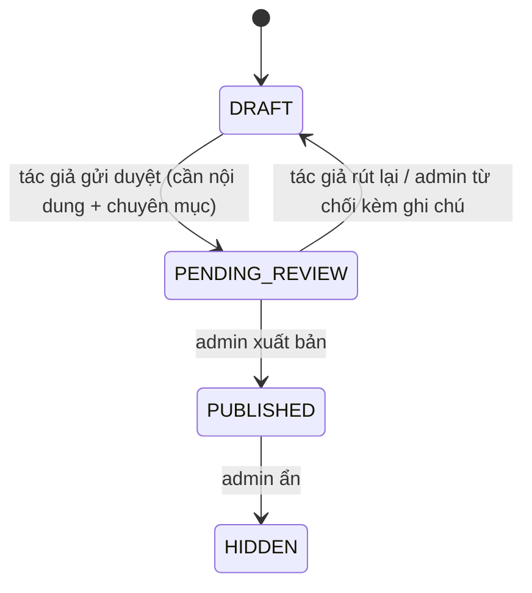

# Blog

Blog kỹ thuật của nền tảng: giảng viên và admin viết bài, admin duyệt và xuất bản, người đọc xem công khai và bình luận (có kiểm duyệt tự động). Nội dung bài là Markdown có KaTeX. Bài có thể liên kết tới một khóa học đã xuất bản.

## Vai trò và vòng đời bài viết

| Việc | Ai |
| --- | --- |
| Viết, sửa bản nháp, gửi duyệt, rút lại, xóa bản nháp | Tác giả (`instructor`, `admin`) |
| Xuất bản, từ chối (kèm ghi chú), ẩn, sửa bài chưa lưu trữ | `admin` |
| Đọc bài đã xuất bản, bình luận | Mọi người (bình luận cần đăng nhập) |

`ARCHIVED` có trong schema nhưng chưa có thao tác API nào đưa bài vào trạng thái này. Trigger PostgreSQL chặn các chuyển trạng thái sai; mỗi bước duyệt ghi một dòng `post_review_logs` (chỉ-ghi-thêm: người, từ → sang, ghi chú). Quyết định biên tập gần nhất (người duyệt, thời điểm, ghi chú) hiện ở chi tiết bài để tác giả đọc. Điều kiện còn thiếu khi gửi duyệt trả `422 BLOG_POST_INCOMPLETE` kèm danh sách `missing`.

Quy tắc sửa: tác giả chỉ sửa **bản nháp** của mình; admin sửa mọi bài chưa lưu trữ. Khác → `409 BLOG_POST_NOT_EDITABLE`. `slug` bị **đóng băng** sau lần xuất bản đầu (`409 BLOG_SLUG_FROZEN`), vì từ đó nó là một phần của URL công khai. Chỉ xóa được bản nháp chưa có lịch sử duyệt (`BLOG_POST_HAS_HISTORY`). Bài của người khác trả 404 với người không phải tác giả/admin.

Giới hạn: tiêu đề ≤ 200, nội dung ≤ 100 000, tóm tắt ≤ 500 ký tự; URL ảnh bìa ≤ 2048. Mỗi bài có tối đa một chuyên mục (`categories`) và có thể liên kết một khóa (`linked_course_id`, tác giả phải quản lý khóa đó).

## API

Hai nhóm: quản lý (`/api/v1/blog/…`) và công khai (`/public/blog/…`).

| Endpoint | Ai | Mô tả |
| --- | --- | --- |
| `POST /api/v1/blog/posts`, `GET /api/v1/blog/posts`, `GET/PATCH/DELETE /api/v1/blog/posts/:id` | instructor, admin | CRUD bản nháp; danh sách có lọc theo trạng thái |
| `POST …/:id/submit`, `POST …/:id/withdraw` | tác giả | Gửi duyệt / rút lại |
| `POST …/:id/publish`, `…/reject`, `…/hide` | admin | Xuất bản / từ chối / ẩn |
| `GET /api/v1/blog/categories`, `POST /api/v1/blog/categories` | mọi người / admin | Chuyên mục (có chuyên mục mặc định do migration) |
| `POST /api/v1/blog/images` | instructor, admin | Tải ảnh minh họa (≤ 5 MB, `sharp` chuẩn hóa, rộng tối đa 1600 px, giới hạn 40 triệu điểm ảnh) → trả đường dẫn **tương đối**; `GET /blog-images/:id` phục vụ công khai |
| `POST /api/v1/blog/import` | instructor, admin | Nhập tài liệu thành bản nháp (dưới) |
| `GET /public/blog/posts`, `/public/blog/posts/:slug`, `/public/blog/sitemap` | công khai | Chỉ bài `PUBLISHED` |
| `POST /api/v1/blog/posts/:slug/comments`, `GET …` | đăng nhập / công khai | Bình luận |
| `GET /admin/comments`, `PATCH /admin/comments/:id/approve|reject` | admin | Duyệt bình luận |

Ảnh được lưu dưới dạng **đường dẫn**, không gắn tên miền, để đổi domain không làm hỏng bài cũ; web tự ghép origin API khi hiển thị (`features/blog/image-url.ts`).

## Nhập từ tài liệu

`POST /api/v1/blog/import` (multipart `file`, ≤ **20 MB**) biến một tài liệu thành **Markdown cho bản nháp trong trình soạn** — không lưu bài nào; tác giả xem và sửa trước khi lưu. Kết quả: `{ title | null, markdown, warnings[] }` (cảnh báo nêu phần không mang sang được).

| Định dạng | Cách xử lý |
| --- | --- |
| `.docx` | Chuyển sang Markdown (tiêu đề, danh sách, bảng, công thức OMML → KaTeX…); ảnh trong tệp được lưu như ảnh tải lên (tối đa 40 ảnh); giới hạn dung lượng giải nén 150 MB |
| `.md`, `.markdown`, `.txt` | Dùng nguyên văn |
| `.xlsx` | Các bảng tính thành bảng Markdown (kiểm tra zip-bomb) |
| `.pdf` | Chỉ lấy văn bản (`pdfjs-dist`); nếu thư viện không khả dụng, trả lỗi rõ ràng |

Phần mở rộng phải khớp chữ ký byte thật (`file-type`); nội dung vượt giới hạn bị cắt ở ranh giới dòng. Lỗi: `BLOG_IMPORT_FILE_REQUIRED` (400), `BLOG_IMPORT_TOO_LARGE` (413), `BLOG_IMPORT_UNSUPPORTED` (415).

## Bình luận

Chỉ bình luận được trên bài `PUBLISHED`. Giới hạn 2000 ký tự/bình luận và **5 bình luận/phút/người** (`429 COMMENT_RATE_LIMITED`). Trạng thái:

| Trạng thái | Ý nghĩa |
| --- | --- |
| `APPROVED` | Công khai |
| `PENDING` | Chờ admin; chỉ tác giả bình luận thấy |
| `REJECTED` | Không bao giờ hiển thị; giữ kèm lý do để xem lại |

Mỗi bình luận đi qua **ba lớp**, mỗi lớp chỉ có thể làm kết quả *chặt hơn*; khi một lớp không quyết định được (AI không phản hồi) bình luận **chờ người duyệt** thay vì được cho qua:

1. **Luật cục bộ** (không dùng mạng): trùng nội dung trong 24 giờ trên cùng bài (`DUPLICATE`), link rút gọn/spam và tên miền bare, link ngoài danh sách cho phép (`SPAM_LINK`), số điện thoại/thông tin liên hệ (`CONTACT_INFO`), từ tục/viết tắt tiếng Việt và tiếng Anh (`PROFANITY`, so khớp theo dạng viết có dấu), từ cấm của đơn vị vận hành (`BLOCKED_TERM`), lặp ký tự/văn bản (`REPEATED_TEXT`). Vi phạm → `REJECTED` ngay. Tên miền được phép gồm MDN, GitHub, Stack Overflow, Wikipedia, W3C, Node.js, React, Next.js, TypeScript, Python… cộng `COMMENT_LINK_ALLOWLIST`; từ cấm bổ sung qua `COMMENT_BLOCKLIST`.
2. **AI độc hại** (`openai` mặc định hoặc `perspective`): điểm `< 0.3` sạch; `0.3–0.7` đáng ngờ → `PENDING`; `> 0.7` độc hại → `REJECTED`; không có phản hồi/khóa → `PENDING`.
3. **Độ tin cậy tác giả**: bình luận sạch của người **đáng tin** được `APPROVED` ngay, người khác `PENDING`. Đáng tin là giảng viên/admin, hoặc tài khoản đã quá 1 ngày tuổi mà *đang học* (ghi danh còn hiệu lực) hoặc có hơn 3 bình luận đã duyệt.

Mỗi bình luận lưu `toxicity_score`, lý do và bản ghi quyết định (`moderation`); việc admin duyệt/từ chối ghi `post_comment_review_logs`. Trang `/admin/comments` hiển thị hàng chờ. Cấu hình ở [configuration](configuration.md#chat-blog-và-lớp-trực-tiếp); không có khóa AI thì mọi bình luận qua luật cục bộ đều chờ admin — không bao giờ có bình luận được duyệt mà chưa chấm điểm.

## Giao diện web

- Công khai (`features/blog`): `/blog` (danh sách, tìm kiếm), `/blog/[slug]` (render Markdown + KaTeX qua `article-markdown`, SEO/Open Graph/JSON-LD, `sitemap`), `BlogCommentSection`.
- Tác giả (`features/blog/authoring`): `/instructor/blog` (danh sách theo trạng thái), `/new`, `/[id]/edit` với `PostEditor`, `MarkdownEditor` (các snippet chèn nhanh), `DocumentImport`, `PostActions` (gửi duyệt/rút lại).
- Admin: `/admin/blog` (cả hàng chờ duyệt, xuất bản/từ chối/ẩn), `/admin/comments` (`AdminCommentQueue`).
- Bài có thể gắn với một khóa để hiển thị liên kết tới khóa đó.

## Kiểm thử

Unit: DTO blog, `blog-text`, ảnh, nhập tài liệu (docx/pdf/xlsx/markdown), luật và pipeline kiểm duyệt bình luận. Web: `blog.test.tsx`, `authoring.test.ts`, `comments.test.tsx`, `image-url.test.ts`. Xem [testing](testing.md).
