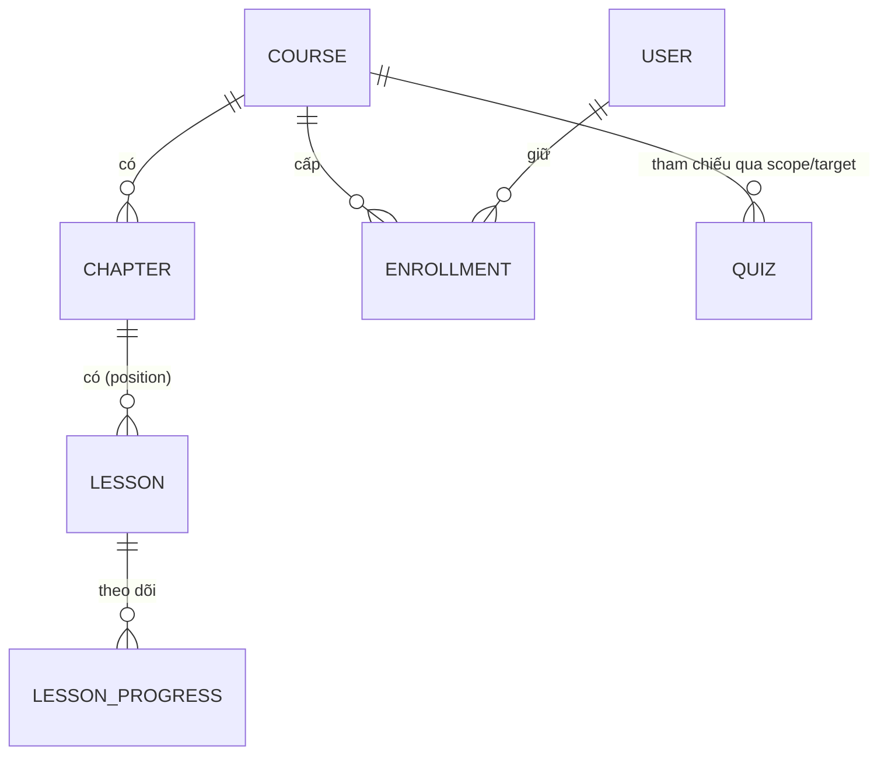

# Khóa học, chương và bài học

## Mô hình

- **Course** thuộc một chủ sở hữu (`owner_id`, và `instructor_id` cho khóa cũ); giảng viên được phân công qua `course_instructors`. Trường chính: `title`, `slug` (unique), `description`, `short_description`, `thumbnail`, `category`, `level` (`Beginner|Intermediate|Advanced`), `language`, `access_type` (`FREE|PAID`), `price`, `currency` (`VND|USD`), `is_sequential`, `live_attendance_threshold`, `status`.
- **Chương** thuộc đúng một khóa; **bài học** thuộc đúng một chương (khóa ngoại tổng hợp `(chapter_id, course_id)` ngăn bài lệch khóa). Vị trí là số nguyên bắt đầu từ 0.
- **Một bài chỉ có một loại nội dung** (`type`): `TEXT`, `VIDEO` hoặc `DOCUMENT`. Dữ liệu từng loại nằm trong các cột có kiểu và được CHECK theo discriminator (văn bản: `text_body`; video: `video_asset_id` hoặc `video_external_url`, `video_provider`, `video_duration_seconds`, `video_file_size`, `video_mime_type`, `video_status`; tài liệu: `document_asset_id`, `document_file_name`, `document_file_size`, `document_mime_type`, `document_file_type`, `document_download_allowed`). Bài trộn nhiều loại phải tách thành các bài liền kề. Cờ khác: `is_preview`, `is_published`, `is_required` (xem [progress](progress.md)).
- Bảng `course_sections` và `lessons.section_id` là di sản trước khi có `chapters`; mã mới chỉ dùng chương.

## Vòng đời khóa học

Trạng thái: `draft ↔ published` và `draft`/`published → archived` (cuối, không quay lại). Schema còn chấp nhận `review` và `hidden` nhưng chưa luồng nào dùng.

| Thao tác | Endpoint | Ghi chú |
| --- | --- | --- |
| Tạo | `POST /courses` | Luôn là `draft`; người tạo là chủ sở hữu |
| Sửa | `PATCH /courses/:id` | Gồm cờ `isSequential`, danh mục, mức độ, ngôn ngữ, thumbnail |
| Xuất bản | `POST /courses/:id/publish` | Phải qua kiểm tra xuất bản (dưới) |
| Hủy xuất bản | `POST /courses/:id/unpublish` | Về `draft`, xóa `publishedAt`. Học viên đã ghi danh mất khả năng xem cho tới khi xuất bản lại |
| Lưu trữ | `POST /courses/:id/archive` | Cuối |
| Giá | `PATCH /courses/:id/pricing`, `GET /courses/:id/pricing-history` | Xem [payments](payments.md#giá-khóa-học) |

**Điều kiện xuất bản** (`CoursePublishabilityValidator`): có tiêu đề, mô tả và thumbnail; có chủ sở hữu hoặc giảng viên; ít nhất một chương; mọi chương đều có bài; ít nhất một bài; mọi bài đều có nội dung hợp lệ (văn bản không rỗng, video có tài nguyên hoặc URL, tài liệu có tệp). Các thao tác cấu trúc và xuất bản được tuần tự hóa bằng khóa transaction cấp khóa học.

**Chương**: `POST/GET /courses/:courseId/chapters`, `PATCH /courses/:courseId/chapters/reorder`, `PATCH|DELETE /chapters/:id`. **Sắp xếp bài** gửi `{ ids: string[] }` đúng bằng toàn bộ thành viên của chương. Mọi thao tác yêu cầu `instructor|admin` và `CourseOwnershipGuard`.

**Thumbnail**: `POST /courses/:courseId/thumbnail` (multipart `file`; JPEG/PNG/WebP tĩnh ≤ 2 MB, ≤ 16 triệu điểm ảnh) được chuẩn hóa sang WebP, lưu bytes trong PostgreSQL (`course_media`) và phục vụ công khai, cache immutable ở `GET /course-media/:id`; trả `{ url }` để lưu khi lưu khóa. Ảnh tải lên mà không áp dụng vẫn nằm lại (chưa có dọn rác).

## Catalog công khai

Không cần đăng nhập: `GET /public/courses` (`page`, `limit` ≤ 50, `search` ≤ 100, `instructorId`, `sortBy` `publishedAt|createdAt`, `sortOrder`), `GET /public/courses/:slug` (kèm `accessType`, `price`, `currency`), `GET /public/courses/:slug/syllabus`. Danh sách, chi tiết và đề cương được cache (xem [architecture](architecture.md#cache)) và vô hiệu hóa ngay khi nội dung đổi. Web render các trang này ở server (`features/courses/server.ts`), có `sitemap.xml`, `robots.txt`, canonical, Open Graph và JSON-LD.

## Ghi danh

- Khóa **FREE**: `POST /enrollments/free` (hoặc `POST /courses/:courseId/enroll`) ghi danh ngay cho `student`. Khóa chưa xuất bản → 409; đã ghi danh → 409 (`UNIQUE(user_id, course_id)` chống đua).
- Khóa **PAID**: không bao giờ ghi danh trực tiếp — trả `402 PAYMENT_REQUIRED` kèm gợi ý checkout; quyền học được cấp sau khi đơn hoàn tất ([payments](payments.md)).
- `GET /courses/:courseId/enrollment-status` cho biết trạng thái. Thu hồi ghi danh đặt `revoked_at` (giữ lịch sử); ghi danh còn hiệu lực là `revoked_at IS NULL`. Đổi giá không ảnh hưởng người đã ghi danh.

## Quyền truy cập bài học

Mọi nơi phát nội dung (bài, video, tài liệu, tiến độ) dùng chung `CourseAccessService.canAccessLesson` qua `LessonAccessGuard` — không nơi nào tự cài lại quy tắc. Thứ tự đánh giá:

1. Không có bài → `LESSON_NOT_FOUND`.
2. **Chủ khóa/giảng viên của khóa hoặc admin** → cho qua (bypass), kể cả khóa/bài chưa xuất bản.
3. Khóa không ở trạng thái `published` → `COURSE_UNAVAILABLE`.
4. Bài chưa xuất bản → `LESSON_UNPUBLISHED`.
5. Học viên có ghi danh còn hiệu lực nhưng khóa **tuần tự** còn bài trước chưa xong (và bài hiện tại không phải xem trước) → `PREREQUISITE_LESSON_NOT_COMPLETED`, kèm bài cần làm trước.
6. Có ghi danh còn hiệu lực → cho qua.
7. Bài xem trước (`is_preview`) → cho cả khách.
8. Chưa đăng nhập → `AUTHENTICATION_REQUIRED` (401).
9. Ghi danh đã bị thu hồi → `ENROLLMENT_SUSPENDED`; còn lại → `ENROLLMENT_REQUIRED` (403).

**Khóa học tuần tự** (`is_sequential`): học viên phải hoàn thành lần lượt. Một bài trước đó chưa "xong" nếu nó là bài bắt buộc chưa hoàn thành, hoặc có quiz `LESSON` bắt buộc đã xuất bản mà học viên chưa đạt. Hệ thống kiểm tra **mọi** bài đứng trước (theo thứ tự chương, rồi bài) nên vẫn đúng sau khi sắp xếp lại hoặc bật chế độ này muộn. Bài xem trước luôn mở.

## Phát nội dung

| Loại | Endpoint | Hành vi |
| --- | --- | --- |
| Chi tiết bài | `GET /lessons/:id` | Chỉ trả nội dung sau khi quyết định truy cập là "cho qua". `text_body` được làm sạch HTML (`sanitize-html`) khi lưu |
| Video | `GET /lessons/:id/video-access` | Trả `{ url, expiresInSeconds }`: URL ngoài (YouTube/Vimeo/nhúng) trả nguyên; video tải lên trả URL ký ngắn hạn (mặc định 3600 giây, cấu hình bằng `MEDIA_URL_TTL_SECONDS` trong 3600–7200). Máy chủ stream có hỗ trợ Range tại `GET /lesson-media/*` sau khi kiểm tra chữ ký và hạn |
| Tài liệu | `GET /lessons/:id/document-view`, `/document-download` | Stream qua API sau khi kiểm tra quyền. `document_download_allowed = false` → `403 DOWNLOAD_NOT_ALLOWED` (chủ khóa/admin vẫn tải được). Đây không phải DRM |

`Cache-Control: no-store` áp dụng cho phản hồi cấp quyền. URL ký là bearer capability, không lưu trong database; thu hồi ghi danh chặn cấp URL mới ngay, còn URL đã cấp chỉ sống tới hết TTL.

## Soạn bài (giảng viên)

`POST /chapters/:chapterId/lessons` (JSON), `…/lessons/video-upload`, `…/lessons/document-upload` (multipart), `PATCH /lessons/:id`, `POST /lessons/:id/video-upload|document-upload`, `PATCH /lessons/:id/document-settings`, `DELETE /lessons/:id`, `PATCH /chapters/:chapterId/lessons/reorder`; cùng nhóm lối vào theo khóa `/courses/:courseId/…`. Yêu cầu `instructor|admin` + `LessonOwnershipGuard`. Mọi đường tạo/sửa (kể cả multipart) đi qua `LessonRequestSanitizationInterceptor`. Nhập bài từ tệp: [content-import](content-import.md). Mọi tạo/sửa/xóa phát `CurriculumEvents` để vô hiệu hóa cache.

## Lưu trữ media

Hai miền lưu trữ **tách biệt**, không dùng chung driver, khóa, thư mục hay chính sách phân phối:

| Miền | Nơi lưu | Giới hạn | Định dạng |
| --- | --- | --- | --- |
| Avatar | `AVATAR_STORAGE_DIR` qua `AvatarStorage`, công khai | 2 MiB | JPEG/PNG/WebP, chuẩn hóa bằng `sharp` |
| Media bài học (riêng tư) | `MediaStorageDriver` (`STORAGE_DRIVER`) | Tài liệu 50 MiB; video 2 GiB (`MAX_VIDEO_SIZE_MB`) | Tài liệu: PDF, DOCX, PPTX, ZIP, TXT, Markdown; video: MP4, WebM, MOV |

- Khóa lưu là chuỗi mờ do server sinh, không bao giờ là đường dẫn hay URL do client cung cấp. Adapter cục bộ ghi bằng tạo-độc-quyền, chế độ `0600`, từ chối path traversal, tính SHA-256 và ký URL phân phối bằng HMAC (`MEDIA_SIGNING_SECRET`, rơi về `JWT_SECRET`).
- Mọi tệp tải lên phải khớp **đồng thời** MIME khai báo, phần mở rộng và chữ ký nhị phân (`file-type`). Đó là kiểm tra định dạng best-effort, không phải quét mã độc.
- `STORAGE_DRIVER=s3` hiện là bản dừng an toàn: mọi thao tác trả 503 để môi trường staging không âm thầm rơi về lưu cục bộ. Trước khi bật cần hoàn thiện adapter, mã hóa phía server, IAM tối thiểu, bucket riêng tư, quarantine/quét mã độc, multipart upload và lifecycle dọn tệp chờ gắn. **Adapter cục bộ nhận tệp vào bộ nhớ đệm — chỉ phù hợp phát triển/một instance; video lớn ở production phải dùng upload streaming/trực tiếp lên object storage.**
- Dọn rác: chưa có tác vụ xóa tệp mồ côi hay thumbnail không dùng; đây là việc vận hành cần bổ sung.

## Giao diện

Trang học `/learn/[courseSlug]/[lessonSlug]` (`components/learning`): mục lục, trình phát video/tài liệu/văn bản (KaTeX + Markdown), thanh hành động hoàn thành bài, chat, quiz. Các trang học nằm trong nhóm route `(learning)`; trang công khai `/courses`, `/courses/[slug]`.
