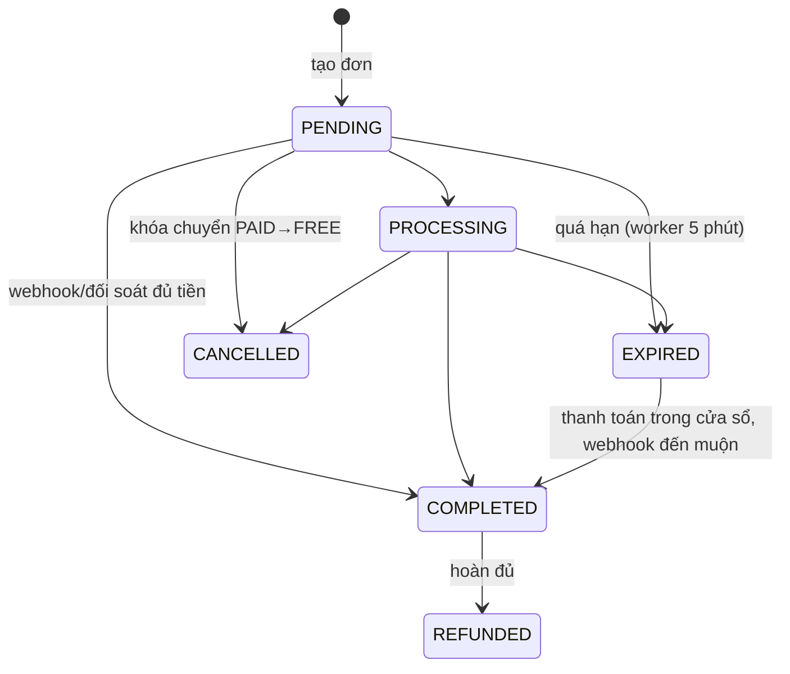
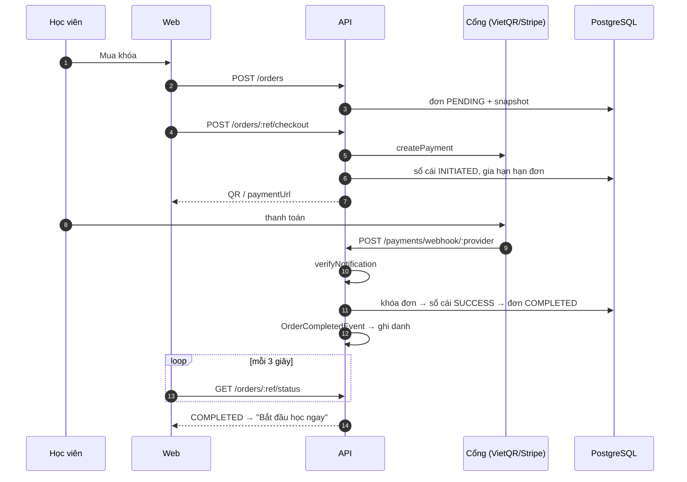

# Thanh toán

Luồng tiền của khóa học trả phí: **Giá → Đơn hàng (snapshot) → Checkout qua cổng → Webhook đã xác minh → Hoàn tất đơn → Cấp quyền học**, kèm sổ cái giao dịch, nhật ký kiểm toán bất biến, đối soát thủ công và hoàn tiền. Các cổng có sẵn: **VietQR** (chuyển khoản ngân hàng) và **Stripe Checkout**; thêm cổng mới chỉ cần thêm một adapter.

## Bất biến cốt lõi

| # | Bất biến | Cơ chế |
| --- | --- | --- |
| 1 | **Giá bị đóng băng lúc tạo đơn.** Đổi giá/tên khóa sau đó không ảnh hưởng đơn đã tạo | `order_items` lưu snapshot; đọc đơn không bao giờ join `courses` để tính tiền; ghi trong một transaction, khóa `courses` bằng `FOR SHARE` |
| 2 | **Chỉ webhook đã xác minh (hoặc đối soát có kiểm toán) mới hoàn tất đơn.** Trang chuyển hướng của trình duyệt không đáng tin | `verifyNotification` chạy trước mọi thao tác; sai chữ ký → 401, không tác dụng phụ |
| 3 | **Thanh toán thành công cấp quyền học đúng một lần** | Idempotency ở sổ cái `UNIQUE(provider, provider_transaction_id)`; khóa dòng đơn; ghi danh `INSERT … ON CONFLICT DO NOTHING` |
| 4 | **Core không biết cổng cụ thể** | Core chỉ phụ thuộc interface `PaymentProvider`; test kiến trúc quét import và từ khóa cổng trong file core |
| 5 | **Mọi thay đổi tiền đều có dấu vết bất biến** | Trigger PostgreSQL + `order_audit_logs` chỉ-ghi-thêm |
| 6 | **Khóa FREE không tạo đơn; khóa PAID không ghi danh trực tiếp** | `enrollCourse` ném `402 PAYMENT_REQUIRED` cho PAID; `createOrder` từ chối `COURSE_IS_FREE` |

Tiền luôn là số nguyên đơn vị nhỏ nhất (`bigint`; VND đồng, USD cent), đọc về `number` qua `bigintNumberTransformer` và ném lỗi nếu vượt `MAX_SAFE_INTEGER`; không dùng số thực. `rawPayload` luôn là JSON thuần.

## Giá khóa học

| Tiền tệ | Đơn vị lưu | Ví dụ | Trần |
| --- | --- | --- | --- |
| `VND` (mặc định) | đồng | `500000` = 500.000 ₫ | 10.000.000.000 |
| `USD` | cent | `1999` = $19.99 | 100.000.000 |

`FREE ⇔ price = 0` và `PAID ⇔ price > 0` (CHECK `courses_access_type_price_check` cộng kiểm tra ở `resolveNextPricing`); `currency` là `varchar(3)` với CHECK `VND|USD`. Đổi giá qua `PATCH /courses/:id/pricing` (giảng viên sở hữu/admin) và xem `GET /courses/:id/pricing-history`; `PATCH /courses/:id` vẫn tương thích. Việc đổi giá chạy trong một transaction, khóa dòng khóa học `FOR NO KEY UPDATE` (không phải `FOR UPDATE`, để tránh deadlock với webhook đang giữ khóa đơn), và ghi `course_price_logs` (chỉ-ghi-thêm: giá/tiền tệ/loại trước-sau, số đơn `PENDING` bị hủy, người đổi). Không ghi log nếu không có gì đổi.

| Chuyển đổi | Đơn mới | Đơn `PENDING` cũ | Đơn `COMPLETED` | Ghi danh |
| --- | --- | --- | --- | --- |
| PAID → PAID | giá mới | **giữ snapshot cũ**, vẫn trả được | giữ nguyên | giữ nguyên |
| PAID → FREE | không tạo được (ghi danh miễn phí) | **`CANCELLED`** | giữ nguyên | người đã mua vẫn học |
| FREE → PAID | bắt buộc mua | — | — | người đã ghi danh **giữ quyền học**; học viên mới phải mua |

## Đơn hàng

Mã đơn `SHAN-YYYYMMDD-XXXX` (ngày UTC, 4 ký tự từ bảng chữ không gây nhầm). Nội dung chuyển khoản/QR dùng mã **bỏ dấu gạch** (ngân hàng thường xóa ký tự đặc biệt); `extractOrderCode` chuẩn hóa không phân biệt hoa thường, dấu cách/gạch, và vẫn nhận mã cũ dạng `SHAN` + 6 ký tự. Va chạm mã làm lại cả transaction với mã mới (tối đa 5 lần, sau đó `409 ORDER_CODE_GENERATION_FAILED`).

Hạn thanh toán ban đầu **15 phút**; khi bắt đầu checkout hạn được gia hạn tới hết cửa sổ của cổng (tối đa 24 giờ) để khoản trả trong cửa sổ đó vẫn được ghi nhận.



Bảng `orders`: `code` (unique), `user_id`, `status`, `currency`, `subtotal`, `discount_total`, `final_total` (= subtotal − discount_total, CHECK), `payment_provider` (null tới khi checkout), `expires_at`, `completed_at` (trigger đặt, bất biến). `order_items`: unique `(order_id, course_id)`, `position`, `course_title_snapshot` (≤ 255 code point), `unit_price_snapshot`, `discount_snapshot`, `final_price_snapshot`, `currency`. Một đơn có thể chứa nhiều khóa (1–20, không trùng) nhưng một tiền tệ (`400 MIXED_CURRENCY_ORDER`). Mỗi người mua giữ tối đa **10 đơn `PENDING` chưa hết hạn** (`429 TOO_MANY_PENDING_ORDERS`); tạo lại đơn cùng tập khóa khi đơn cũ còn hạn trả lại đơn cũ (idempotent).

**Sổ cái** `payment_transactions`: mỗi dòng là một *sự kiện thanh toán* — `provider` (`VIETQR|STRIPE|MOMO|VNPAY|MANUAL_BANK|MANUAL_RECONCILED`), `provider_transaction_id` (unique **theo cổng**), `amount`, `fee_amount`, `currency`, `status` (`INITIATED|SUCCESS|FAILED|REFUNDED|PARTIALLY_REFUNDED`), `raw_payload` (JSONB, không bao giờ trả ra API). Chỉ dòng `INITIATED` được cập nhật (một lần, sang trạng thái cuối). `FAILED` nghĩa là "lần trả này không dẫn tới cấp quyền", kể cả khi tiền thật đã về nhưng đơn không còn hoàn tất được (hết hạn, đã hủy, đã trả…) — payload thô được giữ làm bằng chứng để hoàn tiền thủ công. Hoàn tiền là **dòng mới**, không sửa dòng `SUCCESS` gốc.

## API cho học viên

Mọi route phục vụ cả `/x` lẫn `/api/v1/x`; mutating route cần `Origin` hợp lệ.

| Endpoint | Mô tả |
| --- | --- |
| `POST /orders` `{ courseIds }` | Tạo (hoặc trả lại) đơn chưa thanh toán |
| `GET /orders`, `GET /orders/:ref` | Lịch sử/chi tiết từ snapshot (`ref` = mã đơn hoặc UUID; chủ đơn, hoặc staff) |
| `POST /orders/:ref/checkout` `{ provider, returnUrl?, cancelUrl? }` | Bắt đầu thanh toán; trả `qrCodeUrl`/`paymentUrl` và `transfer` (số tài khoản, tên, số tiền, nội dung) |
| `GET /orders/:ref/status` | `{ status, isPaid, expiresAt, serverTime }` — một truy vấn theo index, `no-store` |
| `GET /student/orders?status=&page=&limit=` | Danh sách phân trang (`all|pending|completed|cancelled`, `limit ≤ 50`). `pending` = PENDING+PROCESSING; `completed` = COMPLETED+REFUNDED; `cancelled` = CANCELLED+EXPIRED |
| `GET /payments/methods?currency=` | Mỗi cổng: `registered`, `available`, `supportsCurrency` |
| `POST /enrollments/free` `{ courseId }` | Ghi danh khóa FREE; khóa PAID → `402` kèm gợi ý checkout |

Lỗi tiêu biểu: `404 PAYMENT_PROVIDER_UNAVAILABLE`, `400 PAYMENT_CURRENCY_NOT_SUPPORTED` (VietQR chỉ VND; Stripe thu cả VND/USD), `400 INVALID_REDIRECT_URL` (`returnUrl/cancelUrl` phải cùng origin với `WEB_ORIGIN`, chống open redirect), `409 ORDER_NOT_PAYABLE`/`ORDER_EXPIRED`, `503 PAYMENT_PROVIDER_NOT_CONFIGURED`, `502 PAYMENT_PROVIDER_*` (lỗi cổng; chi tiết chỉ ghi log).

## Provider và checkout

```ts
interface PaymentProvider {
  readonly providerName: PaymentProviderEnum;
  readonly supportedCurrencies: readonly string[];
  createPayment(input): Promise<CreatePaymentResult>;
  verifyNotification(input): Promise<VerifyNotificationResult>;   // sai chữ ký → { isValid: false }, không ném
  queryPayment(orderCode, providerTransactionId?): Promise<QueryPaymentResult>;
  refundPayment?(input): Promise<RefundPaymentResult>;            // tùy chọn
}
```

`PaymentProviderFactory` giữ registry (đăng ký trùng `providerName` làm app không khởi động). **Thêm một cổng**: viết `XxxProviderAdapter implements PaymentProvider` trong `providers/xxx/`, khai báo trong `PAYMENT_PROVIDERS` ở `payment.module.ts` (composition root duy nhất được biết cổng cụ thể); route `POST /payments/webhook/xxx` hoạt động ngay (enum DB đã có `MOMO`, `VNPAY`, `MANUAL_BANK`).

**`CheckoutService.initiateCheckout`**: lấy provider → đọc đơn của chính người dùng (phải `PENDING`, chưa hết hạn, tiền tệ được cổng hỗ trợ) → kiểm tra URL chuyển hướng → gọi `createPayment` **ngoài** transaction DB (cổng chậm không giữ khóa đơn) → transaction ngắn: khóa đơn, kiểm tra lại còn trả được, ghi dòng sổ cái `INITIATED`, cập nhật `payment_provider`, gia hạn `expires_at`. Người mua đổi được cổng khi đơn còn `PENDING`; lần thử cũ để nguyên.

### VietQR (chuyển khoản)

- Sinh QR động (`img.vietqr.io` hoặc `qr.sepay.vn` khi `VIETQR_QR_FORMAT=sepay`) chứa số tiền đã đóng băng và nội dung là mã đơn bỏ dấu gạch. `providerTransactionId = VIETQR-<orderCode>` nên bắt đầu checkout lại là idempotent. Thiếu `VIETQR_ACCOUNT_NO`/`VIETQR_BANK_ID` → 503 (không bao giờ sinh QR sai).
- **Webhook ngân hàng** do một dịch vụ chuyển tiếp gọi `POST /payments/webhook/vietqr`. Xác thực bằng `x-api-key` hoặc `Authorization: Apikey <key>` (so sánh hằng-thời-gian với `BANK_WEBHOOK_API_KEY`); nếu đặt `BANK_WEBHOOK_HMAC_SECRET` thì còn bắt buộc `x-signature` = HMAC-SHA256 của **raw body**. Thiếu khóa cấu hình → từ chối (fail-closed). Hiểu hai dạng payload: gốc `{ transactionId, amount, transferContent }` và SePay `{ id, referenceCode, transferType, transferAmount, content }`; giao dịch ghi nợ (`out`) chỉ được xác nhận, không bao giờ thanh toán đơn. Nội dung không chứa mã đơn → bỏ qua (`IGNORED`).
- `queryPayment` trả lời từ các thông báo *đã xác minh* trong sổ cái (chuyển khoản là kênh đẩy, không có API hỏi ngược).

### Stripe Checkout

- Gọi REST `POST /v1/checkout/sessions` bằng `fetch` (không dùng SDK). `client_reference_id` = mã đơn; `metadata[order_id|order_code]`; `unit_amount` theo đơn vị nhỏ nhất của Stripe (VND zero-decimal, USD cent); `expires_at = now + 31 phút`.
- Webhook `POST /payments/webhook/stripe`: header `Stripe-Signature: t=…,v1=…`, HMAC-SHA256 của `"<t>.<raw body>"` với `whsec_…`, so sánh hằng-thời-gian với mọi `v1`, dung sai 300 giây chống replay; JSON được parse từ chính các byte đã ký. Sự kiện cần đăng ký: `checkout.session.completed`, `checkout.session.async_payment_succeeded`, `checkout.session.async_payment_failed`, `checkout.session.expired`. Ánh xạ: `completed`+`paid` → `SUCCESS`; `completed`+`unpaid` → `PENDING`; `async_payment_succeeded` → `SUCCESS`; `async_payment_failed` → `FAILED`; `expired` → `EXPIRED`; khác → `PENDING` không mã đơn.
- `queryPayment`: `GET /v1/checkout/sessions/{id}`, từ chối nếu `client_reference_id` không khớp mã đơn. Có `refundPayment` qua API.
- `STRIPE_API_BASE` (tùy chọn, không có trong `.env.example`) chỉ để trỏ về một mock khi phát triển/test.

## Webhook engine

`POST /payments/webhook/:provider` (không guard phiên — tính xác thực do chính provider kiểm tra; `rawBody` được bật). Pipeline:

1. `verifyNotification` — `isValid: false` → **401 `INVALID_WEBHOOK_SIGNATURE`**, không ghi log, không đổi gì. Payload đã xác thực nhưng sai định dạng → 400.
2. Ghi một dòng `webhook_logs` (`PENDING`), duy nhất theo sự kiện của cổng.
3. `PaymentSettlementService.settle` trong **một transaction**, khóa dòng đơn `FOR UPDATE` (giao hàng trùng đồng thời được chuỗi hóa):

| Tình huống | Ghi sổ cái | Đơn | Trả về |
| --- | --- | --- | --- |
| Sự kiện `PENDING` không liên quan | — | — | `ACKNOWLEDGED` |
| Không có mã đơn / không tìm thấy đơn | — | — | `IGNORED` |
| Kết quả không phải `SUCCESS` | `FAILED` | giữ `PENDING` (đổi cổng được) | `PAYMENT_FAILED` |
| Sai tiền tệ | `FAILED` | giữ nguyên | `CURRENCY_MISMATCH` |
| Đơn không còn hoàn tất được (hủy/đã trả/quá hạn không còn cửa sổ) | `FAILED` (bằng chứng) | giữ nguyên | `IGNORED` |
| `amount < final_total` | `FAILED` | giữ `PENDING` | `PARTIAL_AMOUNT` (không cộng dồn với lần chuyển sau; hoàn tiền thủ công) |
| Đủ tiền | `SUCCESS` | `COMPLETED` | `COMPLETED` |
| Sự kiện đã chốt trước đó | — | — | `ALREADY_PROCESSED` |

4. Sau COMMIT, nếu `COMPLETED`: phát `OrderCompletedEvent`. `EnrollmentFulfillmentListener` gọi `EnrollmentService.grantEnrollment` cho từng khóa (idempotent). Bus in-process chờ handler nhưng không ném lỗi vào publisher; lỗi được log và vá bằng worker.
5. Cập nhật `webhook_logs`: `PROCESSED`, `DUPLICATE` hoặc `FAILED` (lỗi xử lý → 500 để cổng retry; lần retry tạo log mới).

Số tiền và quyền học luôn lấy từ `orders`/`order_items` đã chụp, không từ `courses`. Thanh toán trong cửa sổ hiệu lực nhưng webhook đến muộn (kể cả sau khi đơn `EXPIRED`) vẫn hoàn tất được; thanh toán sau hạn, đơn đã hủy hoặc quá 24 giờ khi không có `paidAt` thì **không** tự hoàn tất. Hoàn tất không cần phiên của học viên (off-page).



## Worker an toàn

Mỗi 5 phút, trong tiến trình API, các lượt quét không chồng nhau và idempotent:

- **`PaymentExpirationWorker`** → `expirePendingOrders` (đơn `PENDING` quá hạn → `EXPIRED`, khóa dòng theo thứ tự `id` để không deadlock).
- **`PaymentReconciliationWorker`** → (a) `reconcilePendingCheckouts`: với checkout `INITIATED` quá tuổi tối thiểu (mặc định 120 giây), hỏi cổng bằng `queryPayment` để vá webhook thất lạc (duyệt toàn bộ bằng keyset, tối đa 500 lần tra/lượt để không đói đơn mới); (b) vá đơn đã `COMPLETED` nhưng listener cấp quyền thất bại bằng cách phát lại event (ghi danh idempotent). Độ trễ tối đa để vá một listener lỗi ≈ chu kỳ worker + tuổi tối thiểu. Muốn đảm bảo mạnh hơn cần transactional outbox.

Nhiều instance API đều chạy worker: an toàn vì idempotent nhưng có thể gọi cổng trùng lặp.

## Quản trị đơn hàng

Bảng điều khiển `/admin/orders` cho `admin` và `finance_officer` (route cũng ở `/api/v1/admin/orders`; `:id` là UUID hoặc mã đơn; POST cần `Origin`).

**Ba nguyên tắc**: (1) *không ghi đè trạng thái trực tiếp* — không có PATCH/PUT/DELETE đơn, không có "đánh dấu đã thanh toán"; admin chỉ có hai đường đổi trạng thái là **đối soát thủ công** và **hoàn tiền** (test duyệt toàn bộ route của app để chứng minh); (2) đối soát chỉ qua quy trình có kiểm toán; (3) nhật ký chỉ ghi thêm.

| Endpoint | Mô tả |
| --- | --- |
| `GET /admin/orders` | Lọc: `q` (mã đơn, email/tên học viên, tên khóa snapshot, `providerTransactionId`), `status`, `provider`, `dateField`+`dateFrom`/`dateTo`, `amountMin`/`amountMax`, `sortBy` (whitelist), `sortOrder`, `page`, `limit ≤ 100` |
| `GET /admin/orders/:id` | Chi tiết: học viên, snapshot từng khóa, tóm tắt tài chính, sổ cái, timeline, audit, cờ `actions`. Mở chi tiết ghi `DETAIL_VIEWED` |
| `POST /admin/orders/:id/proofs` | Tải chứng từ (png/jpg/webp/pdf ≤ 5 MB, kiểm tra magic bytes); ghi `PROOF_UPLOADED` |
| `GET /admin/orders/:id/proofs/:key` | Đọc chứng từ (chỉ khi thuộc đúng đơn); ghi `DETAIL_VIEWED` |
| `POST /admin/orders/:id/reconcile` | `{ providerTransactionId, amountReceived, provider, note (≥ 10 ký tự), proofImageUrl? }` → `201 { order, enrollmentGranted }` |
| `POST /admin/orders/:id/refund` | `{ refundAmount, reason, notifyStudent }` → `201 { order, refund }` |

**Đối soát** (đơn `PENDING`/`EXPIRED`): trong một transaction, khóa đơn → ghi dòng sổ cái `MANUAL_RECONCILED`/`SUCCESS` (kênh thật nằm trong `raw_payload.reconciliation.declaredProvider`) → ghi `order_audit_logs` (`MANUAL_RECONCILED`) → mới chuyển đơn `COMPLETED` → cấp quyền học. Phải nhập mã giao dịch ngân hàng thật, đủ tiền (`AMOUNT_BELOW_ORDER_TOTAL`), mã chưa dùng (`PROVIDER_TRANSACTION_ALREADY_RECORDED`); UI bắt buộc tải chứng từ. Webhook thật đến muộn sau đối soát chỉ tạo dòng `FAILED/IGNORED`.

**Hoàn tiền** (chỉ đơn `COMPLETED`): dưới khóa đơn và trong một transaction — gọi API hoàn tiền của cổng nếu cổng có (Stripe, `mode: PROVIDER_API`), nếu không (VietQR) ghi nhận nội bộ chờ chi trả thủ công (`mode: INTERNAL`); không hoàn quá số còn lại (`REFUND_EXCEEDS_REFUNDABLE`); ghi dòng sổ cái hoàn tiền và audit `REFUND_ISSUED`. **Hoàn một phần** giữ đơn `COMPLETED` và giữ quyền học (trạng thái `PARTIALLY_REFUNDED` nằm ở sổ cái, không ở đơn). **Hoàn đủ** chuyển đơn `REFUNDED` và thu hồi ghi danh (mỗi lần thu hồi có audit `ENROLLMENT_REVOKED`). Lỗi cổng → 502, không ghi gì. Thông báo cho học viên đi qua port `OrderNotifier`; hiện chỉ ghi log vì chưa có dịch vụ mail.

**Nhật ký kiểm toán** `order_audit_logs`: `actor_type` (`ADMIN|STUDENT|SYSTEM`), `actor_id` (`NULL` ⇔ `SYSTEM`; FK `RESTRICT` tới `users` nên không thể xóa người đã để lại dấu vết), `actor_email`, `action` (`CREATED`, `STATUS_CHANGED`, `MANUAL_RECONCILED`, `REFUND_ISSUED`, `ENROLLMENT_REVOKED`, `NOTE_ADDED`, `DETAIL_VIEWED`, `PROOF_UPLOADED`), `previous_state`/`new_state` (JSONB), `reason` (không rỗng), `ip_address`, `user_agent`, `db_transaction_id`.

**Trigger bảo vệ** (dù chạy SQL trực tiếp cũng không phá được): audit từ chối `UPDATE/DELETE/TRUNCATE`; tạo đơn tự ghi `CREATED`; mỗi lần đổi `status` mà transaction chưa có audit tương ứng tự ghi `STATUS_CHANGED` (actor `SYSTEM`); `→ COMPLETED` chỉ khi tổng giao dịch `SUCCESS` ≥ `final_total`; `→ REFUNDED` chỉ khi tổng hoàn ≥ tổng đã thu; dòng `MANUAL_RECONCILED`/hoàn tiền cần audit tương ứng cùng transaction (constraint trigger hoãn, kiểm tra lúc COMMIT).

## Giao diện học viên

- **Trang chi tiết khóa** (`CourseCta`): nút đổi theo người xem — khách → đăng nhập rồi quay lại đúng khóa; đã sở hữu → "Vào học ngay"/"Tiếp tục học"; chưa sở hữu FREE → "Đăng ký học miễn phí"; chưa sở hữu PAID → "Mua khóa học" (tạo đơn rồi vào `/checkout/<mã đơn>`). Giá hiển thị là giá công khai lúc tải; giá thực trả là giá đã đóng băng trong đơn.
- **`/checkout/[orderCode]`**: một trang nhiều view theo trạng thái thật (đồng hồ được hiệu chỉnh theo `serverTime`): đang tải, không tìm thấy, lỗi, chờ thanh toán (tóm tắt đơn, đếm ngược, chọn phương thức, QR VietQR kèm các ô sao chép hoặc nút Stripe), thành công (tự chuyển khi poll thấy webhook, confetti tắt khi giảm chuyển động), hết hạn/hủy ("Thử thanh toán lại" tạo đơn mới, "Liên hệ hỗ trợ" từ `NEXT_PUBLIC_SUPPORT_EMAIL`), hoàn tiền. Cổng chưa cấu hình hiển thị nhưng bị khóa.
- **`useOrderStatus`**: poll `GET /orders/:code/status` mỗi 3 giây, lượt sau chỉ lên lịch khi lượt trước xong (không chồng request); dừng khi `COMPLETED/CANCELLED/REFUNDED`; tab ẩn không poll; lỗi mạng backoff 3s×2ⁿ (tối đa 30s) giữ snapshot cũ; `401/403/404` dừng hẳn; `EXPIRED` poll chậm 10 giây trong 30 phút vì thông báo ngân hàng có thể đến muộn; unmount hủy request và timer.
- **`/account/orders`** (`/orders` chuyển hướng): bảng/thẻ, tab **Tất cả | Đang chờ | Hoàn tất | Đã hủy**, trạng thái lưu trên URL, "Thanh toán ngay" cho đơn còn hạn và "Vào học" cho đơn xong.

## Cấu hình

`VIETQR_BANK_ID`, `VIETQR_ACCOUNT_NO`, `VIETQR_ACCOUNT_NAME`, `VIETQR_BANK_NAME`, `VIETQR_QR_FORMAT`, `BANK_WEBHOOK_API_KEY`, `BANK_WEBHOOK_HMAC_SECRET`, `STRIPE_SECRET_KEY`, `STRIPE_WEBHOOK_SECRET`, `WEB_ORIGIN`, `NEXT_PUBLIC_SUPPORT_EMAIL`. Xem [configuration](configuration.md#thanh-toán).

## Giới hạn đã biết

- Bắt đầu checkout Stripe nhiều lần tạo nhiều phiên còn hiệu lực; nếu người mua trả ở cả hai, khoản thứ hai kết thúc ở sổ cái dạng `FAILED` (bằng chứng) để hoàn tiền, đơn không bị cấp quyền hai lần.
- Chuyển thiếu tiền được ghi sổ cái nhưng **không** đóng băng đơn (không còn trạng thái `PROCESSING` do webhook đặt — trước đây ai biết mã đơn cũng khóa được người mua bằng một khoản nhỏ); phải hoàn tiền thủ công.
- Chưa có dịch vụ gửi mail: thông báo hoàn tiền chỉ được ghi log.
- Doanh thu theo khóa cho giảng viên và giảm giá/mã khuyến mãi chưa có (các cột `discount_*` đã sẵn, luôn 0).
- Bảng `bank_webhook_logs` cũ không còn được ghi (thay bằng `webhook_logs`), được giữ để không mất dữ liệu.

## Kiểm thử

Unit: chữ ký Stripe (vector, replay, nhiều `v1`), ánh xạ sự kiện, parser thông báo ngân hàng + URL QR, hai adapter với `fetch` giả, factory, event bus, snapshot đơn. Tích hợp (PostgreSQL thật): giao hàng webhook trùng đồng thời (5 qua service, 100 qua HTTP → đúng một `COMPLETED`, một dòng sổ cái, một ghi danh), tạo đơn × đổi giá × webhook, trigger từ chối sửa/xóa, tổng không khớp bị chặn lúc COMMIT, hoàn tiền một phần/toàn phần, off-page, kiểm tra kiến trúc (core không nhắc tới cổng) và một cổng MoMo giả chạy trọn luồng mà không sửa core. Web: Vitest cho `useOrderStatus`, `CheckoutView`, `OrdersHistory`, `CourseCta`, trang admin đơn; Playwright `e2e/payment-checkout.spec.ts` và `e2e/admin-orders.spec.ts`. Xem [testing](testing.md).
