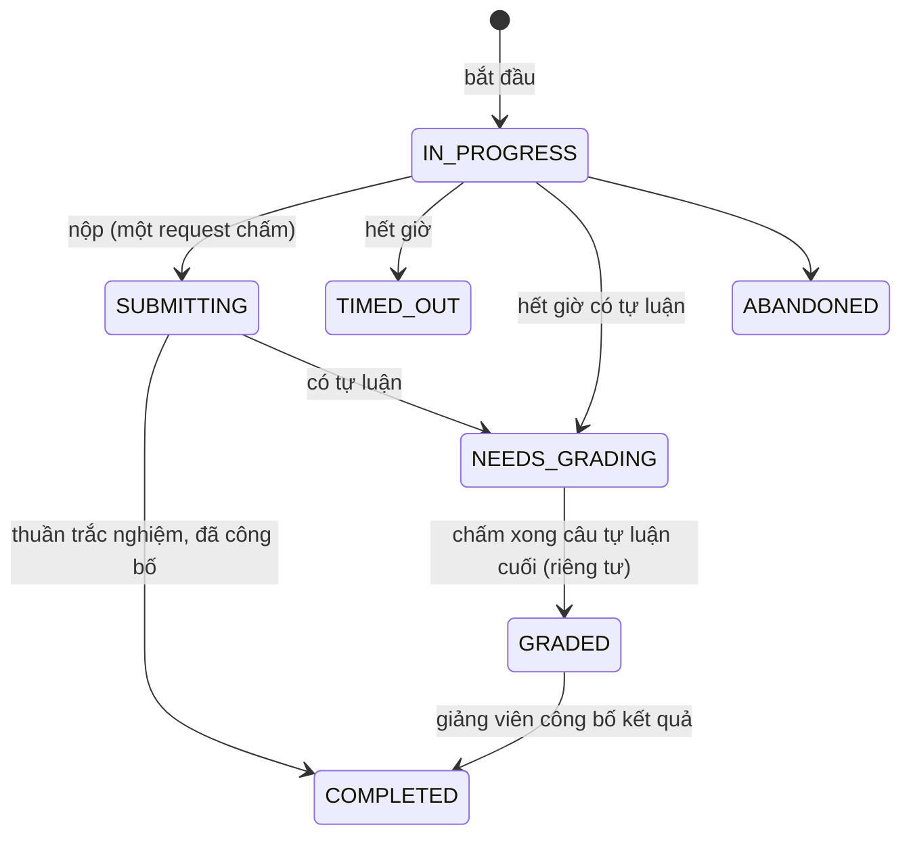

# Quiz và chấm bài

Quiz là một **aggregate độc lập**, không thuộc sở hữu của khóa, chương hay bài. Mọi lượt làm bài chạy trên một **snapshot** bất biến của đề, nên sửa đề sau đó không đổi điểm hay nội dung của lượt đã làm.

## Phạm vi và liên kết

Mỗi quiz có đúng một ngữ cảnh thực thi: `scope` + `target_id` (tham chiếu có kiểu, không phải quan hệ sở hữu).

| `scope` | `target_id` | Ai làm được |
| --- | --- | --- |
| `LESSON` | bài học | Người qua được cổng truy cập bài: đã ghi danh, bài đã xuất bản và (khóa tuần tự) đã xong các bài trước — bài xem trước **không** đủ |
| `CHAPTER` | chương | Có ghi danh còn hiệu lực trong khóa đã xuất bản |
| `COURSE` | khóa | Như trên |
| `STANDALONE` | `NULL` | Mọi người đã đăng nhập; quiz độc lập đã xuất bản hiển thị công khai trong cộng đồng theo `slug` |

Giảng viên của khóa đích và admin luôn xem trước/làm thử được. PostgreSQL không có khóa ngoại đa hình nên sự tồn tại và kiểu của đích được cưỡng chế bằng trigger (constraint trigger hoãn kiểm tra đích, trigger xóa chặn xóa bài/chương/khóa còn quiz gắn vào). Quiz không có `QUIZ` trong `LessonType`: quiz *bổ sung* cho bài chứ không thay bài.

## Cài đặt quiz

| Trường | Giá trị / mặc định |
| --- | --- |
| `passingScore` | 1–100, mặc định 80 |
| `maxAttempts` | số nguyên dương hoặc `null` (không giới hạn) |
| `durationMinutes` | số nguyên dương hoặc `null` (không giới hạn thời gian) |
| `isRequired` | mặc định `false`; quiz bắt buộc chặn hoàn thành khóa và tuần tự ([progress](progress.md)) |
| `reviewPolicy` | `AFTER_SUBMIT` (mặc định), `AFTER_PASS`, `AFTER_EXHAUSTED`, `NEVER` |
| `gradingPolicy` | `HIGHEST` (mặc định) hoặc `LATEST`; được lưu vào snapshot và trả cho client |
| `shuffleQuestions`, `shuffleOptions` | mặc định `true` |
| `slug` | bắt buộc cho quiz độc lập (học viên tìm và mở theo slug) |
| `difficulty`, `tags` | chỉ để khám phá; không bao giờ tham gia chấm điểm hay snapshot |

Loại câu hỏi: `SINGLE_CHOICE` (≥ 2 lựa chọn, đúng một đáp án đúng), `MULTIPLE_CHOICE` (≥ 2 lựa chọn, ít nhất một đúng và một sai) và `ESSAY` (không có lựa chọn; có `essay_config`). Điểm mỗi câu là số nguyên dương. Câu trắc nghiệm chấm **tất cả hoặc không** (không có điểm từng phần, không trừ điểm).

**Tự luận** (`essayConfig`): `allowedSubmissionTypes` (`TEXT_WITH_KATEX`, `FILE_UPLOAD`), `maxFileUploads`, `maxWords`, `gradingGuide`, `rubric` (danh sách tiêu chí `{criterion, maxPoints, description?}`). Bài nộp là văn bản (Markdown/KaTeX) và/hoặc tệp đính kèm tải trực tiếp lên Cloudinary bằng chữ ký do `POST /quiz-attempts/:attemptId/attachments/signature` cấp (503 `UPLOADS_NOT_CONFIGURED` khi chưa cấu hình Cloudinary); URL tệp phải thuộc nguồn được phép.

## Soạn quiz

Dành cho `instructor|admin`; từng quiz đi qua `QuizAuthorizationGuard` (người quản lý khóa đích, chủ quiz độc lập, admin).

| Endpoint | Mô tả |
| --- | --- |
| `POST /admin/quizzes`, `GET /admin/quizzes`, `GET/PUT/DELETE /admin/quizzes/:id` | Tạo, liệt kê, đọc, cập nhật cài đặt, xóa |
| `POST /admin/quizzes/:quizId/questions`, `PATCH …/questions/reorder`, `PUT/DELETE …/questions/:questionId` | Câu hỏi |
| `POST /admin/questions/:questionId/options`, `PATCH …/options/reorder`, `PUT/DELETE /admin/options/:optionId` | Lựa chọn |
| `GET /admin/quizzes/:id/questions` | Toàn bộ câu hỏi kèm đáp án (chỉ phía soạn) |
| `POST /admin/quizzes/:id/publish` | Xuất bản qua cổng chất lượng |
| `POST /admin/quizzes/:id/versions` | Mở lại quiz đã xuất bản thành bản nháp của phiên bản kế |
| `POST /admin/import/quiz` | Nhập từ JSON/Markdown/Excel ([content-import](content-import.md)) |

**Trạng thái quiz**: `DRAFT → PUBLISHED`; `PUBLISHED → DRAFT` (bản nháp phiên bản kế, `version + 1`, khi đó quiz tạm không tính vào tiến độ cho tới khi xuất bản lại); `ARCHIVED`.

**Cổng xuất bản** (`QuizPublishValidationPipeline`) chạy toàn bộ danh sách và trả mọi vi phạm (`422 QUIZ_NOT_PUBLISHABLE` + `issues[]`): đích còn hợp lệ; quiz độc lập có slug; cấu trúc câu hỏi/lựa chọn hợp lệ (đủ lựa chọn, có đáp án đúng, đúng một đáp án với `SINGLE_CHOICE`, điểm > 0, cấu hình tự luận hợp lệ); `passingScore` 1–100; `maxAttempts`/`durationMinutes` là null hoặc số nguyên dương; `AFTER_EXHAUSTED` đòi `maxAttempts` hữu hạn. Hàng quiz bị khóa `FOR UPDATE` trong suốt kiểm tra-và-chuyển, và thao tác sửa câu hỏi/lựa chọn dùng cùng khóa nên không có chỉnh sửa lọt giữa; hai lần xuất bản đồng thời chỉ một thắng.

## Làm bài (học viên)

| Endpoint | Mô tả |
| --- | --- |
| `GET /quizzes/standalone`, `GET /quizzes/standalone/:slug` | Quiz độc lập đã xuất bản |
| `GET /courses/:courseId/quizzes` | Quiz của khóa (cần ghi danh) |
| `GET /quizzes/:id/take` | Đề để làm (không có đáp án) |
| `POST /quizzes/:id/attempts` | Bắt đầu hoặc tiếp tục: **201** tạo lượt mới, **200** trả lượt đang chạy |
| `GET /quizzes/:id/active-attempt` | Lượt đang chạy (nếu có) |
| `PUT /quiz-attempts/:attemptId/answers` | Lưu/thay đáp án **một câu** (idempotent) |
| `PATCH /quiz-attempts/:attemptId/answers/draft` | Lưu nháp bài tự luận |
| `POST /quiz-attempts/:attemptId/submit` | Nộp bài |
| `GET /quiz-attempts/:attemptId` | Lượt làm của mình |
| `GET /quiz-attempts/:attemptId/result` (hoặc `/student-result`) | Kết quả theo chính sách xem lại |
| `GET /my-quiz-attempts` | Lịch sử của tôi (mọi scope) |

Quy tắc:

- **Một lượt `IN_PROGRESS` mỗi (quiz, học viên)**, bảo đảm bằng partial unique index và advisory lock theo cặp đó khi bắt đầu. Hai yêu cầu đồng thời: một tạo, một tiếp tục. Số lượt đã dùng tính cả lượt bỏ dở/hết giờ; `maxAttempts` đạt → `MAX_ATTEMPTS_REACHED`.
- **Snapshot**: lúc bắt đầu, toàn bộ đề (câu hỏi, lựa chọn, đáp án đúng, điểm, giải thích, rubric, chính sách và thứ tự xáo trộn) được đóng băng vào `quiz_attempts.quiz_snapshot`. Đáp án tham chiếu id trong snapshot. Chấm điểm và xem lại chỉ đọc snapshot, không đọc dữ liệu soạn sống. Chính sách xem lại cũng lấy từ snapshot nên phiên bản mới không đổi điều lượt cũ được xem.
- **Thời gian** dùng đồng hồ database; `expires_at = bắt đầu + durationMinutes`. Lưu/nộp sau hạn → `ATTEMPT_EXPIRED` và lượt bị tự đóng (thông báo `ATTEMPT_TIMED_OUT`).
- Phản hồi trước khi chấm không bao giờ chứa đáp án đúng hay trường suy ra được độ đúng.
- Lỗi ổn định thường gặp: `QUIZ_FORBIDDEN` (bản nháp, đã lưu trữ hay không tồn tại — không phân biệt), `TARGET_COURSE_FORBIDDEN` (kèm `reason`: `ENROLLMENT_REQUIRED`, `ENROLLMENT_SUSPENDED`, `TARGET_UNAVAILABLE`), `PREREQUISITE_LESSON_NOT_COMPLETED`, `MAX_ATTEMPTS_REACHED`, `ATTEMPT_EXPIRED`, `SUBMISSION_IN_PROGRESS`, `ATTEMPT_NOT_IN_PROGRESS`, `QUESTION_NOT_IN_SNAPSHOT`, `INVALID_OPTION_FOR_QUESTION`, `INVALID_RESPONSE_TYPE`, `QUIZ_HAS_NO_QUESTIONS`, `ESSAY_*` (từ chối văn bản/tệp/số từ), `UPLOADS_NOT_CONFIGURED`.

### Vòng đời lượt làm



`SUBMITTING` là trạng thái chiếm quyền được commit trong lúc đúng một request chấm bài, nên gửi lại không chấm hai lần. **`GRADED` khác `COMPLETED`**: điểm cuối đã có nhưng học viên chưa được xem; `COMPLETED` nghĩa là *đã công bố* (`published_at` được đặt). Chuyển trạng thái đi qua `assertTransition`; mọi trạng thái khác là cuối và không quay về `IN_PROGRESS`.

## Chấm điểm

Một cài đặt duy nhất (`QuizScoreCalculatorService`):

```text
mcqScore   = tổng điểm các câu trắc nghiệm trả lời đúng (so với đáp án trong snapshot)
essayScore = tổng điểm giảng viên đã chấm cho các câu tự luận
percentage = làm tròn nửa lên 2 chữ số của (mcqScore + essayScore) / tổng điểm snapshot × 100
isPassed   = percentage ≥ passingScore
```

Không có tổng nào do client gửi lên. Khi nộp, câu trắc nghiệm được chấm ngay còn câu tự luận tạm 0; nếu có tự luận thì `isPassed` để `null` cho tới khi chấm xong.

**Tự luận**: lượt có tự luận vào `NEEDS_GRADING` và xuất hiện trong hàng chờ của giảng viên (`GET /instructor/grading-queue`, `…/courses`). Giảng viên mở `GET /instructor/quiz-attempts/:attemptId`, chấm bằng `POST /instructor/quiz-attempts/:attemptId/grade` (điểm từng câu `awardedPoints` với 2 chữ số thập phân, điểm theo `rubric` qua `criterionIndex`, nhận xét ≤ 10 000 ký tự; mức tối đa luôn lấy từ câu hỏi đã đóng băng, không từ payload) và xem `…/grade-history`. Mọi lần chấm/sửa điểm ghi `quiz_grade_audit_logs` (chỉ-ghi-thêm). Khi câu cuối được chấm lượt chuyển `GRADED`.

**Công bố**: `POST /instructor/quiz-attempts/:attemptId/publish` (một học viên, idempotent; 409 nếu chưa `GRADED`) hoặc `POST /instructor/quizzes/:quizId/publish-results` (hàng loạt). Chỉ khi đó tiến độ khóa mới biết kết quả đạt.

**Che điểm**: khi `NEEDS_GRADING`/`GRADED`, học viên không thấy điểm, phần trăm, đạt/trượt, nhận xét hay đáp án — kể cả phần trắc nghiệm đã tự chấm. API còn trả trạng thái `GRADED` thành `NEEDS_GRADING` cho học viên để không lộ việc chấm đã xong.

## Chính sách xem lại (`reviewPolicy`, đóng băng theo lượt)

Quyết định chi tiết đáp án đúng, đúng/sai từng câu và giải thích sau khi có kết quả:

| Chính sách | Cho xem khi |
| --- | --- |
| `AFTER_SUBMIT` | Ngay khi kết quả được xem (snapshot cũ có thể ghi `ALWAYS`, tương đương) |
| `AFTER_PASS` | Lượt đó đạt |
| `AFTER_EXHAUSTED` | Đã dùng hết `maxAttempts` hữu hạn và không còn lượt mở |
| `NEVER` | Không bao giờ; chính sách lạ cũng bị từ chối |

Điểm tổng luôn xem được sau khi công bố; chỉ phần chi tiết đáp án chịu chính sách.

## Tác động lên tiến độ

Quiz gắn khóa đã xuất bản (scope `LESSON|CHAPTER|COURSE`) tham gia thanh tiến độ và cổng hoàn thành ([progress](progress.md)). "Đạt" là mọi lượt đã chốt (`COMPLETED`, `SUBMITTED`, `TIMED_OUT`) có `is_passed`, nên kết quả đạt một khi đã có sẽ không bị lấy lại bởi lần làm sau. Quiz độc lập không bao giờ ảnh hưởng tiến độ hay mở khóa giáo trình. Xuất bản/mở phiên bản quiz phát `CurriculumEvents` để cache liên quan được vô hiệu hóa.

## Giao diện

| Nơi | Component |
| --- | --- |
| Trình soạn (`/instructor/quizzes`, `/create`, `/[id]/edit`) | `features/quiz-builder` |
| Học viên làm bài (`/quizzes`, `/quizzes/[slug]`, `/attempt`, `/results/[attemptId]`, `/quiz-attempts`) | `features/quiz-player`, `features/standalone-quiz` |
| Làm quiz trong trang học (`/learn/[courseSlug]/quiz/[quizId]`) | `components/learning/quiz` |
| Hàng chờ và không gian chấm (`/instructor/grading`) | `features/grading-queue` |

## Kiểm thử

E2E của API ở `apps/api/test/e2e/` (`quiz-engine-mvp-lifecycle`, `quiz-security-audit`, `sprint9-final-audit`) kiểm tra vòng đời, snapshot, đồng thời, che điểm, quyền, tự luận và công bố. Xem [testing](testing.md).
